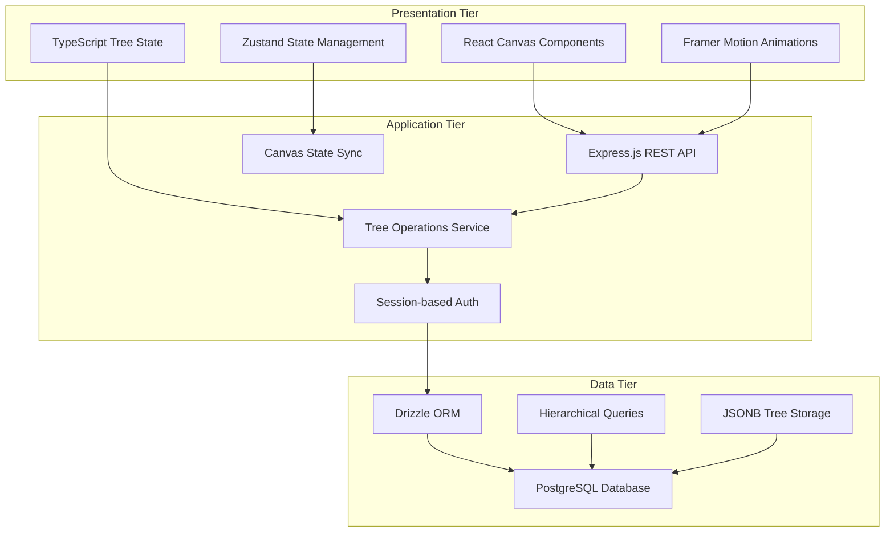
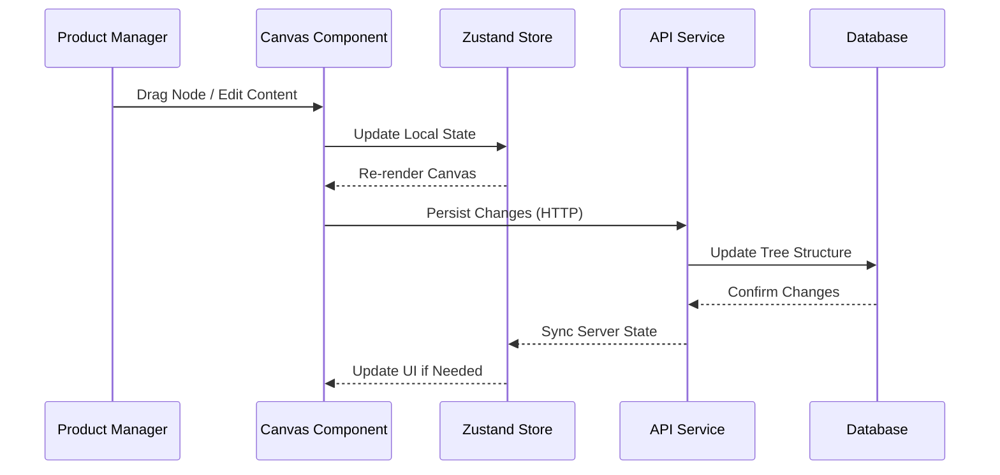
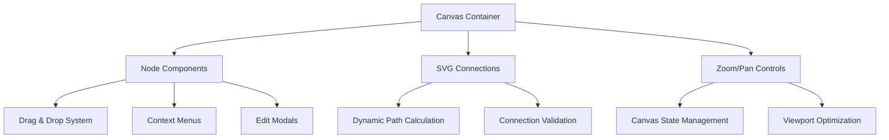
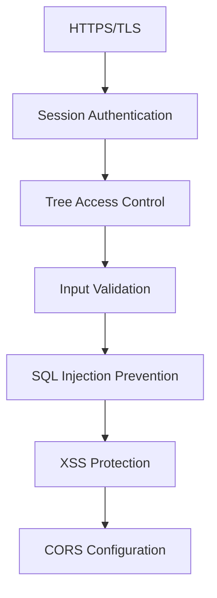
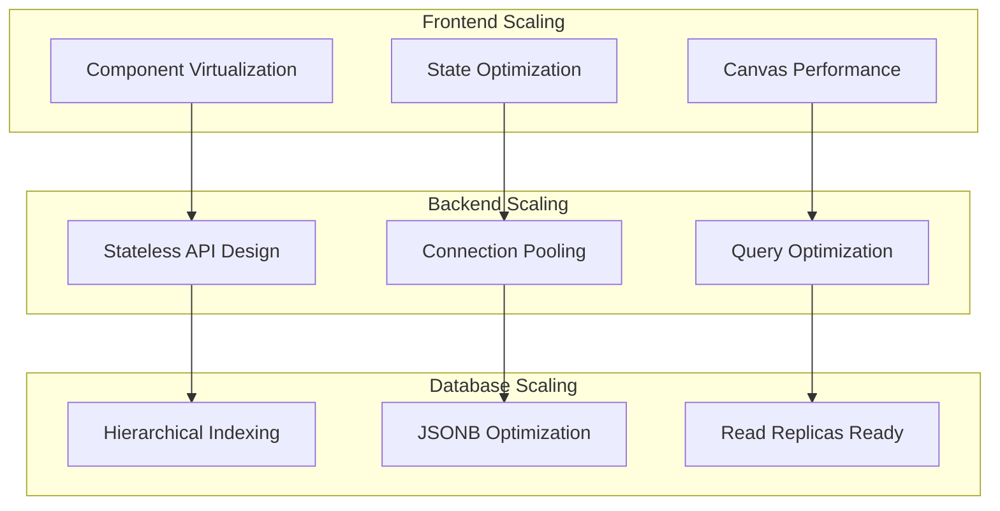
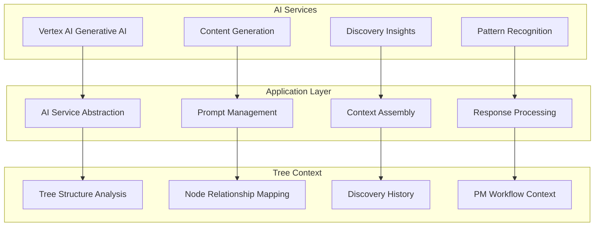
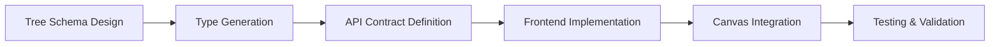
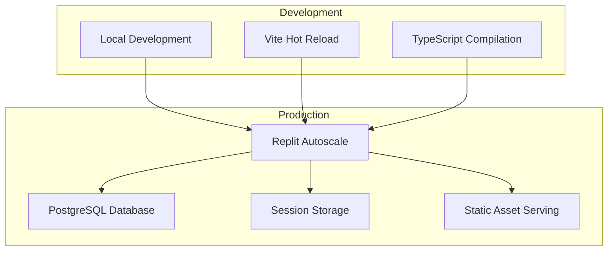
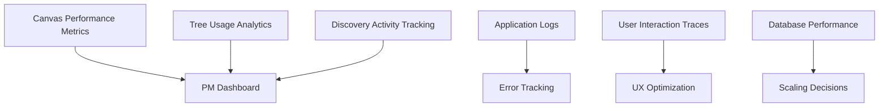

# 🏗️ System Architecture Overview

> **High-level architectural patterns and design principles for AI-Native Impact Tree Canvas**
> **Audience**: Product Managers, Developers, Stakeholders, Management
> **Purpose**: Strategic understanding, architectural reviews, onboarding team members

---

## 🎯 **Executive Summary**

This document provides a high-level overview of the AI-Native Impact Tree Canvas architecture, focusing on architectural patterns, design principles, and strategic technical decisions. The architecture follows modern full-stack development practices optimized for interactive canvas applications, hierarchical data structures, and continuous discovery workflows for Product Managers.

---

## 🏛️ **Architectural Principles**

### **Core Design Principles**
1. **Discovery-First Architecture**: All components support continuous discovery and iterative product management workflows
2. **Live Document Philosophy**: Real-time updates and evolving tree structures as core architectural assumptions
3. **Canvas Performance**: Optimized for large, complex tree structures with smooth interactions
4. **Type-Safe Development**: End-to-end TypeScript for complex hierarchical data modeling
5. **PM-Centric Design**: User experience optimized for Product Manager daily workflows
6. **Scalable Tree Operations**: Efficient handling of deep hierarchies and large node counts

### **Quality Attributes**
- **Interactivity**: Smooth canvas operations and real-time tree manipulation
- **Performance**: Efficient rendering of complex tree structures (100+ nodes)
- **Usability**: Intuitive for Product Managers practicing continuous discovery
- **Flexibility**: Support for evolving tree structures and discovery methodologies
- **Reliability**: Consistent state management between canvas and database
- **Extensibility**: Ready for AI integration and advanced discovery features

---

## 🏗️ **High-Level Architecture**

### **Canvas-Centric Three-Tier Architecture**

### **Component Overview**

#### **Frontend Layer (React + Canvas)**
- **Canvas Components**: Interactive tree nodes with drag-drop capabilities
- **Tree State Management**: Zustand for complex hierarchical state operations
- **SVG Connections**: Dynamic connection rendering between tree nodes
- **TypeScript Models**: Type-safe tree node relationships and canvas operations
- **Performance Optimization**: React.memo and virtualization for large trees

#### **Backend Layer (Node.js/Express)**
- **REST API**: Impact tree CRUD operations and canvas state persistence
- **Tree Operations**: Hierarchical data manipulation and validation
- **Session Management**: Passport.js integration for user authentication
- **Real-time Sync**: Canvas state synchronization between client and server
- **Validation Layer**: Zod schemas for tree structure validation

#### **Data Layer (PostgreSQL + Drizzle)**
- **Hierarchical Storage**: Parent-child relationships with recursive queries
- **JSONB Support**: Flexible node metadata and canvas state storage
- **Type-safe ORM**: Drizzle for compile-time query validation
- **Performance Indexing**: Optimized for tree traversal and large datasets

---

## 🔄 **Data Flow Architecture**

### **Canvas Interaction Flow**

### **Tree Structure Processing**
- **Node Creation**: Hierarchical validation and parent-child relationship setup
- **Canvas State**: Real-time synchronization of zoom, pan, and node positions
- **Tree Traversal**: Efficient recursive queries for deep tree structures
- **State Consistency**: Optimistic updates with server reconciliation
- **Performance Optimization**: Debounced saves and batched operations

---

## 🎨 **Canvas Architecture**

### **Interactive Canvas System**

### **Canvas Performance Features**
- **Virtualization**: Render only visible nodes for large trees
- **Efficient Rendering**: SVG-based connections with optimized path calculations
- **State Batching**: Grouped updates for smooth interactions
- **Memory Management**: Cleanup of unused components and event listeners
- **Responsive Design**: Adaptive layouts for different screen sizes

---

## 🔒 **Security Architecture**

### **Session-Based Security**

### **Security Components**
- **Transport Security**: HTTPS encryption for all communications
- **Session Management**: Secure session-based authentication with Passport.js
- **Tree Permissions**: User-level access control for impact trees
- **Input Sanitization**: Comprehensive validation for tree node content
- **API Security**: Rate limiting and request validation
- **Database Security**: Parameterized queries and ORM protection

---

## 📊 **Scalability Architecture**

### **Performance Scaling Strategy**

### **Scalability Features**
- **Canvas Virtualization**: Handle trees with 1000+ nodes efficiently
- **Stateless Services**: Horizontal scaling readiness for API layer
- **Database Optimization**: Efficient hierarchical queries and indexing
- **Caching Strategy**: Client-side caching for frequent tree operations
- **Progressive Loading**: Load tree sections on-demand for large structures

---

## 🤖 **AI Integration Architecture**

### **Vertex AI Integration Strategy**

### **AI Enhancement Features**
- **Discovery Suggestions**: AI-powered opportunity and solution recommendations
- **Content Generation**: Automated node descriptions and research questions
- **Pattern Recognition**: Identify common structures across trees
- **Learning Amplification**: Synthesize insights from discovery activities

---

## 🛠️ **Development Architecture**

### **TypeScript-First Development**

### **Development Workflow Features**
- **Type Safety**: End-to-end TypeScript for complex tree operations
- **Schema-Driven**: Zod schemas for runtime and compile-time validation
- **Component-Based**: Modular React components for tree elements
- **State Management**: Zustand for predictable tree state operations
- **Performance Monitoring**: Built-in metrics for canvas performance

---

## 🚀 **Deployment Architecture**

### **Replit-Optimized Deployment**

### **Deployment Features**
- **Replit Native**: Optimized for Replit's deployment infrastructure
- **Zero-Config**: Automatic dependency detection and installation
- **Database Integration**: Built-in PostgreSQL with connection pooling
- **Session Persistence**: Reliable session storage for user authentication
- **Asset Optimization**: Vite-based build optimization for production

---

## 📈 **Performance Architecture**

### **Canvas Performance Optimization**
- **Rendering Efficiency**:
  - SVG-based node connections for smooth scaling
  - React.memo for preventing unnecessary re-renders
  - Efficient event handling for drag operations
  - Optimized zoom and pan calculations

- **Memory Management**:
  - Component cleanup for removed nodes
  - Efficient state updates with Zustand
  - Debounced API calls for tree modifications
  - Image and asset optimization

- **Database Performance**:
  - Hierarchical query optimization with CTEs
  - JSONB indexing for fast tree operations
  - Connection pooling for concurrent users
  - Efficient tree structure serialization

---

## 🔍 **Monitoring and Observability**

### **PM-Focused Monitoring**

### **Observability Components**
- **Canvas Metrics**: Node rendering performance and interaction responsiveness
- **Usage Analytics**: Tree complexity, PM workflow patterns, feature adoption
- **Error Tracking**: Canvas errors, API failures, state inconsistencies
- **Performance Monitoring**: Database query performance, API response times
- **User Experience**: PM workflow efficiency and tool adoption metrics

---

## 🔮 **Future Architecture Considerations**

### **Discovery Enhancement Roadmap**
- **Real-time Collaboration**: Socket.io integration for team tree editing
- **Advanced AI Integration**: Enhanced discovery insights and automated research
- **Mobile Optimization**: Touch-optimized canvas for mobile PM workflows
- **Integration APIs**: Connect with PM tools (Miro, Figma, research platforms)

### **Technical Evolution**
- **Microservices**: Potential service separation for AI and core tree operations
- **GraphQL**: Flexible API queries for complex tree relationships
- **Offline Support**: Service worker integration for offline tree editing
- **Advanced Analytics**: ML-powered insights on PM discovery patterns

---

## 📋 **Architecture Decision Records (ADRs)**

### **Key Architectural Decisions**
1. **ADR-001**: React + Canvas over traditional form-based interfaces
2. **ADR-002**: Node.js/Express over Spring Boot for JavaScript ecosystem consistency
3. **ADR-003**: PostgreSQL + JSONB over pure NoSQL for ACID compliance with flexibility
4. **ADR-004**: Zustand over Redux for simpler tree state management
5. **ADR-005**: Vertex AI over OpenAI for enterprise-grade AI integration
6. **ADR-006**: Session-based auth over JWT for simpler security model

### **Decision Criteria**
- **PM User Experience**: Optimize for Product Manager daily workflows
- **Canvas Performance**: Support complex, interactive tree structures
- **Type Safety**: Reduce bugs in complex hierarchical data operations
- **Development Velocity**: Enable rapid iteration for discovery-driven development
- **Scalability**: Support growth from individual PMs to product teams

---

## 🎯 **Success Metrics**

### **Technical Metrics**
- **Canvas Performance**: <100ms interaction response time for trees up to 500 nodes
- **Tree Operations**: <200ms API response for tree CRUD operations
- **Availability**: 99.5% uptime target for discovery-critical workflows
- **Scalability**: Support 100 concurrent PMs with complex trees
- **Data Integrity**: Zero tree corruption incidents

### **Product Manager Experience Metrics**
- **Tree Complexity**: Average 50+ nodes per active tree
- **Discovery Integration**: 80% of trees connected to research activities
- **Workflow Efficiency**: 50% reduction in strategy documentation time
- **Tool Adoption**: Daily active usage by practicing Product Managers
- **Continuous Discovery**: Evidence of iterative tree evolution patterns

---

**📝 Architecture Version**: 1.0  
**🎯 Project Type**: AI-Native Impact Tree Canvas  
**📅 Last Updated**: January 2025  
**👤 Product Manager**: Impact Tree Development Team  
**📊 Status**: ✅ Foundation Architecture - Discovery Playground Phase

