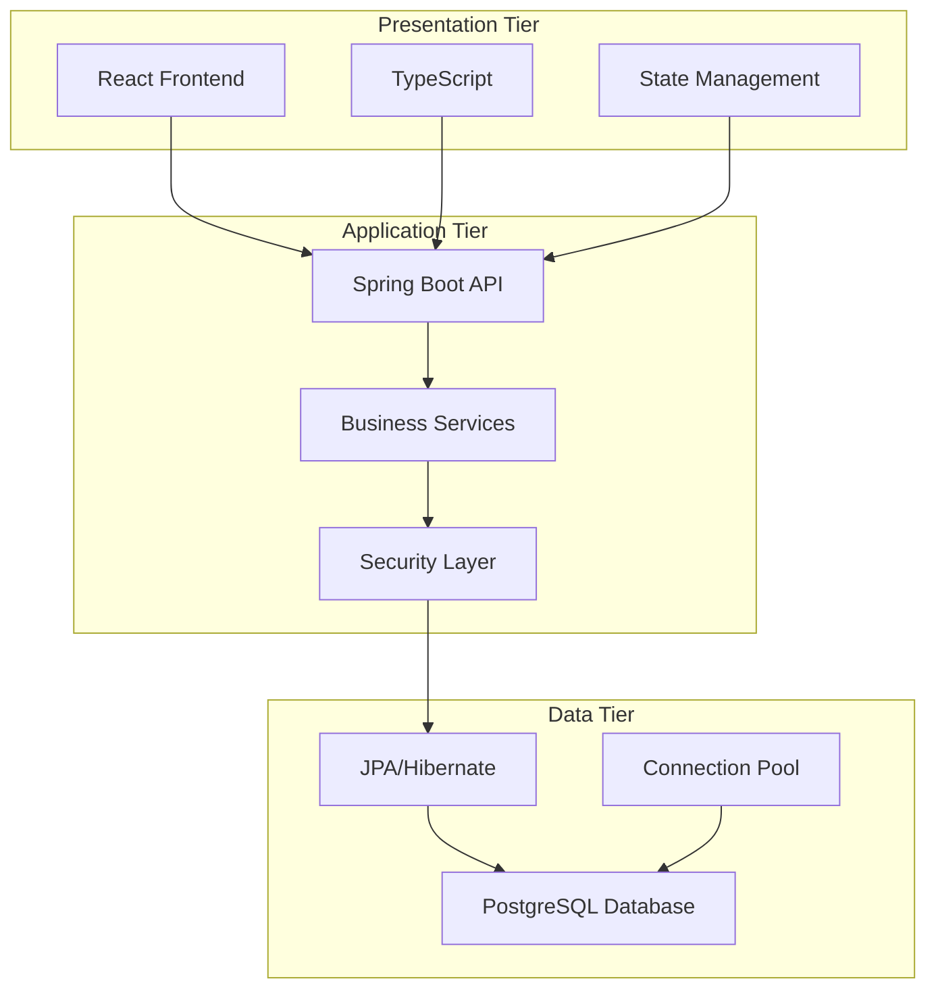
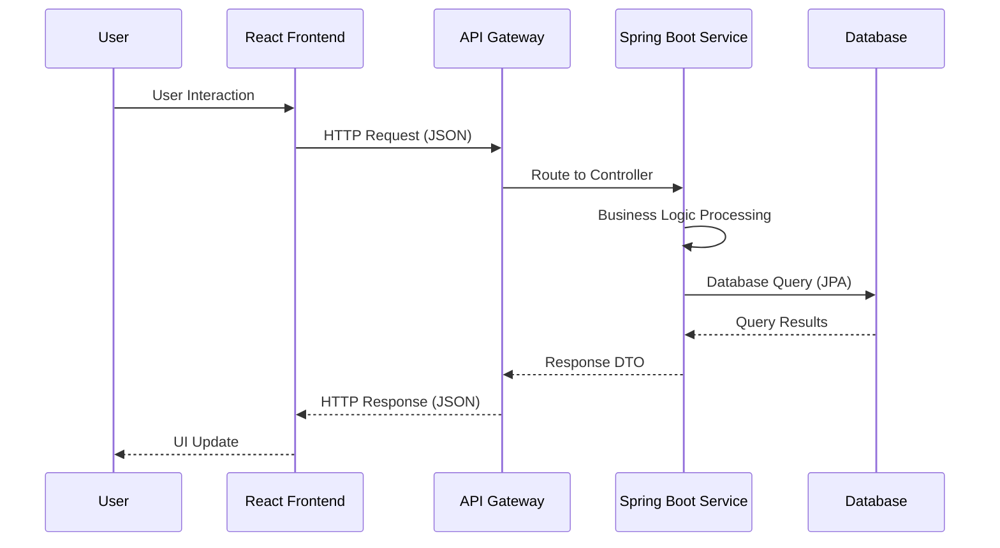
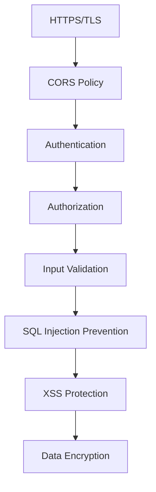
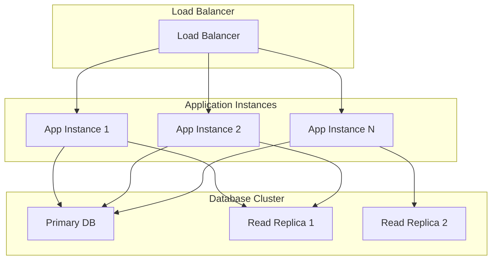
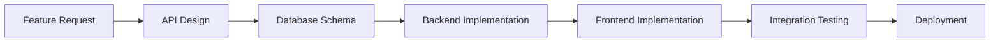
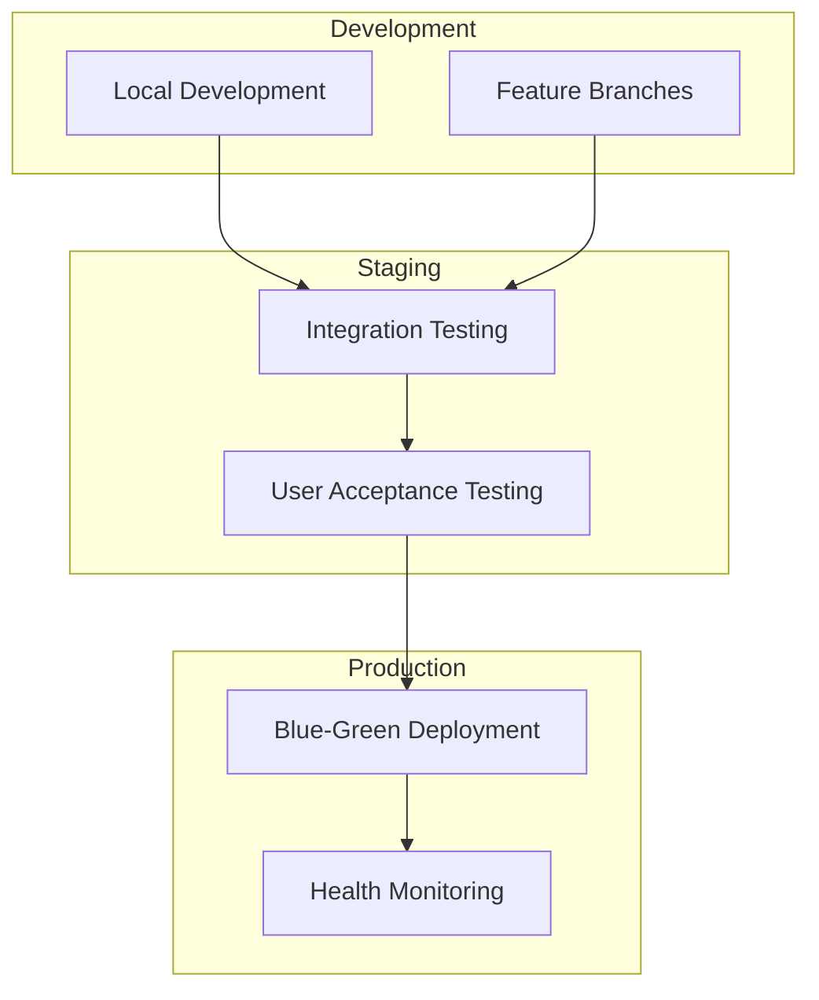
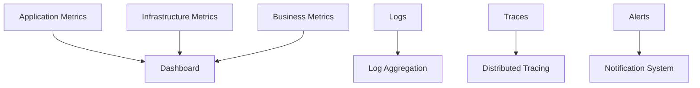

# 🏗️ System Architecture Overview

> **High-level architectural patterns and design principles for React + Java applications**
> **Audience**: Architects, Senior Developers, Stakeholders, Management
> **Purpose**: Strategic understanding, architectural reviews, onboarding executives

---

## 🎯 **Executive Summary**

This document provides a high-level overview of the React + Java application architecture, focusing on architectural patterns, design principles, and strategic technical decisions. The architecture follows modern full-stack development practices with clear separation of concerns, scalable design patterns, and enterprise-grade reliability.

---

## 🏛️ **Architectural Principles**

### **Core Design Principles**
1. **Separation of Concerns**: Clear boundaries between presentation, business logic, and data layers
2. **Single Responsibility**: Each component has one well-defined purpose
3. **Dependency Inversion**: High-level modules don't depend on low-level modules
4. **API-First Design**: APIs designed before frontend implementation
5. **Stateless Services**: Services are stateless and horizontally scalable
6. **Database-Centric**: Data integrity and consistency are paramount

### **Quality Attributes**
- **Scalability**: Horizontal scaling capabilities
- **Maintainability**: Clean, readable, and well-documented code
- **Testability**: Comprehensive testing at all levels
- **Security**: Security-first approach with defense in depth
- **Performance**: Optimized for speed and efficiency
- **Reliability**: High availability and fault tolerance

---

## 🏗️ **High-Level Architecture**

### **Three-Tier Architecture**

### **Component Overview**

#### **Frontend Layer (React)**
- **React Components**: Modular, reusable UI components
- **TypeScript**: Type-safe JavaScript for better development experience
- **State Management**: Centralized state management (Redux/Context API)
- **API Services**: Abstracted API communication layer
- **Routing**: Client-side routing for single-page application

#### **Backend Layer (Java/Spring Boot)**
- **REST Controllers**: HTTP request handling and response formatting
- **Service Layer**: Business logic implementation
- **Repository Layer**: Data access abstraction
- **Security**: Authentication and authorization
- **Configuration**: Environment-specific configuration management

#### **Data Layer**
- **Relational Database**: PostgreSQL for ACID compliance
- **ORM**: JPA/Hibernate for object-relational mapping
- **Connection Pooling**: Efficient database connection management
- **Migrations**: Version-controlled schema changes

---

## 🔄 **Data Flow Architecture**

### **Request-Response Flow**

### **Data Processing Patterns**
- **Request Validation**: Input validation at API boundary
- **DTO Mapping**: Separate DTOs for API contracts
- **Business Logic**: Centralized in service layer
- **Data Access**: Repository pattern for data operations
- **Response Formatting**: Consistent API response structure

---

## 🔒 **Security Architecture**

### **Security Layers**

### **Security Components**
- **Transport Security**: HTTPS/TLS encryption
- **Authentication**: JWT-based stateless authentication
- **Authorization**: Role-based access control (RBAC)
- **Input Validation**: Server-side validation for all inputs
- **SQL Injection Prevention**: Parameterized queries
- **XSS Protection**: Input sanitization and CSP headers
- **CORS**: Configured cross-origin resource sharing

---

## 📊 **Scalability Architecture**

### **Horizontal Scaling Strategy**

### **Scalability Features**
- **Stateless Services**: No server-side session state
- **Database Read Replicas**: Distribute read operations
- **Connection Pooling**: Efficient database connection usage
- **Caching Strategy**: Application-level and database-level caching
- **CDN Integration**: Static asset delivery optimization

---

## 🛠️ **Development Architecture**

### **Development Workflow**

### **Code Organization**
- **Modular Structure**: Clear separation of concerns
- **Dependency Injection**: Loose coupling between components
- **Configuration Management**: Environment-specific configurations
- **Error Handling**: Centralized error handling and logging
- **Testing Strategy**: Unit, integration, and end-to-end testing

---

## 🚀 **Deployment Architecture**

### **Environment Strategy**

### **Deployment Features**
- **Containerization**: Docker containers for consistent environments
- **CI/CD Pipeline**: Automated build, test, and deployment
- **Environment Parity**: Consistent environments across stages
- **Health Checks**: Application and infrastructure health monitoring
- **Rollback Strategy**: Quick rollback capabilities for issues

---

## 📈 **Performance Architecture**

### **Performance Optimization Strategy**
- **Frontend Optimization**:
  - Code splitting and lazy loading
  - Bundle optimization and compression
  - Image optimization and CDN usage
  - Browser caching strategies

- **Backend Optimization**:
  - Database query optimization
  - Connection pooling and caching
  - Asynchronous processing where appropriate
  - Response compression

- **Database Optimization**:
  - Proper indexing strategy
  - Query optimization
  - Connection pooling
  - Read replica usage

---

## 🔍 **Monitoring and Observability**

### **Monitoring Stack**

### **Observability Components**
- **Application Monitoring**: Performance metrics and health checks
- **Infrastructure Monitoring**: Server and database metrics
- **Log Aggregation**: Centralized logging and analysis
- **Distributed Tracing**: Request flow tracking
- **Alerting**: Proactive issue notification

---

## 🔮 **Future Architecture Considerations**

### **Scalability Roadmap**
- **Microservices Migration**: Potential future microservices architecture
- **Event-Driven Architecture**: Asynchronous event processing
- **API Gateway**: Centralized API management
- **Service Mesh**: Advanced service-to-service communication

### **Technology Evolution**
- **Cloud-Native**: Migration to cloud-native technologies
- **Serverless**: Serverless function adoption for specific use cases
- **GraphQL**: Potential GraphQL adoption for flexible APIs
- **Real-Time Features**: WebSocket integration for real-time updates

---

## 📋 **Architecture Decision Records (ADRs)**

### **Key Architectural Decisions**
1. **ADR-001**: Chosen React over Angular for frontend framework
2. **ADR-002**: Selected Spring Boot for backend framework
3. **ADR-003**: PostgreSQL chosen over NoSQL for data consistency
4. **ADR-004**: JWT authentication over session-based authentication
5. **ADR-005**: REST API over GraphQL for simplicity

### **Decision Criteria**
- **Team Expertise**: Leverage existing team knowledge
- **Community Support**: Strong community and ecosystem
- **Long-term Viability**: Technology longevity and support
- **Performance Requirements**: Meet performance objectives
- **Scalability Needs**: Support future growth requirements

---

## 🎯 **Success Metrics**

### **Technical Metrics**
- **Performance**: API response times < 200ms (95th percentile)
- **Availability**: 99.9% uptime target
- **Scalability**: Support 10x current user load
- **Security**: Zero critical security vulnerabilities
- **Code Quality**: >80% test coverage, <5% technical debt

### **Business Metrics**
- **Development Velocity**: Feature delivery speed
- **Maintenance Cost**: Operational overhead
- **User Experience**: Page load times and responsiveness
- **Reliability**: Error rates and system stability

---

**📝 Architecture Version**: 1.0  
**🎯 Project Type**: React + Java  
**📅 Last Updated**: June 2025  
**👤 Architect**: [Architect name]  
**📊 Status**: ✅ Production Architecture
