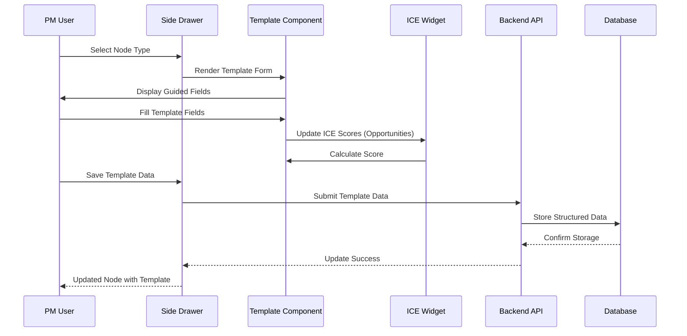

# 🔧 Node Content Templates Implementation Plan

> **Detailed technical implementation plan for Node Content Templates feature**
> **Priority**: High | **Complexity**: Medium | **Effort**: 32 hours

---

## 📋 **Implementation Overview**

### **Objective**
Replace current free-form description field with structured templates for Objective, Outcome, and Opportunity node types, providing Product Managers with guided frameworks for consistent, comprehensive documentation.

### **Current State**
Single description field with markdown support in NodeEditSideDrawer component, resulting in inconsistent documentation quality and missing key information.

### **Target State**
Node-type-specific structured forms with guided fields, ICE scoring integration for opportunities, and modern compact UI optimized for PM workflow.

---

## 🎯 **Technical Requirements**

### **Frontend Requirements (React + TypeScript)**
- [ ] **Template Components**: Objective, Outcome, and Opportunity form templates
- [ ] **State Management**: Enhanced node data structure for template fields
- [ ] **ICE Scoring Widget**: Interactive sliders with real-time calculation
- [ ] **UI/UX Implementation**: Compact, collapsible sections with smart placeholders

### **Backend Requirements (Node.js + Express)**
- [ ] **Schema Updates**: Extended node model to support template data
- [ ] **API Endpoints**: Updated to handle template-structured data
- [ ] **Data Migration**: Convert existing nodes to template format
- [ ] **Validation**: Template-specific validation rules

### **Database Requirements**
- [ ] **Schema Changes**: New template data fields in nodes table
- [ ] **Data Migration**: Preserve existing content during template migration
- [ ] **Performance**: Optimized queries for template data storage

---

## 🏗️ **Implementation Strategy**

### **Phase 1: Template Infrastructure (8 hours)**

#### **Template Data Types**
```typescript
// Enhanced template data interfaces
interface TemplateData {
  // Objective fields
  coreWhy?: string;
  desiredOutcome?: string;
  strategicContext?: string;
  targetAudience?: string;
  exclusionCriteria?: string;
  
  // Outcome fields
  who?: string;
  doesWhat?: string;
  baseline?: string;
  target?: string;
  measurementMethod?: string;
  timeframe?: string;
  
  // Opportunity fields
  customerProblem?: string;
  evidenceInsights?: string;
  linkToKeyResult?: string;
  impactOnCustomer?: string;
  customerSegments?: string;
  
  // ICE scoring
  iceImpact?: number;
  iceConfidence?: number;
  iceEase?: number;
  iceImpactRationale?: string;
  iceConfidenceRationale?: string;
  iceEaseRationale?: string;
}

// Enhanced TreeNode interface
interface TreeNode {
  id: string;
  type: NodeType;
  title: string;
  description: string;
  position: { x: number; y: number };
  testCategory?: TestCategory;
  templateData?: TemplateData; // New template data field
}
```

#### **Template Field Definitions**
```typescript
// Template field configuration
interface TemplateField {
  id: string;
  label: string;
  type: 'text' | 'textarea' | 'slider' | 'calculated';
  placeholder: string;
  required: boolean;
  maxLength?: number;
  rows?: number;
  section?: string;
}

const OBJECTIVE_TEMPLATE: TemplateField[] = [
  {
    id: 'coreWhy',
    label: 'The "Why" (Core Problem/Opportunity)',
    type: 'textarea',
    placeholder: 'What fundamental problem are we solving for users? Focus on the unmet need or significant opportunity...',
    required: false,
    rows: 3,
    section: 'problem'
  },
  // Additional fields...
];
```

### **Phase 2: Template Components (8 hours)**

#### **Objective Template Component**
```tsx
// ObjectiveTemplate.tsx
import React from 'react';
import { TemplateField } from './template-field';
import { TEMPLATE_PLACEHOLDERS } from '../constants/template-placeholders';

interface ObjectiveTemplateProps {
  data: TemplateData;
  onFieldChange: (field: string, value: string) => void;
}

export function ObjectiveTemplate({ data, onFieldChange }: ObjectiveTemplateProps) {
  return (
    <div className="space-y-4">
      <TemplateField
        id="coreWhy"
        label='The "Why" (Core Problem/Opportunity)'
        value={data.coreWhy || ''}
        placeholder={TEMPLATE_PLACEHOLDERS.objective.coreWhy}
        onChange={(value) => onFieldChange('template.coreWhy', value)}
        type="textarea"
        rows={3}
      />
      
      <TemplateField
        id="desiredOutcome"
        label='Desired Outcome (The "What")'
        value={data.desiredOutcome || ''}
        placeholder={TEMPLATE_PLACEHOLDERS.objective.desiredOutcome}
        onChange={(value) => onFieldChange('template.desiredOutcome', value)}
        type="textarea"
        rows={3}
      />
      
      <TemplateField
        id="strategicContext"
        label="Strategic Context & Alignment"
        value={data.strategicContext || ''}
        placeholder={TEMPLATE_PLACEHOLDERS.objective.strategicContext}
        onChange={(value) => onFieldChange('template.strategicContext', value)}
        type="textarea"
        rows={2}
      />
      
      <TemplateField
        id="targetAudience"
        label="Target Audience"
        value={data.targetAudience || ''}
        placeholder={TEMPLATE_PLACEHOLDERS.objective.targetAudience}
        onChange={(value) => onFieldChange('template.targetAudience', value)}
        type="text"
      />
      
      <TemplateField
        id="exclusionCriteria"
        label="Exclusion Criteria / What This Objective Is NOT"
        value={data.exclusionCriteria || ''}
        placeholder={TEMPLATE_PLACEHOLDERS.objective.exclusionCriteria}
        onChange={(value) => onFieldChange('template.exclusionCriteria', value)}
        type="textarea"
        rows={2}
      />
    </div>
  );
}
```

#### **ICE Scoring Widget**
```tsx
// ICEScoringWidget.tsx
import React, { useMemo } from 'react';
import { Card, CardContent, CardHeader, CardTitle } from '@/components/ui/card';
import { Slider } from '@/components/ui/slider';
import { Textarea } from '@/components/ui/textarea';
import { Label } from '@/components/ui/label';
import { Badge } from '@/components/ui/badge';
import { Calculator, HelpCircle } from 'lucide-react';
import { cn } from '@/lib/utils';

interface ICEScoringWidgetProps {
  data: TemplateData;
  onFieldChange: (field: string, value: any) => void;
  calculatedScore: number;
}

export function ICEScoringWidget({ data, onFieldChange, calculatedScore }: ICEScoringWidgetProps) {
  const getScoreColor = (score: number) => {
    if (score < 2) return "text-red-600";
    if (score < 4) return "text-yellow-600";
    return "text-green-600";
  };

  const getScoreLabel = (score: number) => {
    if (score < 2) return "Low";
    if (score < 4) return "Medium";
    return "High";
  };

  return (
    <Card>
      <CardHeader className="pb-3">
        <CardTitle className="text-lg flex items-center justify-between">
          <span className="flex items-center gap-2">
            <Calculator className="w-4 h-4" />
            ICE Prioritization Score
          </span>
          <div className="text-right">
            <div className={cn("text-2xl font-bold", getScoreColor(calculatedScore))}>
              {calculatedScore}
            </div>
            <div className="text-sm text-gray-500">
              {getScoreLabel(calculatedScore)}
            </div>
          </div>
        </CardTitle>
      </CardHeader>
      <CardContent className="space-y-6">
        {/* Impact Scoring */}
        <div className="space-y-3">
          <div className="flex items-center gap-2">
            <Label className="text-sm font-medium">Impact</Label>
            <HelpCircle className="w-3 h-3 text-gray-400" />
            <span className="text-sm text-gray-500 ml-auto">
              Score: {data.iceImpact || 1}
            </span>
          </div>
          <Slider
            value={[data.iceImpact || 1]}
            onValueChange={([value]) => onFieldChange('template.iceImpact', value)}
            max={5}
            min={1}
            step={1}
            className="w-full"
          />
          <div className="flex justify-between text-xs text-gray-500">
            <span>1 - Minimal</span>
            <span>3 - Moderate</span>
            <span>5 - Transformational</span>
          </div>
          <Textarea
            value={data.iceImpactRationale || ''}
            onChange={(e) => onFieldChange('template.iceImpactRationale', e.target.value)}
            placeholder="Why did you give this impact score? Consider potential effect on Key Result and customer impact..."
            rows={2}
            className="text-sm"
          />
        </div>

        {/* Confidence Scoring */}
        <div className="space-y-3">
          <div className="flex items-center gap-2">
            <Label className="text-sm font-medium">Confidence</Label>
            <HelpCircle className="w-3 h-3 text-gray-400" />
            <span className="text-sm text-gray-500 ml-auto">
              Score: {data.iceConfidence || 1}
            </span>
          </div>
          <Slider
            value={[data.iceConfidence || 1]}
            onValueChange={([value]) => onFieldChange('template.iceConfidence', value)}
            max={5}
            min={1}
            step={1}
            className="w-full"
          />
          <div className="flex justify-between text-xs text-gray-500">
            <span>1 - Speculative</span>
            <span>3 - Moderate</span>
            <span>5 - Very Certain</span>
          </div>
          <Textarea
            value={data.iceConfidenceRationale || ''}
            onChange={(e) => onFieldChange('template.iceConfidenceRationale', e.target.value)}
            placeholder="Why this confidence level? Consider strength of evidence, problem clarity, and prior experience..."
            rows={2}
            className="text-sm"
          />
        </div>

        {/* Ease Scoring */}
        <div className="space-y-3">
          <div className="flex items-center gap-2">
            <Label className="text-sm font-medium">Ease</Label>
            <HelpCircle className="w-3 h-3 text-gray-400" />
            <span className="text-sm text-gray-500 ml-auto">
              Score: {data.iceEase || 1}
            </span>
          </div>
          <Slider
            value={[data.iceEase || 1]}
            onValueChange={([value]) => onFieldChange('template.iceEase', value)}
            max={5}
            min={1}
            step={1}
            className="w-full"
          />
          <div className="flex justify-between text-xs text-gray-500">
            <span>1 - Very Difficult</span>
            <span>3 - Moderate</span>
            <span>5 - Very Easy</span>
          </div>
          <Textarea
            value={data.iceEaseRationale || ''}
            onChange={(e) => onFieldChange('template.iceEaseRationale', e.target.value)}
            placeholder="Why this ease score? Consider technical complexity, required research, team capacity, and dependencies..."
            rows={2}
            className="text-sm"
          />
        </div>

        <div className="pt-3 border-t">
          <div className="text-sm text-gray-600">
            <strong>ICE Score Calculation:</strong> Impact ({data.iceImpact || 1}) × Confidence ({data.iceConfidence || 1}) × Ease ({data.iceEase || 1}) = <strong>{calculatedScore}</strong>
          </div>
        </div>
      </CardContent>
    </Card>
  );
}
```

### **Phase 3: Backend Schema Updates (8 hours)**

#### **Database Schema Enhancement**
```typescript
// shared/schema.ts - Enhanced TreeNode schema
export interface TreeNode {
  id: string;
  type: NodeType;
  title: string;
  description: string;
  position: { x: number; y: number };
  testCategory?: TestCategory;
  templateData?: {
    // Objective fields
    coreWhy?: string;
    desiredOutcome?: string;
    strategicContext?: string;
    targetAudience?: string;
    exclusionCriteria?: string;
    
    // Outcome fields
    who?: string;
    doesWhat?: string;
    baseline?: string;
    target?: string;
    measurementMethod?: string;
    timeframe?: string;
    
    // Opportunity fields
    customerProblem?: string;
    evidenceInsights?: string;
    linkToKeyResult?: string;
    impactOnCustomer?: string;
    customerSegments?: string;
    
    // ICE scoring
    iceImpact?: number;
    iceConfidence?: number;
    iceEase?: number;
    iceImpactRationale?: string;
    iceConfidenceRationale?: string;
    iceEaseRationale?: string;
  };
}
```

#### **API Validation Updates**
```typescript
// server/routes.ts - Enhanced validation for template data
import { z } from 'zod';

const templateDataSchema = z.object({
  // Objective fields
  coreWhy: z.string().optional(),
  desiredOutcome: z.string().optional(),
  strategicContext: z.string().optional(),
  targetAudience: z.string().optional(),
  exclusionCriteria: z.string().optional(),
  
  // Outcome fields
  who: z.string().optional(),
  doesWhat: z.string().optional(),
  baseline: z.string().optional(),
  target: z.string().optional(),
  measurementMethod: z.string().optional(),
  timeframe: z.string().optional(),
  
  // Opportunity fields
  customerProblem: z.string().optional(),
  evidenceInsights: z.string().optional(),
  linkToKeyResult: z.string().optional(),
  impactOnCustomer: z.string().optional(),
  customerSegments: z.string().optional(),
  
  // ICE scoring
  iceImpact: z.number().min(1).max(5).optional(),
  iceConfidence: z.number().min(1).max(5).optional(),
  iceEase: z.number().min(1).max(5).optional(),
  iceImpactRationale: z.string().optional(),
  iceConfidenceRationale: z.string().optional(),
  iceEaseRationale: z.string().optional()
}).optional();

const updateNodeSchema = z.object({
  type: z.enum(['objective', 'outcome', 'opportunity', 'solution', 'assumption', 'metric', 'research']),
  title: z.string().min(1).max(255),
  description: z.string(),
  position: z.object({
    x: z.number(),
    y: z.number()
  }),
  testCategory: z.enum(['viability', 'value', 'feasibility', 'usability']).optional(),
  templateData: templateDataSchema
});
```

### **Phase 4: Integration & Testing (8 hours)**

#### **Integration Testing Strategy**
```typescript
// Test template data persistence
describe('Template Data Integration', () => {
  it('should save objective template data correctly', async () => {
    const objectiveNode = {
      type: 'objective',
      title: 'Test Objective',
      templateData: {
        coreWhy: 'Solve user onboarding problems',
        desiredOutcome: 'Smooth onboarding experience',
        strategicContext: 'Aligns with user retention goals'
      }
    };
    
    const response = await request(app)
      .put('/api/trees/1/nodes/node-1')
      .send(objectiveNode);
    
    expect(response.status).toBe(200);
    expect(response.body.templateData.coreWhy).toBe('Solve user onboarding problems');
  });

  it('should calculate ICE score correctly', () => {
    const iceData = {
      iceImpact: 4,
      iceConfidence: 3,
      iceEase: 5
    };
    
    const calculatedScore = iceData.iceImpact * iceData.iceConfidence * iceData.iceEase;
    expect(calculatedScore).toBe(60);
  });
});
```

---

## 🧪 **Testing Strategy**

### **Frontend Testing**
- [ ] **Template Component Tests**: React Testing Library for all template forms
- [ ] **ICE Scoring Tests**: Slider interactions and score calculations
- [ ] **Form Validation Tests**: Template-specific validation rules
- [ ] **Type Switching Tests**: Data preservation and loss prevention

### **Backend Testing**
- [ ] **Schema Validation Tests**: Template data validation with Zod
- [ ] **API Integration Tests**: Template data CRUD operations
- [ ] **Data Migration Tests**: Existing node conversion to template format
- [ ] **Performance Tests**: Large template data handling

### **Integration Testing**
- [ ] **End-to-End Tests**: Complete template workflow from creation to save
- [ ] **Template Switching Tests**: Type changes with data preservation warnings
- [ ] **ICE Scoring Tests**: Real-time calculation and persistence
- [ ] **Mobile Responsiveness**: Template forms on tablet devices

---

## 📋 **Deployment Checklist**

### **Pre-Deployment**
- [ ] **Template components** tested and validated
- [ ] **ICE scoring widget** calculations verified
- [ ] **Backend schema** updated with template fields
- [ ] **Data migration** scripts prepared and tested

### **Deployment**
- [ ] **Frontend build** with template components deployed
- [ ] **Backend API** updated with template validation
- [ ] **Database schema** migration applied
- [ ] **Existing nodes** migrated to template format

### **Post-Deployment**
- [ ] **Template functionality** validated in production
- [ ] **ICE scoring** calculations verified
- [ ] **Data integrity** confirmed after migration
- [ ] **PM user feedback** collected on template experience

---

## 🎓 **Developer Learning Guide**

### **📚 Template System Concepts**
The Node Content Templates system transforms free-form documentation into structured, guided forms that follow Product Management best practices. Each node type (Objective, Outcome, Opportunity) gets a specific template that captures essential information consistently.

This approach addresses a core PM challenge: maintaining documentation quality and consistency across discovery activities while reducing cognitive load through guided prompts and contextual placeholders.

### **🏗️ Template Architecture Flow**


### **🔄 Step-by-Step Template Implementation**
1. **Type Selection**: PM chooses node type, triggering template selection
2. **Dynamic Rendering**: Template component renders type-specific fields
3. **Guided Input**: PM fills fields with contextual placeholder guidance
4. **ICE Scoring**: For opportunities, real-time ICE calculation provides prioritization
5. **Data Validation**: Only title is mandatory, template fields remain optional
6. **Structured Storage**: Template data persists separately from description field
7. **Type Switching**: Smart data preservation with confirmation for incompatible changes

### **⚠️ Implementation Pitfalls**
- **Data Loss on Type Switching**: Always show confirmation dialog when template data exists
- **ICE Score Validation**: Ensure scores stay within 1-5 range with proper step validation
- **Template Field Performance**: Large template forms can slow rendering - use React.memo appropriately
- **Placeholder Text Length**: Keep placeholders helpful but not overwhelming in UI space
- **Mobile Template Forms**: Complex template forms need careful responsive design
- **Backend Validation**: Template data is optional but must validate when present

### **🔗 Learning Resources**
- **Product Management Templates**: OKR methodology, Impact Mapping frameworks
- **ICE Prioritization**: Impact-Confidence-Ease scoring methodology
- **React Form Patterns**: Controlled components, form validation, dynamic forms
- **TypeScript Interfaces**: Optional properties, union types, template data structures
- **UX Form Design**: Progressive disclosure, contextual help, validation feedback

### **🎯 Key Takeaways**
- Templates guide PMs toward complete, consistent documentation
- ICE scoring provides immediate prioritization feedback for opportunities
- Optional template fields reduce cognitive pressure while encouraging completeness
- Type switching with data preservation prevents accidental information loss
- Structured data enables future analytics and reporting capabilities
- The system balances guidance with flexibility for various PM working styles

---

## 📊 **Success Metrics**

### **Technical Metrics**
- [ ] **Template Rendering**: <200ms for template component switching
- [ ] **ICE Calculation**: Real-time score updates <50ms
- [ ] **Data Persistence**: 100% successful template data storage
- [ ] **Type Switching**: <5% data loss incidents with confirmation system

### **Business Metrics**
- [ ] **Template Adoption**: 80% of new nodes use template format within 30 days
- [ ] **Field Completion**: 60% average template field completion rate
- [ ] **ICE Score Usage**: 100% of opportunities include ICE scores
- [ ] **Documentation Quality**: 90% reduction in incomplete node information

---

**📝 Plan Version**: 1.0  
**🎯 Project Type**: React Frontend Enhancement  
**📅 Created**: January 2025  
**👤 Author**: AI Assistant  
**📊 Status**: 📋 Ready for Implementation

