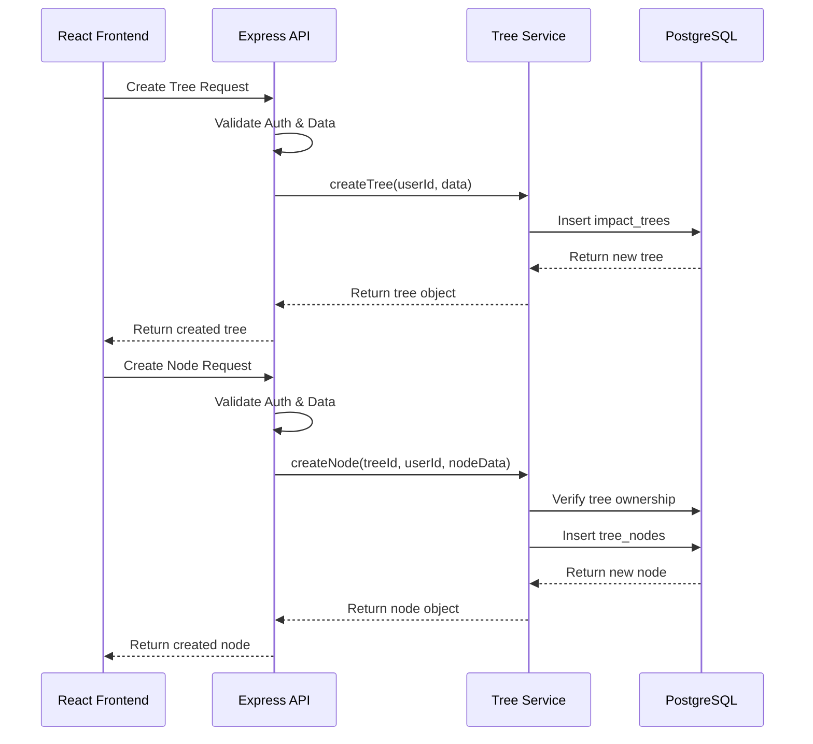

# 🔧 Tree and Node Data Persistence Implementation Plan

> **Detailed technical implementation plan for PostgreSQL backend with complete CRUD operations**
> **Priority**: Critical | **Complexity**: Medium | **Effort**: 40 hours

---

## 📋 **Implementation Overview**

### **Objective**
Implement complete PostgreSQL backend with Drizzle ORM for persistent storage of impact trees and nodes, enabling Product Managers to save, manage, and collaborate on strategic discovery work across sessions.

### **Current State**
Frontend-only impact tree system with no data persistence, preventing users from saving their strategic planning work or accessing trees across sessions.

### **Target State**
Fully persistent system with PostgreSQL backend, complete REST API, user isolation, and real-time synchronization between canvas state and database storage.

---

## 🎯 **Technical Requirements**

### **Frontend Requirements (React + TypeScript)**
- [ ] **API Integration**: TanStack Query for all CRUD operations
- [ ] **State Management**: Enhanced Zustand store with backend synchronization
- [ ] **Error Handling**: User-friendly error states and retry mechanisms
- [ ] **Loading States**: Proper loading indicators for all database operations

### **Backend Requirements (Node.js + Express)**
- [ ] **API Endpoints**: Complete REST API for trees and nodes
- [ ] **User Authorization**: Route-level protection and data isolation
- [ ] **Data Validation**: Zod schemas for all input validation
- [ ] **Error Handling**: Comprehensive error responses and logging

### **Database Requirements**
- [ ] **Schema Design**: PostgreSQL tables with proper relationships
- [ ] **Data Migration**: Drizzle migrations for schema management
- [ ] **Performance**: Indexes for efficient tree queries
- [ ] **Constraints**: Foreign key relationships and data integrity

---

## 🏗️ **Implementation Strategy**

### **Phase 1: Database Foundation (8 hours)**

#### **PostgreSQL Schema Design**
```sql
-- Users table (assuming exists from authentication)
CREATE TABLE users (
  id TEXT PRIMARY KEY,
  email TEXT NOT NULL UNIQUE,
  first_name TEXT,
  last_name TEXT,
  created_at TIMESTAMP WITH TIME ZONE DEFAULT NOW(),
  updated_at TIMESTAMP WITH TIME ZONE DEFAULT NOW()
);

-- Impact trees table
CREATE TABLE impact_trees (
  id SERIAL PRIMARY KEY,
  user_id TEXT NOT NULL REFERENCES users(id) ON DELETE CASCADE,
  name TEXT NOT NULL,
  description TEXT,
  canvas_state JSONB NOT NULL DEFAULT '{"zoom": 1, "pan": {"x": 0, "y": 0}, "orientation": "vertical"}',
  created_at TIMESTAMP WITH TIME ZONE DEFAULT NOW(),
  updated_at TIMESTAMP WITH TIME ZONE DEFAULT NOW()
);

-- Tree nodes table with adjacency list model
CREATE TABLE tree_nodes (
  id TEXT PRIMARY KEY,
  tree_id INTEGER NOT NULL REFERENCES impact_trees(id) ON DELETE CASCADE,
  parent_id TEXT REFERENCES tree_nodes(id) ON DELETE CASCADE,
  node_type TEXT NOT NULL CHECK (node_type IN ('objective', 'outcome', 'opportunity', 'solution', 'assumption', 'metric', 'research')),
  title TEXT NOT NULL,
  description TEXT,
  template_data JSONB DEFAULT '{}',
  position JSONB NOT NULL DEFAULT '{"x": 0, "y": 0}',
  metadata JSONB DEFAULT '{}',
  created_at TIMESTAMP WITH TIME ZONE DEFAULT NOW(),
  updated_at TIMESTAMP WITH TIME ZONE DEFAULT NOW()
);

-- Indexes for performance
CREATE INDEX idx_impact_trees_user_id ON impact_trees(user_id);
CREATE INDEX idx_tree_nodes_tree_id ON tree_nodes(tree_id);
CREATE INDEX idx_tree_nodes_parent_id ON tree_nodes(parent_id);
CREATE INDEX idx_tree_nodes_type ON tree_nodes(node_type);
```

#### **Drizzle ORM Schema Implementation**
```typescript
// server/db/schema.ts
import { pgTable, text, serial, integer, jsonb, timestamp, check } from "drizzle-orm/pg-core";
import { relations } from "drizzle-orm";

export const users = pgTable("users", {
  id: text("id").primaryKey(),
  email: text("email").notNull().unique(),
  firstName: text("first_name"),
  lastName: text("last_name"),
  createdAt: timestamp("created_at", { withTimezone: true }).defaultNow().notNull(),
  updatedAt: timestamp("updated_at", { withTimezone: true }).defaultNow().notNull(),
});

export const impactTrees = pgTable("impact_trees", {
  id: serial("id").primaryKey(),
  userId: text("user_id").notNull().references(() => users.id, { onDelete: "cascade" }),
  name: text("name").notNull(),
  description: text("description"),
  canvasState: jsonb("canvas_state").notNull().default('{"zoom": 1, "pan": {"x": 0, "y": 0}, "orientation": "vertical"}'),
  createdAt: timestamp("created_at", { withTimezone: true }).defaultNow().notNull(),
  updatedAt: timestamp("updated_at", { withTimezone: true }).defaultNow().notNull(),
});

export const treeNodes = pgTable("tree_nodes", {
  id: text("id").primaryKey(),
  treeId: integer("tree_id").notNull().references(() => impactTrees.id, { onDelete: "cascade" }),
  parentId: text("parent_id").references(() => treeNodes.id, { onDelete: "cascade" }),
  nodeType: text("node_type").notNull(),
  title: text("title").notNull(),
  description: text("description"),
  templateData: jsonb("template_data").default('{}'),
  position: jsonb("position").notNull().default('{"x": 0, "y": 0}'),
  metadata: jsonb("metadata").default('{}'),
  createdAt: timestamp("created_at", { withTimezone: true }).defaultNow().notNull(),
  updatedAt: timestamp("updated_at", { withTimezone: true }).defaultNow().notNull(),
}, (table) => ({
  nodeTypeCheck: check("node_type_check", 
    table.nodeType.in(['objective', 'outcome', 'opportunity', 'solution', 'assumption', 'metric', 'research'])
  ),
}));

// Relations
export const usersRelations = relations(users, ({ many }) => ({
  impactTrees: many(impactTrees),
}));

export const impactTreesRelations = relations(impactTrees, ({ one, many }) => ({
  user: one(users, {
    fields: [impactTrees.userId],
    references: [users.id],
  }),
  nodes: many(treeNodes),
}));

export const treeNodesRelations = relations(treeNodes, ({ one, many }) => ({
  tree: one(impactTrees, {
    fields: [treeNodes.treeId],
    references: [impactTrees.id],
  }),
  parent: one(treeNodes, {
    fields: [treeNodes.parentId],
    references: [treeNodes.id],
  }),
  children: many(treeNodes),
}));
```

### **Phase 2: Backend Services (12 hours)**

#### **Data Access Layer**
```typescript
// server/services/impact-tree-service.ts
import { eq, and, desc } from "drizzle-orm";
import { db } from "../db";
import { impactTrees, treeNodes } from "../db/schema";
import { ImpactTree, TreeNode } from "../../shared/schema";

export class ImpactTreeService {
  
  async getUserTrees(userId: string): Promise<ImpactTree[]> {
    const trees = await db
      .select()
      .from(impactTrees)
      .where(eq(impactTrees.userId, userId))
      .orderBy(desc(impactTrees.updatedAt));
    
    return trees.map(tree => ({
      id: tree.id,
      name: tree.name,
      description: tree.description,
      canvasState: tree.canvasState as any,
      nodes: [], // Loaded separately for performance
      createdAt: tree.createdAt.toISOString(),
      updatedAt: tree.updatedAt.toISOString(),
    }));
  }

  async getTreeWithNodes(treeId: number, userId: string): Promise<ImpactTree | null> {
    // First verify ownership
    const tree = await db
      .select()
      .from(impactTrees)
      .where(and(
        eq(impactTrees.id, treeId),
        eq(impactTrees.userId, userId)
      ))
      .limit(1);

    if (tree.length === 0) return null;

    // Get all nodes for this tree
    const nodes = await db
      .select()
      .from(treeNodes)
      .where(eq(treeNodes.treeId, treeId));

    return {
      id: tree[0].id,
      name: tree[0].name,
      description: tree[0].description,
      canvasState: tree[0].canvasState as any,
      nodes: nodes.map(node => ({
        id: node.id,
        type: node.nodeType as any,
        title: node.title,
        description: node.description,
        templateData: node.templateData as any,
        position: node.position as any,
        parentId: node.parentId || undefined,
        metadata: node.metadata as any,
      })),
      createdAt: tree[0].createdAt.toISOString(),
      updatedAt: tree[0].updatedAt.toISOString(),
    };
  }

  async createTree(userId: string, data: {
    name: string;
    description?: string;
  }): Promise<ImpactTree> {
    const [newTree] = await db
      .insert(impactTrees)
      .values({
        userId,
        name: data.name,
        description: data.description,
        canvasState: {
          zoom: 1,
          pan: { x: 0, y: 0 },
          orientation: "vertical"
        },
      })
      .returning();

    return {
      id: newTree.id,
      name: newTree.name,
      description: newTree.description,
      canvasState: newTree.canvasState as any,
      nodes: [],
      createdAt: newTree.createdAt.toISOString(),
      updatedAt: newTree.updatedAt.toISOString(),
    };
  }

  async updateTree(treeId: number, userId: string, updates: {
    name?: string;
    description?: string;
    canvasState?: any;
  }): Promise<ImpactTree | null> {
    const [updatedTree] = await db
      .update(impactTrees)
      .set({
        ...updates,
        updatedAt: new Date(),
      })
      .where(and(
        eq(impactTrees.id, treeId),
        eq(impactTrees.userId, userId)
      ))
      .returning();

    if (!updatedTree) return null;

    // Get nodes for complete response
    const nodes = await db
      .select()
      .from(treeNodes)
      .where(eq(treeNodes.treeId, treeId));

    return {
      id: updatedTree.id,
      name: updatedTree.name,
      description: updatedTree.description,
      canvasState: updatedTree.canvasState as any,
      nodes: nodes.map(node => ({
        id: node.id,
        type: node.nodeType as any,
        title: node.title,
        description: node.description,
        templateData: node.templateData as any,
        position: node.position as any,
        parentId: node.parentId || undefined,
        metadata: node.metadata as any,
      })),
      createdAt: updatedTree.createdAt.toISOString(),
      updatedAt: updatedTree.updatedAt.toISOString(),
    };
  }

  async deleteTree(treeId: number, userId: string): Promise<boolean> {
    const result = await db
      .delete(impactTrees)
      .where(and(
        eq(impactTrees.id, treeId),
        eq(impactTrees.userId, userId)
      ))
      .returning();

    return result.length > 0;
  }

  async createNode(treeId: number, userId: string, nodeData: {
    id: string;
    type: string;
    title: string;
    description?: string;
    templateData?: any;
    position: { x: number; y: number };
    parentId?: string;
    metadata?: any;
  }): Promise<TreeNode | null> {
    // Verify tree ownership
    const treeOwnership = await db
      .select({ id: impactTrees.id })
      .from(impactTrees)
      .where(and(
        eq(impactTrees.id, treeId),
        eq(impactTrees.userId, userId)
      ))
      .limit(1);

    if (treeOwnership.length === 0) return null;

    const [newNode] = await db
      .insert(treeNodes)
      .values({
        id: nodeData.id,
        treeId,
        parentId: nodeData.parentId,
        nodeType: nodeData.type,
        title: nodeData.title,
        description: nodeData.description,
        templateData: nodeData.templateData || {},
        position: nodeData.position,
        metadata: nodeData.metadata || {},
      })
      .returning();

    return {
      id: newNode.id,
      type: newNode.nodeType as any,
      title: newNode.title,
      description: newNode.description,
      templateData: newNode.templateData as any,
      position: newNode.position as any,
      parentId: newNode.parentId || undefined,
      metadata: newNode.metadata as any,
    };
  }

  async updateNode(treeId: number, nodeId: string, userId: string, updates: {
    title?: string;
    description?: string;
    templateData?: any;
    position?: { x: number; y: number };
    parentId?: string;
    metadata?: any;
  }): Promise<TreeNode | null> {
    // Verify tree ownership and node existence
    const nodeExists = await db
      .select({ id: treeNodes.id })
      .from(treeNodes)
      .innerJoin(impactTrees, eq(treeNodes.treeId, impactTrees.id))
      .where(and(
        eq(treeNodes.id, nodeId),
        eq(treeNodes.treeId, treeId),
        eq(impactTrees.userId, userId)
      ))
      .limit(1);

    if (nodeExists.length === 0) return null;

    const [updatedNode] = await db
      .update(treeNodes)
      .set({
        ...updates,
        updatedAt: new Date(),
      })
      .where(eq(treeNodes.id, nodeId))
      .returning();

    return {
      id: updatedNode.id,
      type: updatedNode.nodeType as any,
      title: updatedNode.title,
      description: updatedNode.description,
      templateData: updatedNode.templateData as any,
      position: updatedNode.position as any,
      parentId: updatedNode.parentId || undefined,
      metadata: updatedNode.metadata as any,
    };
  }

  async deleteNode(treeId: number, nodeId: string, userId: string): Promise<boolean> {
    // Verify tree ownership and node existence
    const nodeExists = await db
      .select({ id: treeNodes.id })
      .from(treeNodes)
      .innerJoin(impactTrees, eq(treeNodes.treeId, impactTrees.id))
      .where(and(
        eq(treeNodes.id, nodeId),
        eq(treeNodes.treeId, treeId),
        eq(impactTrees.userId, userId)
      ))
      .limit(1);

    if (nodeExists.length === 0) return false;

    const result = await db
      .delete(treeNodes)
      .where(eq(treeNodes.id, nodeId))
      .returning();

    return result.length > 0;
  }
}
```

### **Phase 3: API Endpoints (8 hours)**

#### **Express Route Implementation**
```typescript
// server/routes/impact-trees.ts
import express from 'express';
import { z } from 'zod';
import { ImpactTreeService } from '../services/impact-tree-service';
import { requireAuth } from '../middleware/auth';

const router = express.Router();
const treeService = new ImpactTreeService();

// Validation schemas
const createTreeSchema = z.object({
  name: z.string().min(1).max(255),
  description: z.string().optional(),
});

const updateTreeSchema = z.object({
  name: z.string().min(1).max(255).optional(),
  description: z.string().optional(),
  canvasState: z.object({
    zoom: z.number(),
    pan: z.object({
      x: z.number(),
      y: z.number(),
    }),
    orientation: z.enum(['vertical', 'horizontal']).optional(),
  }).optional(),
});

const createNodeSchema = z.object({
  id: z.string(),
  type: z.enum(['objective', 'outcome', 'opportunity', 'solution', 'assumption', 'metric', 'research']),
  title: z.string().min(1).max(255),
  description: z.string().optional(),
  templateData: z.record(z.any()).optional(),
  position: z.object({
    x: z.number(),
    y: z.number(),
  }),
  parentId: z.string().optional(),
  metadata: z.record(z.any()).optional(),
});

const updateNodeSchema = z.object({
  title: z.string().min(1).max(255).optional(),
  description: z.string().optional(),
  templateData: z.record(z.any()).optional(),
  position: z.object({
    x: z.number(),
    y: z.number(),
  }).optional(),
  parentId: z.string().optional(),
  metadata: z.record(z.any()).optional(),
});

// Get all trees for user
router.get('/api/impact-trees', requireAuth, async (req, res) => {
  try {
    const trees = await treeService.getUserTrees(req.user.id);
    res.json(trees);
  } catch (error) {
    console.error('Error fetching trees:', error);
    res.status(500).json({ message: 'Failed to fetch trees' });
  }
});

// Get specific tree with nodes
router.get('/api/impact-trees/:id', requireAuth, async (req, res) => {
  try {
    const treeId = parseInt(req.params.id);
    if (isNaN(treeId)) {
      return res.status(400).json({ message: 'Invalid tree ID' });
    }

    const tree = await treeService.getTreeWithNodes(treeId, req.user.id);
    if (!tree) {
      return res.status(404).json({ message: 'Tree not found' });
    }

    res.json(tree);
  } catch (error) {
    console.error('Error fetching tree:', error);
    res.status(500).json({ message: 'Failed to fetch tree' });
  }
});

// Create new tree
router.post('/api/impact-trees', requireAuth, async (req, res) => {
  try {
    const validatedData = createTreeSchema.parse(req.body);
    const tree = await treeService.createTree(req.user.id, validatedData);
    res.status(201).json(tree);
  } catch (error) {
    if (error instanceof z.ZodError) {
      return res.status(400).json({ message: 'Invalid data', errors: error.errors });
    }
    console.error('Error creating tree:', error);
    res.status(500).json({ message: 'Failed to create tree' });
  }
});

// Update tree
router.put('/api/impact-trees/:id', requireAuth, async (req, res) => {
  try {
    const treeId = parseInt(req.params.id);
    if (isNaN(treeId)) {
      return res.status(400).json({ message: 'Invalid tree ID' });
    }

    const validatedData = updateTreeSchema.parse(req.body);
    const tree = await treeService.updateTree(treeId, req.user.id, validatedData);
    
    if (!tree) {
      return res.status(404).json({ message: 'Tree not found' });
    }

    res.json(tree);
  } catch (error) {
    if (error instanceof z.ZodError) {
      return res.status(400).json({ message: 'Invalid data', errors: error.errors });
    }
    console.error('Error updating tree:', error);
    res.status(500).json({ message: 'Failed to update tree' });
  }
});

// Delete tree
router.delete('/api/impact-trees/:id', requireAuth, async (req, res) => {
  try {
    const treeId = parseInt(req.params.id);
    if (isNaN(treeId)) {
      return res.status(400).json({ message: 'Invalid tree ID' });
    }

    const deleted = await treeService.deleteTree(treeId, req.user.id);
    if (!deleted) {
      return res.status(404).json({ message: 'Tree not found' });
    }

    res.status(204).send();
  } catch (error) {
    console.error('Error deleting tree:', error);
    res.status(500).json({ message: 'Failed to delete tree' });
  }
});

// Create node
router.post('/api/impact-trees/:id/nodes', requireAuth, async (req, res) => {
  try {
    const treeId = parseInt(req.params.id);
    if (isNaN(treeId)) {
      return res.status(400).json({ message: 'Invalid tree ID' });
    }

    const validatedData = createNodeSchema.parse(req.body);
    const node = await treeService.createNode(treeId, req.user.id, validatedData);
    
    if (!node) {
      return res.status(404).json({ message: 'Tree not found' });
    }

    res.status(201).json(node);
  } catch (error) {
    if (error instanceof z.ZodError) {
      return res.status(400).json({ message: 'Invalid data', errors: error.errors });
    }
    console.error('Error creating node:', error);
    res.status(500).json({ message: 'Failed to create node' });
  }
});

// Update node
router.put('/api/impact-trees/:id/nodes/:nodeId', requireAuth, async (req, res) => {
  try {
    const treeId = parseInt(req.params.id);
    const nodeId = req.params.nodeId;
    
    if (isNaN(treeId)) {
      return res.status(400).json({ message: 'Invalid tree ID' });
    }

    const validatedData = updateNodeSchema.parse(req.body);
    const node = await treeService.updateNode(treeId, nodeId, req.user.id, validatedData);
    
    if (!node) {
      return res.status(404).json({ message: 'Node not found' });
    }

    res.json(node);
  } catch (error) {
    if (error instanceof z.ZodError) {
      return res.status(400).json({ message: 'Invalid data', errors: error.errors });
    }
    console.error('Error updating node:', error);
    res.status(500).json({ message: 'Failed to update node' });
  }
});

// Delete node
router.delete('/api/impact-trees/:id/nodes/:nodeId', requireAuth, async (req, res) => {
  try {
    const treeId = parseInt(req.params.id);
    const nodeId = req.params.nodeId;
    
    if (isNaN(treeId)) {
      return res.status(400).json({ message: 'Invalid tree ID' });
    }

    const deleted = await treeService.deleteNode(treeId, nodeId, req.user.id);
    if (!deleted) {
      return res.status(404).json({ message: 'Node not found' });
    }

    res.status(204).send();
  } catch (error) {
    console.error('Error deleting node:', error);
    res.status(500).json({ message: 'Failed to delete node' });
  }
});

export default router;
```

### **Phase 4: Frontend Integration (12 hours)**

#### **Enhanced API Service**
```typescript
// client/src/services/api.ts
import { useQuery, useMutation, useQueryClient } from '@tanstack/react-query';
import { ImpactTree, TreeNode } from '../../../shared/schema';

const API_BASE = '/api';

// Tree API functions
export const treeApi = {
  getTrees: async (): Promise<ImpactTree[]> => {
    const response = await fetch(`${API_BASE}/impact-trees`);
    if (!response.ok) throw new Error('Failed to fetch trees');
    return response.json();
  },

  getTree: async (id: number): Promise<ImpactTree> => {
    const response = await fetch(`${API_BASE}/impact-trees/${id}`);
    if (!response.ok) throw new Error('Failed to fetch tree');
    return response.json();
  },

  createTree: async (data: { name: string; description?: string }): Promise<ImpactTree> => {
    const response = await fetch(`${API_BASE}/impact-trees`, {
      method: 'POST',
      headers: { 'Content-Type': 'application/json' },
      body: JSON.stringify(data),
    });
    if (!response.ok) throw new Error('Failed to create tree');
    return response.json();
  },

  updateTree: async (id: number, data: Partial<ImpactTree>): Promise<ImpactTree> => {
    const response = await fetch(`${API_BASE}/impact-trees/${id}`, {
      method: 'PUT',
      headers: { 'Content-Type': 'application/json' },
      body: JSON.stringify(data),
    });
    if (!response.ok) throw new Error('Failed to update tree');
    return response.json();
  },

  deleteTree: async (id: number): Promise<void> => {
    const response = await fetch(`${API_BASE}/impact-trees/${id}`, {
      method: 'DELETE',
    });
    if (!response.ok) throw new Error('Failed to delete tree');
  },

  createNode: async (treeId: number, nodeData: Omit<TreeNode, 'id'> & { id: string }): Promise<TreeNode> => {
    const response = await fetch(`${API_BASE}/impact-trees/${treeId}/nodes`, {
      method: 'POST',
      headers: { 'Content-Type': 'application/json' },
      body: JSON.stringify(nodeData),
    });
    if (!response.ok) throw new Error('Failed to create node');
    return response.json();
  },

  updateNode: async (treeId: number, nodeId: string, data: Partial<TreeNode>): Promise<TreeNode> => {
    const response = await fetch(`${API_BASE}/impact-trees/${treeId}/nodes/${nodeId}`, {
      method: 'PUT',
      headers: { 'Content-Type': 'application/json' },
      body: JSON.stringify(data),
    });
    if (!response.ok) throw new Error('Failed to update node');
    return response.json();
  },

  deleteNode: async (treeId: number, nodeId: string): Promise<void> => {
    const response = await fetch(`${API_BASE}/impact-trees/${treeId}/nodes/${nodeId}`, {
      method: 'DELETE',
    });
    if (!response.ok) throw new Error('Failed to delete node');
  },
};

// React Query hooks
export const useImpactTrees = () => {
  return useQuery({
    queryKey: ['/api/impact-trees'],
    queryFn: treeApi.getTrees,
  });
};

export const useImpactTree = (id: number | null) => {
  return useQuery({
    queryKey: ['/api/impact-trees', id],
    queryFn: () => id ? treeApi.getTree(id) : Promise.resolve(null),
    enabled: !!id,
  });
};

export const useCreateTree = () => {
  const queryClient = useQueryClient();
  
  return useMutation({
    mutationFn: treeApi.createTree,
    onSuccess: () => {
      queryClient.invalidateQueries({ queryKey: ['/api/impact-trees'] });
    },
  });
};

export const useUpdateTree = () => {
  const queryClient = useQueryClient();
  
  return useMutation({
    mutationFn: ({ id, data }: { id: number; data: Partial<ImpactTree> }) =>
      treeApi.updateTree(id, data),
    onSuccess: (_, { id }) => {
      queryClient.invalidateQueries({ queryKey: ['/api/impact-trees'] });
      queryClient.invalidateQueries({ queryKey: ['/api/impact-trees', id] });
    },
  });
};

export const useDeleteTree = () => {
  const queryClient = useQueryClient();
  
  return useMutation({
    mutationFn: treeApi.deleteTree,
    onSuccess: () => {
      queryClient.invalidateQueries({ queryKey: ['/api/impact-trees'] });
    },
  });
};

export const useCreateNode = () => {
  const queryClient = useQueryClient();
  
  return useMutation({
    mutationFn: ({ treeId, nodeData }: { treeId: number; nodeData: Omit<TreeNode, 'id'> & { id: string } }) =>
      treeApi.createNode(treeId, nodeData),
    onSuccess: (_, { treeId }) => {
      queryClient.invalidateQueries({ queryKey: ['/api/impact-trees', treeId] });
    },
  });
};

export const useUpdateNode = () => {
  const queryClient = useQueryClient();
  
  return useMutation({
    mutationFn: ({ treeId, nodeId, data }: { treeId: number; nodeId: string; data: Partial<TreeNode> }) =>
      treeApi.updateNode(treeId, nodeId, data),
    onSuccess: (_, { treeId }) => {
      queryClient.invalidateQueries({ queryKey: ['/api/impact-trees', treeId] });
    },
  });
};

export const useDeleteNode = () => {
  const queryClient = useQueryClient();
  
  return useMutation({
    mutationFn: ({ treeId, nodeId }: { treeId: number; nodeId: string }) =>
      treeApi.deleteNode(treeId, nodeId),
    onSuccess: (_, { treeId }) => {
      queryClient.invalidateQueries({ queryKey: ['/api/impact-trees', treeId] });
    },
  });
};
```

---

## 🧪 **Testing Strategy**

### **Frontend Testing**
- [ ] **API Integration Tests**: Mock server responses and test TanStack Query integration
- [ ] **State Management Tests**: Verify Zustand store updates with backend sync
- [ ] **Error Handling Tests**: Network failures, unauthorized access, validation errors
- [ ] **Loading States Tests**: Proper loading indicators during API operations

### **Backend Testing**
- [ ] **Unit Tests**: Service layer methods with database mocking
- [ ] **API Integration Tests**: All endpoints with proper authorization testing
- [ ] **Database Tests**: Drizzle ORM operations and constraint validation
- [ ] **Security Tests**: User isolation and authorization bypass attempts

### **End-to-End Testing**
- [ ] **Complete Workflows**: Tree creation, node management, data persistence
- [ ] **Multi-User Testing**: User isolation and concurrent access scenarios
- [ ] **Performance Testing**: Large tree handling and query optimization
- [ ] **Data Integrity**: Verify no data loss during operations

---

## 📋 **Deployment Checklist**

### **Pre-Deployment**
- [ ] **Database migrations** prepared and tested in staging
- [ ] **API endpoints** thoroughly tested with proper authorization
- [ ] **Frontend integration** completed and validated
- [ ] **Performance benchmarks** established for tree operations

### **Deployment**
- [ ] **Database schema** applied to production PostgreSQL
- [ ] **Backend services** deployed with new API endpoints
- [ ] **Frontend build** deployed with API integration
- [ ] **Environment variables** configured for database connection

### **Post-Deployment**
- [ ] **Health checks** verify all API endpoints respond correctly
- [ ] **User data migration** completed if needed
- [ ] **Performance monitoring** confirms acceptable response times
- [ ] **User acceptance testing** completed with PM feedback

---

## 🎓 **Developer Learning Guide**

### **📚 Implementation Concepts**
This implementation creates the foundational persistence layer for the AI-Native Impact Tree, enabling Product Managers to save and manage their strategic discovery work. The architecture uses PostgreSQL with an adjacency list model for efficient tree hierarchy storage, combined with JSONB for flexible template data.

The system prioritizes user data isolation and provides a complete REST API for frontend integration. Every database operation includes proper authorization to ensure users can only access their own trees and nodes.

### **🏗️ Architecture Flow**


### **🔄 Step-by-Step Breakdown**
1. **Database Schema**: PostgreSQL tables with proper foreign key relationships
2. **Service Layer**: Business logic with user authorization and data validation
3. **API Endpoints**: RESTful routes with Zod validation and error handling
4. **Frontend Integration**: TanStack Query hooks for seamless data synchronization
5. **User Isolation**: Every operation validates user ownership before data access
6. **Error Handling**: Comprehensive error responses for all failure scenarios

### **⚠️ Implementation Pitfalls**
- **User Authorization**: Every database query must include user ID filtering
- **Foreign Key Constraints**: Proper cascade deletes prevent orphaned data
- **JSONB Performance**: Index JSONB fields used in queries for better performance
- **Concurrent Access**: Handle simultaneous edits with proper error responses
- **Data Migration**: Existing frontend state must migrate to new API structure
- **API Response Size**: Large trees may need pagination or lazy loading

### **🔗 Learning Resources**
- **PostgreSQL Adjacency List**: Hierarchical data storage patterns
- **Drizzle ORM Relations**: Type-safe foreign key relationships
- **Express.js Authorization**: Route-level security middleware patterns
- **TanStack Query**: React state synchronization with server data
- **Zod Validation**: Runtime type checking for API inputs
- **RESTful API Design**: Resource-based URL design principles

### **🎯 Key Takeaways**
- User data isolation is critical for multi-tenant tree management
- JSONB enables flexible template storage while maintaining query performance
- Proper foreign key constraints ensure data integrity across tree operations
- TanStack Query provides optimal frontend-backend synchronization
- All API endpoints must validate both authentication and authorization
- Database schema should support PM workflow patterns and future feature growth

---

## 📊 **Success Metrics**

### **Technical Metrics**
- [ ] **API Response Times**: <200ms for tree operations, <100ms for node operations
- [ ] **Database Performance**: Optimized queries handle 1000+ node trees efficiently
- [ ] **Error Rate**: <1% API error rate under normal operation
- [ ] **Data Integrity**: Zero data loss incidents during all operations

### **Business Metrics**
- [ ] **PM Adoption**: 100% of PMs successfully save and retrieve their trees
- [ ] **Tree Persistence**: 100% successful tree save/load operations
- [ ] **User Satisfaction**: Seamless experience with no visible performance impact
- [ ] **Collaboration**: Multiple users can access and manage their individual trees

---

**📝 Implementation Plan Version**: 1.0  
**🎯 Estimated Completion**: 5 days  
**📅 Created**: January 2025  
**👤 Implementation Team**: Full-Stack Development Team  
**📊 Status**: 📋 Planning
