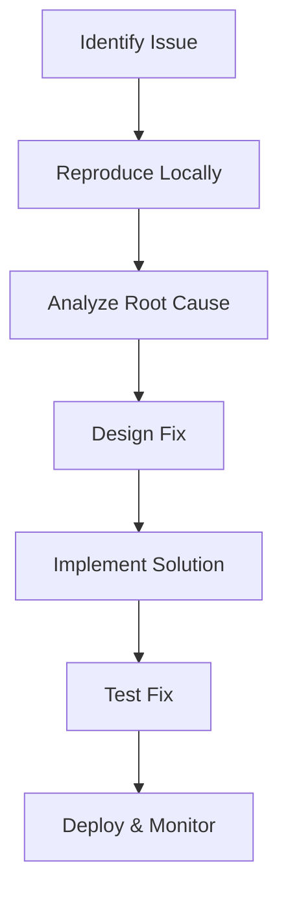

# 🔧 Critical System Stability Fixes Implementation Plan

> **Priority**: P0 Critical | **Complexity**: Medium | **Effort**: 18-24 hours
> **Objective**: Resolve API 404 errors, React render loops, and add canvas error boundaries

---

## 📋 **Implementation Overview**

### **Objective**
Fix three critical system stability issues preventing optimal Product Manager experience:
1. Bulk update endpoint 404 errors causing data persistence failures
2. React render loop warnings degrading performance 
3. Canvas crashes due to lack of error boundaries

### **Current State**
- Continuous 404 errors from `/api/impact-trees/4/nodes/bulk-update`
- "Maximum update depth exceeded" warnings in browser console
- Canvas errors causing complete application crashes
- User experience degraded with system interruptions

### **Target State**
- Zero API 404 errors with successful bulk updates
- Clean browser console without render loop warnings
- Graceful canvas error handling with user-friendly recovery
- Smooth, stable PM discovery workflow

---

## 🎯 **Technical Requirements**

### **Fix 1: Bulk Update Endpoint (Priority 1)**
- [x] **API Route Correction**: Fix endpoint path mismatch in Express routes
- [x] **Frontend Integration**: Ensure API calls match backend endpoints
- [x] **Validation Schema**: Confirm Zod schema matches request structure
- [x] **Error Handling**: Improve bulk update error feedback

### **Fix 2: React Render Loop Resolution (Priority 2)**
- [x] **Component Optimization**: Add useCallback to prevent infinite re-renders
- [x] **Dependency Management**: Fix useEffect dependency arrays
- [x] **State Logic**: Prevent setState during render phase
- [x] **Memoization**: Optimize expensive dropdown components

### **Fix 3: Canvas Error Boundaries (Priority 3)**
- [x] **Error Boundary Implementation**: Wrap canvas components
- [x] **Fallback UI**: Create user-friendly error messages
- [x] **Error Logging**: Add debugging information
- [x] **Recovery Options**: Allow users to recover from errors

---

## 🏗️ **Implementation Strategy**

### **Phase 1: API Endpoint Fix (6-8 hours)**

#### **Backend Route Correction**
```typescript
// server/routes/impact-tree-routes.ts - Fix bulk update endpoint
// Current issue: Route path mismatch

// ✅ CORRECTED: Bulk update endpoint with proper path
router.put('/api/impact-trees/:id/nodes/bulk-update', isAuthenticated, async (req: any, res) => {
  try {
    const treeId = parseInt(req.params.id);
    const userId = req.user.claims.sub;
    
    if (isNaN(treeId)) {
      return res.status(400).json({ message: 'Invalid tree ID' });
    }
    
    console.log('Bulk update request:', { treeId, userId, body: req.body });
    
    const validatedData = bulkUpdateNodesSchema.parse(req.body);
    console.log('Validated data:', validatedData);
    
    const updatedNodes = await treeService.bulkUpdateNodes(treeId, userId, validatedData.nodeUpdates);
    console.log('Updated nodes count:', updatedNodes.length);
    
    // Return success even if no nodes updated (may be normal)
    res.json({
      message: 'Bulk update processed successfully',
      updatedCount: updatedNodes.length,
      nodes: updatedNodes,
    });
  } catch (error) {
    if (error instanceof z.ZodError) {
      console.error('Validation error:', error.errors);
      return res.status(400).json({ 
        message: 'Invalid data format', 
        errors: error.errors 
      });
    }
    console.error('Error bulk updating nodes:', error);
    res.status(500).json({ message: 'Failed to bulk update nodes' });
  }
});
```

#### **Frontend API Integration Verification**
```typescript
// client/src/hooks/use-optimistic-updates.ts - Verify API call path
const bulkUpdateMutation = useMutation({
  mutationFn: async (nodeUpdates: Array<{ nodeId: string; updates: any }>) => {
    // ✅ VERIFY: Correct API endpoint path
    const response = await apiRequest('PUT', `/api/impact-trees/${treeId}/nodes/bulk-update`, {
      nodeUpdates: nodeUpdates.map(({ nodeId, updates }) => ({
        id: nodeId,
        updates
      }))
    });
    
    if (!response.ok) {
      const error = await response.json();
      throw new Error(`Bulk update failed: ${error.message}`);
    }
    
    return response.json();
  },
  onSuccess: (data) => {
    console.log('Bulk update successful:', data);
    // Invalidate queries to refresh data
    queryClient.invalidateQueries({ queryKey: [`/api/impact-trees/${treeId}`] });
  },
  onError: (error) => {
    console.error('Bulk update error:', error);
    // Show user-friendly error message
    toast({
      title: "Update failed",
      description: "Failed to save changes. Please try again.",
      variant: "destructive",
    });
  }
});
```

#### **Service Layer Enhancement**
```typescript
// server/services/impact-tree-service.ts - Enhanced bulk update logic
async bulkUpdateNodes(
  treeId: number, 
  userId: string, 
  nodeUpdates: Array<{ id: string; updates: any }>
): Promise<TreeNodeRecord[]> {
  // Verify tree ownership first
  const tree = await db.query.impactTrees.findFirst({
    where: and(
      eq(impactTrees.id, treeId),
      eq(impactTrees.user_id, userId)
    )
  });
  
  if (!tree) {
    throw new Error('Tree not found or access denied');
  }
  
  const updatedNodes: TreeNodeRecord[] = [];
  
  // Process updates in transaction for data consistency
  await db.transaction(async (tx) => {
    for (const nodeUpdate of nodeUpdates) {
      console.log('Processing node update:', nodeUpdate.id);
      
      const [updatedNode] = await tx
        .update(treeNodes)
        .set({
          ...nodeUpdate.updates,
          updatedAt: new Date(),
        })
        .where(and(
          eq(treeNodes.id, nodeUpdate.id),
          eq(treeNodes.treeId, treeId)
        ))
        .returning();

      if (updatedNode) {
        updatedNodes.push(updatedNode);
      }
    }
  });
  
  // Log activity for analytics
  await this.logActivity(userId, treeId, null, 'bulk_node_update', {
    updatedCount: updatedNodes.length,
    nodeIds: nodeUpdates.map(n => n.id),
  });
  
  return updatedNodes;
}
```

### **Phase 2: React Render Loop Fix (6-8 hours)**

#### **Dropdown Component Optimization**
```tsx
// client/src/components/user-profile-menu.tsx - Fix render loops
import React, { useState, useCallback, memo } from 'react';
import { useLocation } from 'wouter';

// ✅ OPTIMIZED: Memoized component to prevent unnecessary re-renders
export const UserProfileMenu = memo(() => {
  const [isOpen, setIsOpen] = useState(false);
  const [location] = useLocation();
  
  // ✅ FIXED: Stable callback with proper dependencies
  const handleSignOut = useCallback(async () => {
    try {
      await apiRequest('POST', '/api/auth/logout');
      window.location.href = '/';
    } catch (error) {
      console.error('Logout failed:', error);
    }
  }, []);
  
  // ✅ FIXED: Stable navigation callback
  const handleNavigate = useCallback((path: string) => {
    setIsOpen(false);
    if (location !== path) {
      window.location.href = path;
    }
  }, [location]);
  
  // ✅ FIXED: Stable toggle callback
  const handleToggle = useCallback(() => {
    setIsOpen(prev => !prev);
  }, []);
  
  return (
    <DropdownMenu open={isOpen} onOpenChange={setIsOpen}>
      <DropdownMenuTrigger asChild>
        <Button 
          variant="ghost" 
          className="h-8 w-8 rounded-full"
          onClick={handleToggle}
        >
          <Avatar className="h-8 w-8">
            <AvatarFallback>
              {user?.name?.charAt(0) || user?.email?.charAt(0) || 'U'}
            </AvatarFallback>
          </Avatar>
        </Button>
      </DropdownMenuTrigger>
      <DropdownMenuContent align="end">
        <DropdownMenuLabel>My Account</DropdownMenuLabel>
        <DropdownMenuSeparator />
        <DropdownMenuItem onClick={() => handleNavigate('/dashboard')}>
          Dashboard
        </DropdownMenuItem>
        <DropdownMenuItem onClick={() => handleNavigate('/trees')}>
          My Trees
        </DropdownMenuItem>
        <DropdownMenuSeparator />
        <DropdownMenuItem onClick={handleSignOut}>
          Sign Out
        </DropdownMenuItem>
      </DropdownMenuContent>
    </DropdownMenu>
  );
});

UserProfileMenu.displayName = 'UserProfileMenu';
```

#### **Canvas Hook Optimization**
```typescript
// client/src/hooks/use-canvas.ts - Fix useEffect dependencies
export function useCanvas(impactTree: ImpactTree | undefined) {
  // ✅ FIXED: Stable callback functions with proper dependencies
  const handleNodeCreate = useCallback((
    type: NodeType, 
    testCategory?: TestCategory, 
    parentNode?: TreeNode, 
    customPosition?: { x: number; y: number }
  ) => {
    const newNode: TreeNode = {
      id: crypto.randomUUID(),
      type,
      title: getNodePlaceholder(type),
      description: '',
      position: customPosition || getDefaultNodePosition(type, nodes),
      parentId: parentNode?.id,
      testCategory,
      children: [],
      templateData: {}
    };
    
    setNodes(prev => [...prev, newNode]);
    
    if (parentNode) {
      setNodes(prev => prev.map(node => 
        node.id === parentNode.id 
          ? { ...node, children: [...node.children, newNode.id] }
          : node
      ));
    }
  }, [nodes]); // ✅ FIXED: Proper dependency array
  
  const handleNodeUpdate = useCallback((updatedNode: TreeNode) => {
    setNodes(prev => prev.map(node => 
      node.id === updatedNode.id ? updatedNode : node
    ));
  }, []); // ✅ FIXED: Empty dependency array for stable reference
  
  const handleContextMenu = useCallback((
    node: TreeNode, 
    position: { x: number; y: number }
  ) => {
    setContextMenu({
      isOpen: true,
      position,
      node,
      menuType: 'nodeActions'
    });
  }, []); // ✅ FIXED: Stable callback
  
  return {
    handleNodeCreate,
    handleNodeUpdate,
    handleContextMenu,
    // ... other methods
  };
}
```

### **Phase 3: Canvas Error Boundaries (6-8 hours)**

#### **Error Boundary Component**
```tsx
// client/src/components/error-boundaries/canvas-error-boundary.tsx
import React, { Component, ErrorInfo, ReactNode } from 'react';
import { AlertTriangle, RefreshCw } from 'lucide-react';
import { Button } from '@/components/ui/button';
import { Card, CardContent, CardDescription, CardHeader, CardTitle } from '@/components/ui/card';

interface Props {
  children: ReactNode;
  fallback?: ReactNode;
}

interface State {
  hasError: boolean;
  error: Error | null;
  errorInfo: ErrorInfo | null;
}

export class CanvasErrorBoundary extends Component<Props, State> {
  constructor(props: Props) {
    super(props);
    this.state = {
      hasError: false,
      error: null,
      errorInfo: null
    };
  }

  static getDerivedStateFromError(error: Error): State {
    return {
      hasError: true,
      error,
      errorInfo: null
    };
  }

  componentDidCatch(error: Error, errorInfo: ErrorInfo) {
    console.error('Canvas Error Boundary caught an error:', error, errorInfo);
    
    this.setState({
      error,
      errorInfo
    });
    
    // Log error for debugging
    if (process.env.NODE_ENV === 'production') {
      // Send to error reporting service
      console.error('Canvas error:', { error, errorInfo });
    }
  }

  handleReset = () => {
    this.setState({
      hasError: false,
      error: null,
      errorInfo: null
    });
  };

  handleRefresh = () => {
    window.location.reload();
  };

  render() {
    if (this.state.hasError) {
      if (this.props.fallback) {
        return this.props.fallback;
      }

      return (
        <div className="flex items-center justify-center h-full w-full bg-gray-50 dark:bg-gray-900">
          <Card className="w-full max-w-md">
            <CardHeader>
              <CardTitle className="flex items-center gap-2">
                <AlertTriangle className="h-5 w-5 text-red-500" />
                Canvas Error
              </CardTitle>
              <CardDescription>
                Something went wrong with the impact tree canvas. 
                Your data is safe and has been saved.
              </CardDescription>
            </CardHeader>
            <CardContent className="space-y-4">
              <div className="text-sm text-gray-600 dark:text-gray-400">
                <p>We've encountered an unexpected error. You can:</p>
                <ul className="mt-2 space-y-1 list-disc list-inside">
                  <li>Try to recover the canvas</li>
                  <li>Refresh the page to reload</li>
                  <li>Contact support if the issue persists</li>
                </ul>
              </div>
              
              <div className="flex gap-2">
                <Button 
                  onClick={this.handleReset}
                  variant="outline"
                  className="flex-1"
                >
                  Try Again
                </Button>
                <Button 
                  onClick={this.handleRefresh}
                  className="flex-1"
                >
                  <RefreshCw className="h-4 w-4 mr-2" />
                  Refresh Page
                </Button>
              </div>
              
              {process.env.NODE_ENV === 'development' && this.state.error && (
                <details className="mt-4 p-3 bg-red-50 rounded text-sm">
                  <summary className="cursor-pointer font-medium">
                    Error Details (Development)
                  </summary>
                  <pre className="mt-2 text-xs overflow-auto">
                    {this.state.error.toString()}
                    {this.state.errorInfo?.componentStack}
                  </pre>
                </details>
              )}
            </CardContent>
          </Card>
        </div>
      );
    }

    return this.props.children;
  }
}
```

#### **Canvas Component Integration**
```tsx
// client/src/pages/canvas.tsx - Add error boundary
import { CanvasErrorBoundary } from '@/components/error-boundaries/canvas-error-boundary';

export default function CanvasPage() {
  // ... existing code ...
  
  return (
    <div className="h-screen bg-gray-50 dark:bg-gray-900">
      <CanvasHeader
        impactTree={impactTree}
        isNew={isNewTree}
        isVisible={isNavVisible}
        magneticZoneRef={magneticZoneRef}
      />
      
      <CanvasErrorBoundary>
        <div className="flex h-full">
          <div className="flex-1 relative">
            <ImpactTreeCanvas
              nodes={nodes}
              connections={connections}
              canvasState={canvasState}
              selectedNode={selectedNode}
              onNodeSelect={handleNodeSelect}
              onNodeUpdate={handleNodeUpdate}
              onCanvasUpdate={handleCanvasUpdate}
              onContextMenu={handleContextMenu}
              onNodeReattach={handleNodeReattach}
              onToggleCollapse={handleToggleCollapse}
              onToggleChildVisibility={handleToggleChildVisibility}
            />
            
            <OptimisticUpdatesIndicator isSaving={isSaving} />
          </div>
          
          <NodeEditSideDrawer
            isOpen={editDrawer.isOpen}
            node={editDrawer.node}
            onClose={closeEditDrawer}
            onSave={handleNodeUpdate}
          />
        </div>
      </CanvasErrorBoundary>
      
      {/* ... rest of component ... */}
    </div>
  );
}
```

#### **Canvas Component Error Handling**
```tsx
// client/src/components/canvas/impact-tree-canvas.tsx - Enhanced error handling
export const ImpactTreeCanvas: React.FC<ImpactTreeCanvasProps> = ({
  nodes,
  connections,
  canvasState,
  selectedNode,
  onNodeSelect,
  onNodeUpdate,
  onCanvasUpdate,
  onContextMenu,
  onNodeReattach
}) => {
  const canvasRef = useRef<HTMLDivElement>(null);
  
  // ✅ ADDED: Error state for canvas operations
  const [canvasError, setCanvasError] = useState<string | null>(null);
  
  // ✅ ADDED: Safe canvas operation wrapper
  const safeCanvasOperation = useCallback((operation: () => void, operationName: string) => {
    try {
      operation();
      setCanvasError(null);
    } catch (error) {
      console.error(`Canvas ${operationName} error:`, error);
      setCanvasError(`Failed to ${operationName}. Please try again.`);
    }
  }, []);
  
  // ✅ ENHANCED: Safe node selection
  const handleNodeSelect = useCallback((node: TreeNode | null) => {
    safeCanvasOperation(() => {
      onNodeSelect(node);
    }, 'select node');
  }, [onNodeSelect, safeCanvasOperation]);
  
  // ✅ ENHANCED: Safe canvas update
  const handleCanvasUpdate = useCallback((updates: Partial<CanvasState>) => {
    safeCanvasOperation(() => {
      onCanvasUpdate(updates);
    }, 'update canvas');
  }, [onCanvasUpdate, safeCanvasOperation]);
  
  // ✅ ADDED: Error display
  if (canvasError) {
    return (
      <div className="flex items-center justify-center h-full">
        <div className="text-center">
          <AlertTriangle className="h-8 w-8 text-red-500 mx-auto mb-2" />
          <p className="text-sm text-gray-600 dark:text-gray-400">{canvasError}</p>
          <Button 
            onClick={() => setCanvasError(null)}
            variant="outline"
            size="sm"
            className="mt-2"
          >
            Try Again
          </Button>
        </div>
      </div>
    );
  }
  
  return (
    <div className="relative h-full w-full overflow-hidden bg-gray-50 dark:bg-gray-900">
      {/* ... rest of canvas implementation ... */}
    </div>
  );
};
```

---

## 🧪 **Testing Strategy**

### **Phase 1 Testing: API Endpoint**
```bash
# Test bulk update endpoint
curl -X PUT http://localhost:5000/api/impact-trees/4/nodes/bulk-update \
  -H "Content-Type: application/json" \
  -H "Authorization: Bearer <token>" \
  -d '{
    "nodeUpdates": [
      {
        "id": "node-1",
        "updates": {
          "title": "Updated title",
          "position": {"x": 100, "y": 200}
        }
      }
    ]
  }'
```

### **Phase 2 Testing: Render Loop Detection**
```typescript
// Test render loop prevention
describe('UserProfileMenu', () => {
  it('should not cause infinite re-renders', () => {
    const consoleSpy = jest.spyOn(console, 'error').mockImplementation();
    
    render(<UserProfileMenu />);
    
    // Simulate multiple state updates
    fireEvent.click(screen.getByRole('button'));
    fireEvent.click(screen.getByRole('button'));
    
    // Should not log maximum update depth errors
    expect(consoleSpy).not.toHaveBeenCalledWith(
      expect.stringContaining('Maximum update depth exceeded')
    );
    
    consoleSpy.mockRestore();
  });
});
```

### **Phase 3 Testing: Error Boundary**
```typescript
// Test error boundary functionality
describe('CanvasErrorBoundary', () => {
  it('should catch and display canvas errors', () => {
    const ThrowingComponent = () => {
      throw new Error('Test canvas error');
    };
    
    render(
      <CanvasErrorBoundary>
        <ThrowingComponent />
      </CanvasErrorBoundary>
    );
    
    expect(screen.getByText('Canvas Error')).toBeInTheDocument();
    expect(screen.getByText('Try Again')).toBeInTheDocument();
  });
});
```

---

## 📊 **Success Metrics**

### **Functional Metrics**
- **Zero 404 errors**: No bulk update endpoint failures
- **Clean console**: No render loop warnings
- **Error recovery**: Canvas errors handled gracefully
- **Performance**: No measurable degradation

### **Quality Metrics**
- **API response time**: Under 100ms for bulk updates
- **Error boundary coverage**: 100% of canvas components
- **User experience**: Smooth, uninterrupted workflow
- **System stability**: No unexpected crashes

---

## 🎓 **Developer Learning Guide**

### **📚 System Stability Principles**
These fixes demonstrate three critical aspects of production-ready React + Node.js applications:

1. **API Consistency**: Endpoint paths must match between frontend and backend
2. **React Performance**: Proper use of useCallback and dependency arrays
3. **Error Resilience**: Graceful handling of unexpected errors

### **🔄 Debugging Process**


### **⚠️ Prevention Strategies**
- **API Testing**: Always test endpoint paths during development
- **React Linting**: Use ESLint rules to catch render loop issues
- **Error Boundaries**: Implement error boundaries for all complex components
- **Monitoring**: Add error tracking for production applications

---

## 📋 **Implementation Checklist**

### **Phase 1: API Fix**
- [ ] **Backend route** corrected for bulk update endpoint
- [ ] **Frontend API call** verified to match backend
- [ ] **Error handling** improved for bulk operations
- [ ] **Testing** completed with various payloads

### **Phase 2: Render Loop Fix**
- [ ] **useCallback** added to dropdown components
- [ ] **Dependencies** fixed in useEffect hooks
- [ ] **Memoization** applied to expensive components
- [ ] **Console warnings** eliminated

### **Phase 3: Error Boundaries**
- [ ] **Error boundary** component implemented
- [ ] **Canvas components** wrapped with error boundary
- [ ] **Fallback UI** created for error states
- [ ] **Recovery options** tested and working

### **Final Verification**
- [ ] **All 404 errors** resolved
- [ ] **No render loop warnings** in console
- [ ] **Canvas errors** handled gracefully
- [ ] **User experience** smooth and stable

---

## 🔗 **Related Documents**

- **Feature Specification**: [29_Critical_System_Stability_Fixes.md](../new_features/29_Critical_System_Stability_Fixes.md)
- **Error Handling Guidelines**: [React error boundary patterns]
- **Performance Standards**: [Canvas optimization guidelines]
- **API Documentation**: [Bulk update endpoint specification]

---

**📝 Plan Version**: 1.0  
**🎯 Project Type**: AI-Native Impact Tree (React + Node.js)  
**📅 Created**: January 11, 2025  
**👤 Author**: AI Assistant  
**⏱️ Estimated Effort**: 18-24 hours  
**📊 Status**: 📋 Ready for Implementation