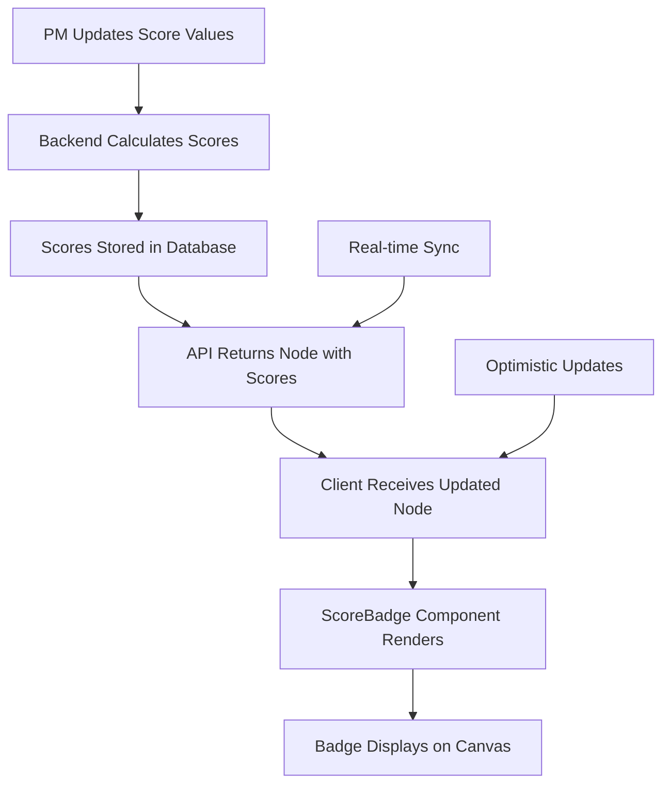

# 🔧 Implementation Plan: ICE & RICE Score Badge Display

> **Detailed technical implementation plan for displaying ICE and RICE scores as badges on tree node cards**
> **Priority**: P1 | **Complexity**: Medium | **Effort**: 20-24 hours

---

## 📋 **Implementation Overview**

### **Objective**
Implement visual score badges that display calculated ICE and RICE scores directly on Opportunity and Solution cards respectively, enabling PMs to quickly compare and prioritize nodes without opening detailed editing interfaces.

### **Current State**
- ICE and RICE scores are calculated and stored in node templateData
- Scores are only visible within the node editing drawer interface
- PMs must open each node individually to view scoring information
- No visual indication of node priorities on the canvas

### **Target State**
- ICE scores displayed as badges on Opportunity cards
- RICE scores displayed as badges on Solution cards
- Badges positioned on bottom-left of node cards
- Real-time badge updates when scores change
- Badges only appear when all required scoring fields are completed

---

## 🎯 **Technical Requirements**

### **Frontend Requirements (React + TypeScript)**
- [x] **ScoreBadge Component**: Reusable badge component for displaying scores
- [x] **TreeNode Integration**: Integrate badges into existing node rendering
- [x] **Real-time Updates**: Update badges through optimistic updates system
- [x] **Conditional Rendering**: Show badges only when scores exist
- [x] **Canvas Performance**: Maintain rendering performance with multiple badges

### **Backend Requirements (Node.js + Express)**
- [x] **Score Calculation Service**: Calculate and persist ICE/RICE scores
- [x] **Database Persistence**: Store calculated scores in templateData
- [x] **Bulk Updates**: Handle score calculations during bulk operations
- [x] **Score Validation**: Validate score inputs and handle edge cases

### **Database Requirements**
- [x] **Score Storage**: Extend templateData JSONB with calculated scores
- [x] **Migration Strategy**: Update existing nodes with calculated scores
- [x] **Performance**: No additional indexes needed (existing JSONB structure)

---

## 🏗️ **Implementation Strategy**

### **🚨 CRITICAL: Pre-Implementation Quality Gates**

#### **API Integration Quality Gates**
- [x] **Score Calculation Accuracy**: Verify backend calculations match frontend formulas
- [x] **Database Persistence**: Ensure calculated scores are properly stored
- [x] **API Response Structure**: Validate score data in API responses
- [x] **Error Handling**: Implement proper error handling for score calculations
- [x] **Bulk Operations**: Verify score calculations work with bulk updates

#### **React Component Quality Gates**
- [x] **Badge Rendering**: Ensure badges render correctly on canvas
- [x] **Performance Impact**: Verify no canvas performance regression
- [x] **Positioning**: Confirm badges don't overlap with node content
- [x] **Responsive Design**: Badges scale properly with canvas zoom
- [x] **Conditional Display**: Badges only show when scores are complete

#### **Database Integrity Gates**
- [x] **Score Persistence**: Verify calculated scores are stored correctly
- [x] **Data Consistency**: Ensure score data remains consistent across operations
- [x] **Migration Safety**: Validate score calculation for existing nodes
- [x] **Performance**: Confirm no impact on database query performance

### **Phase 1: Backend Score Calculation and Persistence (6-8 hours)**

#### **Score Calculation Service**
```typescript
// Enhanced score calculation service
import { TreeNodeRecord } from '@shared/schema';

export class ScoreCalculationService {
  /**
   * Calculate ICE score for Opportunity nodes
   * Formula: (Impact + Confidence + Ease) / 3
   */
  calculateICEScore(templateData: any): number | null {
    const { iceImpact, iceConfidence, iceEase } = templateData;
    
    // Only calculate if all required fields are present and valid
    if (!this.isValidScore(iceImpact) || !this.isValidScore(iceConfidence) || !this.isValidScore(iceEase)) {
      return null;
    }
    
    return Math.round(((iceImpact + iceConfidence + iceEase) / 3) * 10) / 10;
  }

  /**
   * Calculate RICE score for Solution nodes
   * Formula: (Reach × Impact × Confidence) / Effort
   */
  calculateRICEScore(templateData: any): number | null {
    const { riceReach, riceImpact, riceConfidence, riceEffort } = templateData;
    
    // Only calculate if all required fields are present and valid
    if (!this.isValidScore(riceReach) || !this.isValidScore(riceImpact) || 
        !this.isValidScore(riceConfidence) || !this.isValidScore(riceEffort)) {
      return null;
    }
    
    // Prevent division by zero
    if (riceEffort === 0) {
      return null;
    }
    
    return Math.round(((riceReach * riceImpact * riceConfidence) / riceEffort) * 10) / 10;
  }

  /**
   * Calculate and update scores for a node
   */
  updateNodeScores(node: TreeNodeRecord): any {
    const updatedTemplateData = { ...node.templateData };
    
    // Calculate ICE score for Opportunity nodes
    if (node.nodeType === 'opportunity') {
      const iceScore = this.calculateICEScore(updatedTemplateData);
      if (iceScore !== null) {
        updatedTemplateData.iceScore = iceScore;
      } else {
        delete updatedTemplateData.iceScore;
      }
    }
    
    // Calculate RICE score for Solution nodes
    if (node.nodeType === 'solution') {
      const riceScore = this.calculateRICEScore(updatedTemplateData);
      if (riceScore !== null) {
        updatedTemplateData.riceScore = riceScore;
      } else {
        delete updatedTemplateData.riceScore;
      }
    }
    
    return updatedTemplateData;
  }

  /**
   * Validate score value
   */
  private isValidScore(value: any): boolean {
    return typeof value === 'number' && value >= 0 && value <= 10;
  }
}

export const scoreCalculationService = new ScoreCalculationService();
```

#### **Enhanced ImpactTreeService Integration**
```typescript
// Update existing ImpactTreeService to include score calculations
import { scoreCalculationService } from './score-calculation-service';

export class ImpactTreeService {
  // ... existing methods ...

  /**
   * Update node with automatic score calculation
   */
  async updateNode(treeId: number, nodeId: string, userId: string, updates: {
    title?: string;
    description?: string;
    templateData?: any;
    position?: { x: number; y: number };
  }): Promise<TreeNodeRecord | null> {
    try {
      // Get existing node
      const existingNode = await db.query.treeNodes.findFirst({
        where: and(
          eq(treeNodes.id, nodeId),
          eq(treeNodes.treeId, treeId)
        )
      });

      if (!existingNode) return null;

      // Verify tree ownership
      const tree = await db.query.impactTrees.findFirst({
        where: and(
          eq(impactTrees.id, treeId),
          eq(impactTrees.user_id, userId)
        )
      });

      if (!tree) return null;

      // Calculate updated template data with scores
      const updatedTemplateData = updates.templateData 
        ? { ...existingNode.templateData, ...updates.templateData }
        : existingNode.templateData;

      // Calculate and update scores
      const templateDataWithScores = scoreCalculationService.updateNodeScores({
        ...existingNode,
        templateData: updatedTemplateData
      });

      // Update node in database
      const [updatedNode] = await db
        .update(treeNodes)
        .set({
          ...updates,
          templateData: templateDataWithScores,
          updatedAt: new Date()
        })
        .where(eq(treeNodes.id, nodeId))
        .returning();

      // Log activity
      await this.logActivity(userId, treeId, 'node_updated', {
        nodeId,
        nodeType: updatedNode.nodeType,
        hasScores: !!(templateDataWithScores.iceScore || templateDataWithScores.riceScore)
      });

      return updatedNode;
    } catch (error) {
      console.error('Error updating node:', error);
      return null;
    }
  }

  /**
   * Bulk update nodes with score calculations
   */
  async bulkUpdateNodes(treeId: number, userId: string, nodeUpdates: Array<{
    id: string;
    updates: any;
  }>): Promise<{ updatedNodes: number; message: string }> {
    try {
      // Verify tree ownership
      const tree = await db.query.impactTrees.findFirst({
        where: and(
          eq(impactTrees.id, treeId),
          eq(impactTrees.user_id, userId)
        )
      });

      if (!tree) {
        throw new Error('Tree not found or access denied');
      }

      // Get existing nodes for score calculation
      const existingNodes = await db.query.treeNodes.findMany({
        where: and(
          eq(treeNodes.treeId, treeId),
          inArray(treeNodes.id, nodeUpdates.map(u => u.id))
        )
      });

      const validUpdates = nodeUpdates.filter(update => 
        existingNodes.some(node => node.id === update.id)
      );

      // Process each update with score calculation
      for (const update of validUpdates) {
        const existingNode = existingNodes.find(node => node.id === update.id);
        if (!existingNode) continue;

        // Calculate updated template data
        const updatedTemplateData = update.updates.templateData
          ? { ...existingNode.templateData, ...update.updates.templateData }
          : existingNode.templateData;

        // Calculate and update scores
        const templateDataWithScores = scoreCalculationService.updateNodeScores({
          ...existingNode,
          templateData: updatedTemplateData
        });

        // Update node in database
        await db
          .update(treeNodes)
          .set({
            ...update.updates,
            templateData: templateDataWithScores,
            updatedAt: new Date()
          })
          .where(eq(treeNodes.id, update.id));
      }

      return {
        updatedNodes: validUpdates.length,
        message: `Bulk updated ${validUpdates.length} nodes with score calculations`
      };
    } catch (error) {
      console.error('Error in bulk update:', error);
      throw error;
    }
  }
}
```

### **Phase 2: Frontend Score Badge Component (6-8 hours)**

#### **ScoreBadge Component**
```tsx
// Score badge component for displaying ICE and RICE scores
import React from 'react';
import { cn } from '@/lib/utils';

interface ScoreBadgeProps {
  score: number;
  type: 'ICE' | 'RICE';
  className?: string;
}

export const ScoreBadge: React.FC<ScoreBadgeProps> = ({ 
  score, 
  type, 
  className 
}) => {
  // Determine badge color based on score
  const getScoreColor = (score: number, type: string) => {
    if (type === 'ICE') {
      // ICE scores: 0-10 scale
      if (score >= 7) return 'bg-green-500 text-white';
      if (score >= 4) return 'bg-yellow-500 text-white';
      return 'bg-red-500 text-white';
    } else {
      // RICE scores: variable scale, use relative thresholds
      if (score >= 10) return 'bg-green-500 text-white';
      if (score >= 5) return 'bg-yellow-500 text-white';
      return 'bg-red-500 text-white';
    }
  };

  const colorClass = getScoreColor(score, type);
  const displayScore = type === 'ICE' ? score.toFixed(1) : score.toFixed(0);

  return (
    <div 
      className={cn(
        'absolute bottom-1 left-1 px-2 py-1 rounded-md text-xs font-medium',
        'shadow-sm border border-white/20',
        'transition-all duration-200',
        colorClass,
        className
      )}
    >
      {type}: {displayScore}
    </div>
  );
};
```

#### **Enhanced TreeNode Component Integration**
```tsx
// Update existing TreeNode component to include score badges
import React, { useMemo } from 'react';
import { ScoreBadge } from './score-badge';
import { TreeNode as TreeNodeType } from '@shared/schema';

interface TreeNodeProps {
  node: TreeNodeType;
  isSelected: boolean;
  onSelect: (node: TreeNodeType) => void;
  onUpdate: (node: TreeNodeType) => void;
  onContextMenu: (node: TreeNodeType, position: { x: number; y: number }) => void;
  // ... other existing props
}

export const TreeNode: React.FC<TreeNodeProps> = ({
  node,
  isSelected,
  onSelect,
  onUpdate,
  onContextMenu,
  // ... other props
}) => {
  // Calculate if node has complete scores
  const hasICEScore = useMemo(() => {
    if (node.type !== 'opportunity') return false;
    const { iceScore } = node.templateData || {};
    return typeof iceScore === 'number';
  }, [node.type, node.templateData]);

  const hasRICEScore = useMemo(() => {
    if (node.type !== 'solution') return false;
    const { riceScore } = node.templateData || {};
    return typeof riceScore === 'number';
  }, [node.type, node.templateData]);

  return (
    <div
      className={cn(
        'relative group min-w-[200px] min-h-[120px]',
        'bg-white dark:bg-gray-800 rounded-lg border-2',
        'transition-all duration-200 cursor-pointer',
        'hover:shadow-md',
        isSelected ? 'border-blue-500 shadow-lg' : 'border-gray-200 dark:border-gray-600',
        // ... other existing styles
      )}
      onClick={() => onSelect(node)}
      onContextMenu={(e) => {
        e.preventDefault();
        onContextMenu(node, { x: e.clientX, y: e.clientY });
      }}
    >
      {/* Existing node content */}
      <div className="p-3">
        <div className="flex items-center justify-between mb-2">
          <span className="text-xs font-medium text-gray-500 dark:text-gray-400 capitalize">
            {node.type}
          </span>
          {/* ... existing node type indicators */}
        </div>
        
        <h3 className="font-medium text-gray-900 dark:text-white mb-2 line-clamp-2">
          {node.title}
        </h3>
        
        {node.description && (
          <p className="text-sm text-gray-600 dark:text-gray-300 line-clamp-2">
            {node.description}
          </p>
        )}
      </div>

      {/* Score badges */}
      {hasICEScore && (
        <ScoreBadge 
          score={node.templateData.iceScore} 
          type="ICE"
          className="z-10"
        />
      )}
      
      {hasRICEScore && (
        <ScoreBadge 
          score={node.templateData.riceScore} 
          type="RICE"
          className="z-10"
        />
      )}

      {/* ... existing node elements */}
    </div>
  );
};
```

### **Phase 3: Real-time Updates and Integration (4-6 hours)**

#### **Enhanced useOptimisticUpdates Hook**
```typescript
// Update optimistic updates to handle score calculations
import { useCallback } from 'react';
import { useMutation, useQueryClient } from '@tanstack/react-query';
import { scoreCalculationService } from '@/lib/score-calculation';

export const useOptimisticUpdates = (treeId: number | null) => {
  const queryClient = useQueryClient();

  // Client-side score calculation for immediate updates
  const calculateClientScores = useCallback((node: TreeNode) => {
    const updatedTemplateData = { ...node.templateData };
    
    if (node.type === 'opportunity') {
      const iceScore = scoreCalculationService.calculateICEScore(updatedTemplateData);
      if (iceScore !== null) {
        updatedTemplateData.iceScore = iceScore;
      } else {
        delete updatedTemplateData.iceScore;
      }
    }
    
    if (node.type === 'solution') {
      const riceScore = scoreCalculationService.calculateRICEScore(updatedTemplateData);
      if (riceScore !== null) {
        updatedTemplateData.riceScore = riceScore;
      } else {
        delete updatedTemplateData.riceScore;
      }
    }
    
    return { ...node, templateData: updatedTemplateData };
  }, []);

  const { mutate: updateNode } = useMutation({
    mutationFn: async (updates: { nodeId: string; updates: any }) => {
      const response = await fetch(`/api/impact-trees/${treeId}/nodes/${updates.nodeId}`, {
        method: 'PUT',
        headers: { 'Content-Type': 'application/json' },
        body: JSON.stringify(updates.updates)
      });
      
      if (!response.ok) {
        throw new Error('Failed to update node');
      }
      
      return response.json();
    },
    onMutate: async (updates) => {
      // Optimistically update with calculated scores
      await queryClient.cancelQueries({ queryKey: ['impact-tree', treeId] });
      
      const previousData = queryClient.getQueryData(['impact-tree', treeId]);
      
      queryClient.setQueryData(['impact-tree', treeId], (old: any) => {
        if (!old) return old;
        
        const updatedNodes = old.nodeRecords.map((node: TreeNode) => {
          if (node.id === updates.nodeId) {
            const updatedNode = {
              ...node,
              ...updates.updates,
              templateData: { ...node.templateData, ...updates.updates.templateData }
            };
            return calculateClientScores(updatedNode);
          }
          return node;
        });
        
        return { ...old, nodeRecords: updatedNodes };
      });
      
      return { previousData };
    },
    onError: (err, updates, context) => {
      // Revert optimistic update on error
      queryClient.setQueryData(['impact-tree', treeId], context?.previousData);
    },
    onSuccess: () => {
      // Refetch to ensure data consistency
      queryClient.invalidateQueries({ queryKey: ['impact-tree', treeId] });
    }
  });

  return { updateNode };
};
```

#### **Client-side Score Calculation Utility**
```typescript
// Client-side score calculation for immediate UI updates
export class ClientScoreCalculationService {
  /**
   * Calculate ICE score (client-side)
   */
  calculateICEScore(templateData: any): number | null {
    const { iceImpact, iceConfidence, iceEase } = templateData;
    
    if (!this.isValidScore(iceImpact) || !this.isValidScore(iceConfidence) || !this.isValidScore(iceEase)) {
      return null;
    }
    
    return Math.round(((iceImpact + iceConfidence + iceEase) / 3) * 10) / 10;
  }

  /**
   * Calculate RICE score (client-side)
   */
  calculateRICEScore(templateData: any): number | null {
    const { riceReach, riceImpact, riceConfidence, riceEffort } = templateData;
    
    if (!this.isValidScore(riceReach) || !this.isValidScore(riceImpact) || 
        !this.isValidScore(riceConfidence) || !this.isValidScore(riceEffort)) {
      return null;
    }
    
    if (riceEffort === 0) return null;
    
    return Math.round(((riceReach * riceImpact * riceConfidence) / riceEffort) * 10) / 10;
  }

  private isValidScore(value: any): boolean {
    return typeof value === 'number' && value >= 0 && value <= 10;
  }
}

export const clientScoreCalculationService = new ClientScoreCalculationService();
```

### **Phase 4: Database Migration and Testing (4-6 hours)**

#### **Score Migration Script**
```typescript
// Migration script to calculate scores for existing nodes
import { db } from '../db';
import { treeNodes } from '@shared/schema';
import { scoreCalculationService } from '../services/score-calculation-service';

export async function migrateExistingScores() {
  console.log('Starting score migration for existing nodes...');
  
  try {
    // Get all nodes that need score calculations
    const allNodes = await db.query.treeNodes.findMany({
      where: or(
        eq(treeNodes.nodeType, 'opportunity'),
        eq(treeNodes.nodeType, 'solution')
      )
    });

    console.log(`Found ${allNodes.length} nodes to process`);

    let updatedCount = 0;
    
    for (const node of allNodes) {
      try {
        const updatedTemplateData = scoreCalculationService.updateNodeScores(node);
        
        // Only update if scores were calculated
        const hasNewScores = updatedTemplateData.iceScore || updatedTemplateData.riceScore;
        
        if (hasNewScores) {
          await db
            .update(treeNodes)
            .set({
              templateData: updatedTemplateData,
              updatedAt: new Date()
            })
            .where(eq(treeNodes.id, node.id));
          
          updatedCount++;
        }
      } catch (error) {
        console.error(`Error updating node ${node.id}:`, error);
      }
    }

    console.log(`Score migration completed. Updated ${updatedCount} nodes.`);
    return { success: true, updatedCount };
  } catch (error) {
    console.error('Score migration failed:', error);
    return { success: false, error: error.message };
  }
}
```

#### **Testing Strategy Implementation**
```typescript
// Comprehensive testing for score badge functionality
import { render, screen } from '@testing-library/react';
import { ScoreBadge } from '../score-badge';
import { TreeNode } from '../tree-node';

describe('ScoreBadge Component', () => {
  test('renders ICE score badge correctly', () => {
    render(<ScoreBadge score={7.5} type="ICE" />);
    expect(screen.getByText('ICE: 7.5')).toBeInTheDocument();
  });

  test('renders RICE score badge correctly', () => {
    render(<ScoreBadge score={15} type="RICE" />);
    expect(screen.getByText('RICE: 15')).toBeInTheDocument();
  });

  test('applies correct color classes based on score', () => {
    const { rerender } = render(<ScoreBadge score={8} type="ICE" />);
    expect(screen.getByText('ICE: 8.0')).toHaveClass('bg-green-500');
    
    rerender(<ScoreBadge score={5} type="ICE" />);
    expect(screen.getByText('ICE: 5.0')).toHaveClass('bg-yellow-500');
    
    rerender(<ScoreBadge score={2} type="ICE" />);
    expect(screen.getByText('ICE: 2.0')).toHaveClass('bg-red-500');
  });
});

describe('TreeNode with Score Badges', () => {
  const mockOpportunityNode = {
    id: 'test-opportunity',
    type: 'opportunity',
    title: 'Test Opportunity',
    description: 'Test description',
    templateData: {
      iceImpact: 8,
      iceConfidence: 7,
      iceEase: 6,
      iceScore: 7.0
    }
  };

  const mockSolutionNode = {
    id: 'test-solution',
    type: 'solution',
    title: 'Test Solution',
    description: 'Test description',
    templateData: {
      riceReach: 5,
      riceImpact: 8,
      riceConfidence: 7,
      riceEffort: 3,
      riceScore: 93.3
    }
  };

  test('displays ICE badge on opportunity node', () => {
    render(
      <TreeNode
        node={mockOpportunityNode}
        isSelected={false}
        onSelect={() => {}}
        onUpdate={() => {}}
        onContextMenu={() => {}}
      />
    );
    
    expect(screen.getByText('ICE: 7.0')).toBeInTheDocument();
  });

  test('displays RICE badge on solution node', () => {
    render(
      <TreeNode
        node={mockSolutionNode}
        isSelected={false}
        onSelect={() => {}}
        onUpdate={() => {}}
        onContextMenu={() => {}}
      />
    );
    
    expect(screen.getByText('RICE: 93')).toBeInTheDocument();
  });

  test('does not display badge when score is incomplete', () => {
    const incompleteNode = {
      ...mockOpportunityNode,
      templateData: {
        iceImpact: 8,
        iceConfidence: 7,
        // Missing iceEase - score should not be calculated
      }
    };

    render(
      <TreeNode
        node={incompleteNode}
        isSelected={false}
        onSelect={() => {}}
        onUpdate={() => {}}
        onContextMenu={() => {}}
      />
    );
    
    expect(screen.queryByText(/ICE:/)).not.toBeInTheDocument();
  });
});
```

---

## 🧪 **Testing & Validation Strategy**

### **Manual Testing Checklist**
- [ ] **ICE Badge Display**: Verify badges appear on Opportunity nodes with complete scores
- [ ] **RICE Badge Display**: Verify badges appear on Solution nodes with complete scores
- [ ] **Badge Positioning**: Confirm badges are positioned on bottom-left of nodes
- [ ] **Real-time Updates**: Verify badges update immediately when scores change
- [ ] **Conditional Display**: Confirm badges only appear when all required fields are complete
- [ ] **Canvas Performance**: Verify no performance regression with multiple badges
- [ ] **Score Accuracy**: Validate displayed scores match calculated values

### **Automated Testing Requirements**
- [ ] **Component Tests**: ScoreBadge rendering and props
- [ ] **Integration Tests**: TreeNode badge integration
- [ ] **API Tests**: Score calculation endpoints
- [ ] **Performance Tests**: Canvas rendering with badges
- [ ] **Migration Tests**: Existing node score calculation

---

## 🎓 **Developer Learning Guide**

### **📚 Implementation Context**
This implementation adds visual scoring badges to tree nodes to support Product Manager prioritization workflows. The badges display calculated ICE and RICE scores directly on the canvas, eliminating the need to open detailed editing interfaces for comparison.

### **🔍 Technical Implementation Flow**


### **⚠️ Implementation Pitfalls**
- **Score Calculation Consistency**: Ensure backend and frontend formulas match exactly
- **Performance Impact**: Multiple badges can affect canvas rendering performance
- **Data Synchronization**: Keep displayed scores synchronized with database values
- **Edge Cases**: Handle division by zero and incomplete score data properly
- **Visual Hierarchy**: Ensure badges don't overpower node titles or content

### **🎯 Key Success Factors**
- Accurate score calculations matching existing frontend logic
- Smooth integration with existing canvas performance optimizations
- Proper conditional rendering based on score completeness
- Real-time updates through optimistic update system
- Minimal visual impact while maintaining clear prioritization visibility

---

## 📈 **Success Metrics & Validation**

### **Implementation Success Criteria**
- [ ] **ICE badges** display correctly on Opportunity nodes
- [ ] **RICE badges** display correctly on Solution nodes
- [ ] **Real-time updates** work without performance issues
- [ ] **Score accuracy** matches frontend calculations
- [ ] **Canvas performance** shows no regression
- [ ] **Visual design** integrates seamlessly with existing UI

### **Performance Benchmarks**
- [ ] **Canvas rendering** maintains 60fps with 100+ nodes
- [ ] **Badge calculations** complete within 100ms
- [ ] **Database queries** show no performance degradation
- [ ] **Memory usage** remains within acceptable limits

---

## 🔗 **Related Documents**

- **Feature Specification**: [docs/new_features/33_ICE_RICE_Score_Badge_Display.md]
- **Canvas Performance**: [docs/development/canvas_performance_guidelines.md]
- **Score Templates**: [docs/new_features/Node_Content_Templates.md]
- **Optimistic Updates**: [docs/implementation_reports/28_Tree_Node_Data_Persistence_Report.md]

---

**📝 Implementation Plan Version**: 1.0  
**🎯 Project Type**: AI-Native Impact Tree (React + Node.js)  
**📅 Created**: July 15, 2025  
**👤 Author**: AI Assistant  
**📊 Status**: 📋 Ready for Implementation