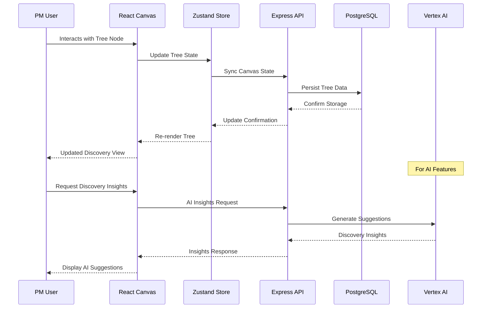

# 🔧 Implementation Plan Template

> **Detailed technical implementation plan for AI-Native Impact Tree features and fixes**
> **Priority**: [P1/P2/P3] | **Complexity**: [Low/Medium/High] | **Effort**: [X hours]

---

## 📋 **Implementation Overview**

### **Objective**
[Clear statement of what this implementation achieves for PM discovery workflow]

### **Current State**
[Description of current impact tree functionality/problem]

### **Target State**
[Description of desired end state for PM users and discovery workflow]

---

## 🎯 **Technical Requirements**

### **Frontend Requirements (React + TypeScript)**
- [ ] **Canvas Components**: [Tree nodes, connections, interactions]
- [ ] **State Management**: [Zustand for tree state, TanStack Query for server state]
- [ ] **API Integration**: [Impact tree endpoints, canvas state sync]
- [ ] **UI/UX Implementation**: [PM-focused discovery interface]

### **Backend Requirements (Node.js + Express)**
- [ ] **API Endpoints**: [Impact tree CRUD, canvas state persistence]
- [ ] **Business Logic**: [Tree validation, discovery workflow support]
- [ ] **Data Access**: [Drizzle ORM operations, PostgreSQL queries]
- [ ] **AI Integration**: [Vertex AI for discovery insights]

### **Database Requirements**
- [ ] **Schema Changes**: [impact_trees table, discovery-related tables]
- [ ] **Data Migration**: [Tree structure updates, canvas state]
- [ ] **Performance**: [Indexing for tree queries, JSONB optimization]

---

## 🏗️ **Implementation Strategy**

### **Phase 1: Backend Foundation (X hours)**

#### **Database Layer (Drizzle ORM + PostgreSQL)**
```typescript
// Schema definition for impact trees
import { pgTable, text, serial, integer, jsonb, timestamp } from "drizzle-orm/pg-core";

export const impactTrees = pgTable("impact_trees", {
  id: serial("id").primaryKey(),
  name: text("name").notNull(),
  description: text("description"),
  nodes: jsonb("nodes").notNull().default('[]'),
  connections: jsonb("connections").notNull().default('[]'),
  canvasState: jsonb("canvas_state").notNull().default('{"zoom": 1, "pan": {"x": 0, "y": 0}}'),
  createdAt: timestamp("created_at").defaultNow().notNull(),
  updatedAt: timestamp("updated_at").defaultNow().notNull(),
});

// Migration for new features
export const discoveryArtifacts = pgTable("discovery_artifacts", {
  id: serial("id").primaryKey(),
  treeId: integer("tree_id").references(() => impactTrees.id),
  nodeId: text("node_id").notNull(),
  artifactType: text("artifact_type").notNull(), // research, assumption, metric
  content: jsonb("content").notNull(),
  createdAt: timestamp("created_at").defaultNow().notNull(),
});
```

#### **Storage Layer**
```typescript
// Impact tree service with discovery support
export class ImpactTreeService {
  private db: DrizzleDB;

  async createImpactTree(data: InsertImpactTree): Promise<ImpactTree> {
    const [tree] = await this.db.insert(impactTrees).values(data).returning();
    return tree;
  }

  async updateTreeCanvas(id: number, updates: {
    nodes: TreeNode[];
    connections: NodeConnection[];
    canvasState: CanvasState;
  }): Promise<ImpactTree | undefined> {
    const [updated] = await this.db
      .update(impactTrees)
      .set({
        nodes: updates.nodes,
        connections: updates.connections,
        canvasState: updates.canvasState,
        updatedAt: new Date()
      })
      .where(eq(impactTrees.id, id))
      .returning();
    
    return updated;
  }

  async addDiscoveryArtifact(treeId: number, nodeId: string, artifact: DiscoveryArtifact) {
    // Support for PM discovery workflows
    return await this.db.insert(discoveryArtifacts).values({
      treeId,
      nodeId,
      artifactType: artifact.type,
      content: artifact.content
    });
  }
}
```

### **Phase 2: API Layer (X hours)**

#### **Express API Endpoints**
```typescript
// Impact tree REST API with discovery support
import express from 'express';
import { ImpactTreeService } from './services/impact-tree-service';

const router = express.Router();
const treeService = new ImpactTreeService();

// Core impact tree operations
router.post('/api/impact-trees', async (req, res) => {
  try {
    const validatedData = insertImpactTreeSchema.parse(req.body);
    const tree = await treeService.createImpactTree(validatedData);
    res.status(201).json(tree);
  } catch (error) {
    if (error instanceof z.ZodError) {
      return res.status(400).json({ message: "Invalid data", errors: error.errors });
    }
    res.status(500).json({ message: "Failed to create impact tree" });
  }
});

// Canvas state persistence for PM workflow
router.put('/api/impact-trees/:id/canvas', async (req, res) => {
  try {
    const id = parseInt(req.params.id);
    const validatedData = updateCanvasSchema.parse(req.body);
    
    const updatedTree = await treeService.updateTreeCanvas(id, validatedData);
    if (!updatedTree) {
      return res.status(404).json({ message: "Impact tree not found" });
    }

    res.json(updatedTree);
  } catch (error) {
    res.status(500).json({ message: "Failed to update canvas state" });
  }
});

// Discovery artifacts for continuous discovery
router.post('/api/impact-trees/:id/artifacts', async (req, res) => {
  try {
    const treeId = parseInt(req.params.id);
    const { nodeId, artifact } = req.body;
    
    await treeService.addDiscoveryArtifact(treeId, nodeId, artifact);
    res.status(201).json({ message: "Discovery artifact added" });
  } catch (error) {
    res.status(500).json({ message: "Failed to add discovery artifact" });
  }
});
```

#### **Validation Schemas**
```typescript
// Zod schemas for impact tree validation
export const treeNodeSchema = z.object({
  id: z.string(),
  type: z.enum(['objective', 'outcome', 'opportunity', 'solution', 'assumption', 'metric', 'research']),
  title: z.string().min(1).max(255),
  description: z.string().optional(),
  position: z.object({
    x: z.number(),
    y: z.number()
  }),
  metadata: z.record(z.any()).optional()
});

export const updateCanvasSchema = z.object({
  nodes: z.array(treeNodeSchema),
  connections: z.array(z.object({
    id: z.string(),
    sourceId: z.string(),
    targetId: z.string()
  })),
  canvasState: z.object({
    zoom: z.number(),
    pan: z.object({
      x: z.number(),
      y: z.number()
    }),
    orientation: z.enum(['vertical', 'horizontal']).optional()
  })
});
```

### **Phase 3: Frontend Implementation (X hours)**

#### **Canvas State Management**
```tsx
// Tree state management with Zustand
import { create } from 'zustand';
import { TreeNode, NodeConnection, CanvasState } from '../types/canvas';

interface TreeStore {
  nodes: TreeNode[];
  connections: NodeConnection[];
  canvasState: CanvasState;
  selectedNode: TreeNode | null;
  
  // Actions for PM discovery workflow
  addNode: (node: TreeNode) => void;
  updateNode: (id: string, updates: Partial<TreeNode>) => void;
  deleteNode: (id: string) => void;
  addConnection: (connection: NodeConnection) => void;
  updateCanvasState: (state: Partial<CanvasState>) => void;
  selectNode: (node: TreeNode | null) => void;
}

export const useTreeStore = create<TreeStore>((set, get) => ({
  nodes: [],
  connections: [],
  canvasState: { zoom: 1, pan: { x: 0, y: 0 }, orientation: 'vertical' },
  selectedNode: null,
  
  addNode: (node) => set((state) => ({
    nodes: [...state.nodes, node]
  })),
  
  updateNode: (id, updates) => set((state) => ({
    nodes: state.nodes.map(node => 
      node.id === id ? { ...node, ...updates } : node
    )
  })),
  
  deleteNode: (id) => set((state) => ({
    nodes: state.nodes.filter(node => node.id !== id),
    connections: state.connections.filter(conn => 
      conn.sourceId !== id && conn.targetId !== id
    )
  })),
  
  addConnection: (connection) => set((state) => ({
    connections: [...state.connections, connection]
  })),
  
  updateCanvasState: (newState) => set((state) => ({
    canvasState: { ...state.canvasState, ...newState }
  })),
  
  selectNode: (node) => set({ selectedNode: node })
}));
```

#### **Canvas Components**
```tsx
// Main impact tree canvas component
import React, { useEffect, useRef, useCallback } from 'react';
import { useTreeStore } from '../stores/tree-store';
import { TreeNode } from './tree-node';
import { NodeConnections } from './node-connections';
import { CanvasToolbar } from './canvas-toolbar';

export const ImpactTreeCanvas: React.FC<{
  treeId: number;
}> = ({ treeId }) => {
  const canvasRef = useRef<HTMLDivElement>(null);
  const {
    nodes,
    connections,
    canvasState,
    updateCanvasState,
    selectedNode,
    selectNode
  } = useTreeStore();

  // Canvas pan and zoom handling
  const handleWheel = useCallback((e: WheelEvent) => {
    e.preventDefault();
    const delta = e.deltaY > 0 ? 0.9 : 1.1;
    const newZoom = Math.max(0.1, Math.min(3, canvasState.zoom * delta));
    
    updateCanvasState({ zoom: newZoom });
  }, [canvasState.zoom, updateCanvasState]);

  // Canvas click handling for discovery workflow
  const handleCanvasClick = useCallback((e: React.MouseEvent) => {
    if (e.target === e.currentTarget) {
      selectNode(null); // Deselect when clicking empty canvas
    }
  }, [selectNode]);

  useEffect(() => {
    const canvas = canvasRef.current;
    if (canvas) {
      canvas.addEventListener('wheel', handleWheel, { passive: false });
      return () => canvas.removeEventListener('wheel', handleWheel);
    }
  }, [handleWheel]);

  return (
    <div className="relative h-full w-full overflow-hidden bg-gray-50">
      <CanvasToolbar treeId={treeId} />
      
      <div
        ref={canvasRef}
        className="h-full w-full cursor-move"
        style={{
          transform: `scale(${canvasState.zoom}) translate(${canvasState.pan.x}px, ${canvasState.pan.y}px)`
        }}
        onClick={handleCanvasClick}
      >
        {/* SVG connections layer */}
        <NodeConnections
          connections={connections}
          nodes={nodes}
          zoom={canvasState.zoom}
        />
        
        {/* Nodes layer for PM discovery */}
        {nodes.map(node => (
          <TreeNode
            key={node.id}
            node={node}
            isSelected={selectedNode?.id === node.id}
            onSelect={() => selectNode(node)}
            onUpdate={(updates) => updateNode(node.id, updates)}
          />
        ))}
      </div>
    </div>
  );
};
```

#### **API Integration with TanStack Query**
```tsx
// API service for impact trees
import { useQuery, useMutation, useQueryClient } from '@tanstack/react-query';

export const useImpactTree = (treeId: number) => {
  return useQuery({
    queryKey: ['impact-tree', treeId],
    queryFn: async () => {
      const response = await fetch(`/api/impact-trees/${treeId}`);
      if (!response.ok) throw new Error('Failed to fetch tree');
      return response.json();
    }
  });
};

export const useUpdateTreeCanvas = () => {
  const queryClient = useQueryClient();
  
  return useMutation({
    mutationFn: async ({ treeId, updates }: {
      treeId: number;
      updates: { nodes: TreeNode[]; connections: NodeConnection[]; canvasState: CanvasState };
    }) => {
      const response = await fetch(`/api/impact-trees/${treeId}/canvas`, {
        method: 'PUT',
        headers: { 'Content-Type': 'application/json' },
        body: JSON.stringify(updates)
      });
      if (!response.ok) throw new Error('Failed to update canvas');
      return response.json();
    },
    onSuccess: (_, { treeId }) => {
      queryClient.invalidateQueries({ queryKey: ['impact-tree', treeId] });
    }
  });
};
```

### **Phase 4: AI Integration (X hours) - For AI Features**

#### **Vertex AI Service Integration**
```typescript
// Vertex AI integration for discovery insights
import { VertexAI } from '@google-cloud/vertexai';

export class DiscoveryAIService {
  private vertexAI: VertexAI;
  
  constructor() {
    this.vertexAI = new VertexAI({
      project: process.env.GOOGLE_CLOUD_PROJECT,
      location: process.env.GOOGLE_CLOUD_LOCATION
    });
  }

  async generateResearchQuestions(treeContext: {
    currentNode: TreeNode;
    siblingNodes: TreeNode[];
    parentNodes: TreeNode[];
  }): Promise<string[]> {
    const prompt = this.buildResearchPrompt(treeContext);
    
    const response = await this.vertexAI.preview.generateContent({
      model: 'gemini-pro',
      contents: [{ role: 'user', parts: [{ text: prompt }] }]
    });
    
    return this.parseResearchQuestions(response.response.text);
  }

  async identifyOpportunityGaps(treeData: {
    opportunities: TreeNode[];
    outcomes: TreeNode[];
    assumptions: TreeNode[];
  }): Promise<{
    gaps: string[];
    suggestions: string[];
  }> {
    const prompt = this.buildGapAnalysisPrompt(treeData);
    
    const response = await this.vertexAI.preview.generateContent({
      model: 'gemini-pro',
      contents: [{ role: 'user', parts: [{ text: prompt }] }]
    });
    
    return this.parseGapAnalysis(response.response.text);
  }

  private buildResearchPrompt(context: any): string {
    return `
      As a Product Management AI assistant, analyze this impact tree context:
      Current Node: ${context.currentNode.title} (${context.currentNode.type})
      
      Suggest 3-5 specific research questions that would help validate assumptions and discover new opportunities in this area.
      Focus on continuous discovery practices and customer-centric research.
    `;
  }
}
```

---

## 🧪 **Testing Strategy**

### **Frontend Testing**
- [ ] **Component Tests**: React Testing Library for canvas components and tree nodes
- [ ] **Canvas Testing**: HTML5 canvas interaction and rendering tests
- [ ] **State Management**: Zustand store testing for tree operations
- [ ] **API Integration**: TanStack Query integration testing

### **Backend Testing**
- [ ] **Unit Tests**: Express endpoint testing with Jest
- [ ] **Database Tests**: Drizzle ORM operations and PostgreSQL integration
- [ ] **API Tests**: Impact tree CRUD operations and canvas state persistence
- [ ] **AI Integration**: Vertex AI service testing (for AI features)

### **Integration Testing**
- [ ] **Canvas-API Sync**: Tree state synchronization between frontend and backend
- [ ] **Discovery Workflow**: End-to-end PM discovery workflow testing
- [ ] **Performance**: Large tree handling and canvas optimization
- [ ] **Replit Deployment**: Production deployment testing

---

## 📋 **Deployment Checklist**

### **Pre-Deployment**
- [ ] **Code review** completed and approved
- [ ] **Canvas performance** testing with large trees
- [ ] **Database migrations** prepared and tested
- [ ] **Replit environment** variables configured

### **Deployment**
- [ ] **Backend deployment** to Replit completed
- [ ] **Frontend build** and deployment completed
- [ ] **Database schema** changes applied
- [ ] **Replit health checks** passing

### **Post-Deployment**
- [ ] **Discovery workflow** testing with PM users
- [ ] **Canvas performance** monitoring active
- [ ] **Tree persistence** validation
- [ ] **PM user feedback** collected

---

## 🎓 **Developer Learning Guide**

### **📚 Implementation Concepts**
This implementation supports the AI-Native Impact Tree's core mission: helping Product Managers practice continuous discovery through visual tree structures that evolve with learning.

The impact tree serves as a live document connecting OKR methodology (Objectives & Outcomes) with impact mapping (Opportunities & Solutions) and user story mapping techniques. Every implementation decision should support the PM's discovery workflow and maintain the tree's role as an evolving strategic document.

### **🏗️ Architecture Flow**


### **🔄 Step-by-Step Breakdown**
1. **Canvas Interaction**: PM clicks/drags tree nodes on HTML5 canvas
2. **State Management**: Zustand updates tree state and triggers React re-renders
3. **API Synchronization**: TanStack Query syncs changes to Express backend
4. **Data Persistence**: Drizzle ORM saves tree structure to PostgreSQL
5. **AI Enhancement**: Vertex AI provides discovery insights based on tree context
6. **Discovery Loop**: PM receives suggestions and continues discovery workflow

### **⚠️ Implementation Pitfalls**
- **Canvas Performance**: Large trees (100+ nodes) can slow rendering - implement virtualization
- **State Synchronization**: Canvas state and server state must stay synchronized
- **Discovery Context**: All features must support continuous discovery mindset
- **PM Workflow**: Don't disrupt the natural flow of discovery activities
- **AI Integration**: Handle rate limits and ensure insights enhance rather than replace PM judgment
- **Tree Evolution**: Support the live document nature - trees change frequently

### **🔗 Learning Resources**
- **Continuous Discovery**: Teresa Torres methodology and practices
- **React Canvas**: HTML5 canvas with React performance patterns
- **Drizzle ORM**: Type-safe PostgreSQL operations and migrations
- **Vertex AI**: Google Cloud AI integration and prompt engineering
- **Impact Mapping**: Gojko Adzic's impact mapping techniques
- **OKR Framework**: Objectives and Key Results implementation

### **🎯 Key Takeaways**
- Impact trees are live documents that evolve with PM discovery
- Canvas performance is critical for large, complex trees
- State management must handle both immediate UI updates and persistent storage
- AI integration should enhance discovery workflows, not replace PM thinking
- All features should support the continuous discovery cycle
- The tool should feel like a natural extension of the PM's thinking process

---

## 📊 **Success Metrics**

### **Technical Metrics**
- [ ] **Canvas Performance**: 60fps with 100+ nodes
- [ ] **API Response Times**: <200ms for tree operations
- [ ] **Database Queries**: Optimized for tree structure operations
- [ ] **Test Coverage**: >85% for critical discovery features

### **Business Metrics**
- [ ] **PM Adoption**: Active weekly usage by discovery-practicing PMs
- [ ] **Tree Evolution**: Measurable tree changes indicating discovery activity
- [ ] **Discovery Insights**: AI suggestions leading to actionable research
- [ ] **Workflow Integration**: Smooth integration with existing PM tools

---

**📝 Template Version**: 2.0  
**🎯 Project Type**: AI-Native Impact Tree (React + Node.js)  
**📅 Created**: [Date]  
**👤 Author**: [Author name]  
**📊 Status**: 📋 Planning
