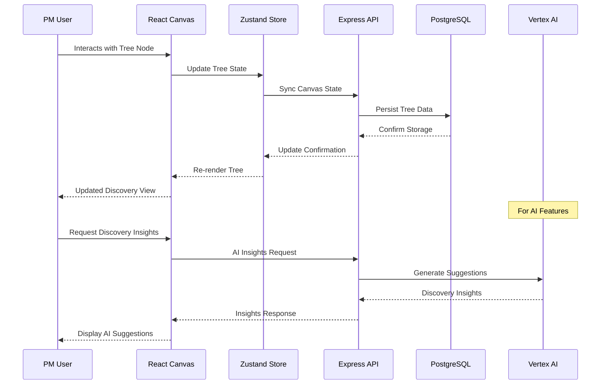

# 🔧 Implementation Plan Template

> **Detailed technical implementation plan for AI-Native Impact Tree features and fixes**
> **Priority**: [P1/P2/P3] | **Complexity**: [Low/Medium/High] | **Effort**: [X hours]

---

## 📋 **Implementation Overview**

### **Objective**
[Clear statement of what this implementation achieves for PM discovery workflow]

### **Current State**
[Description of current impact tree functionality/problem]

### **Target State**
[Description of desired end state for PM users and discovery workflow]

---

## 🎯 **Technical Requirements**

### **Frontend Requirements (React + TypeScript)**
- [ ] **Canvas Components**: [Tree nodes, connections, interactions]
- [ ] **State Management**: [Zustand for tree state, TanStack Query for server state]
- [ ] **API Integration**: [Impact tree endpoints, canvas state sync]
- [ ] **UI/UX Implementation**: [PM-focused discovery interface]

### **Backend Requirements (Node.js + Express)**
- [ ] **API Endpoints**: [Impact tree CRUD, canvas state persistence]
- [ ] **Business Logic**: [Tree validation, discovery workflow support]
- [ ] **Data Access**: [Drizzle ORM operations, PostgreSQL queries]
- [ ] **AI Integration**: [Vertex AI for discovery insights]

### **Database Requirements**
- [ ] **Schema Changes**: [impact_trees table, discovery-related tables]
- [ ] **Data Migration**: [Tree structure updates, canvas state]
- [ ] **Performance**: [Indexing for tree queries, JSONB optimization]

---

## 🏗️ **Implementation Strategy**

### **Phase 1: Backend Foundation (X hours)**

#### **Database Layer (Drizzle ORM + PostgreSQL)**
```typescript
// Schema definition for impact trees (following existing patterns)
import { pgTable, text, serial, integer, jsonb, timestamp, varchar, index } from "drizzle-orm/pg-core";

export const impactTrees = pgTable("impact_trees", {
  id: serial("id").primaryKey(),
  user_id: varchar("user_id", { length: 255 }),
  name: text("name").notNull(),
  description: text("description"),
  nodes: jsonb("nodes").notNull().default('[]'),
  connections: jsonb("connections").notNull().default('[]'),
  canvasState: jsonb("canvas_state").notNull().default('{"zoom": 1, "pan": {"x": 0, "y": 0}, "orientation": "vertical"}'),
  createdAt: timestamp("created_at").defaultNow().notNull(),
  updatedAt: timestamp("updated_at").defaultNow().notNull(),
}, (table) => ({
  userUpdatedIdx: index("idx_trees_user_updated").on(table.user_id, table.updatedAt.desc()),
}));

// Individual tree nodes table (adjacency list model)
export const treeNodes = pgTable("tree_nodes", {
  id: text("id").primaryKey(),
  treeId: integer("tree_id").notNull().references(() => impactTrees.id, { onDelete: "cascade" }),
  parentId: text("parent_id").references(() => treeNodes.id, { onDelete: "cascade" }),
  nodeType: text("node_type").notNull(),
  title: text("title").notNull(),
  description: text("description"),
  templateData: jsonb("template_data").default('{}'),
  position: jsonb("position").notNull().default('{"x": 0, "y": 0}'),
  createdAt: timestamp("created_at").defaultNow().notNull(),
  updatedAt: timestamp("updated_at").defaultNow().notNull(),
}, (table) => ({
  treeIdIdx: index("idx_tree_nodes_tree_id").on(table.treeId),
  parentIdIdx: index("idx_tree_nodes_parent_id").on(table.parentId),
}));
```

#### **Service Layer**
```typescript
// Impact tree service with discovery support (following existing patterns)
import { eq, and, desc } from "drizzle-orm";
import { db } from "../db";
import { impactTrees, treeNodes } from "@shared/schema";

export class ImpactTreeService {
  async createImpactTree(userId: string, data: {
    name: string;
    description?: string;
    canvasState?: any;
  }): Promise<ImpactTree> {
    const [tree] = await db
      .insert(impactTrees)
      .values({
        user_id: userId,
        name: data.name,
        description: data.description,
        canvasState: data.canvasState || {
          zoom: 1,
          pan: { x: 0, y: 0 },
          orientation: "vertical"
        }
      })
      .returning();
    
    return tree;
  }

  async updateTree(treeId: number, userId: string, updates: {
    name?: string;
    description?: string;
    canvasState?: any;
    nodes?: TreeNode[];
    connections?: any[];
  }): Promise<ImpactTree | null> {
    const [updated] = await db
      .update(impactTrees)
      .set({
        ...updates,
        updatedAt: new Date()
      })
      .where(and(
        eq(impactTrees.id, treeId),
        eq(impactTrees.user_id, userId)
      ))
      .returning();
    
    return updated || null;
  }

  async createNode(treeId: number, userId: string, nodeData: {
    id: string;
    parentId?: string;
    type: string;
    title: string;
    description?: string;
    position: { x: number; y: number };
    templateData?: any;
  }): Promise<TreeNodeRecord | null> {
    // Verify tree ownership first
    const tree = await db.query.impactTrees.findFirst({
      where: and(
        eq(impactTrees.id, treeId),
        eq(impactTrees.user_id, userId)
      )
    });
    
    if (!tree) return null;
    
    const [node] = await db
      .insert(treeNodes)
      .values({
        id: nodeData.id,
        treeId,
        parentId: nodeData.parentId,
        nodeType: nodeData.type,
        title: nodeData.title,
        description: nodeData.description,
        templateData: nodeData.templateData || {},
        position: nodeData.position,
      })
      .returning();
    
    return node;
  }
}
```

### **Phase 2: API Layer (X hours)**

#### **Express API Endpoints**
```typescript
// Impact tree REST API with discovery support (following existing patterns)
import express, { Request, Response } from 'express';
import { ImpactTreeService } from '../services/impact-tree-service';
import { isAuthenticated } from '../replitAuth';
import { z } from 'zod';

const router = express.Router();
const treeService = new ImpactTreeService();

// Apply authentication middleware
router.use(isAuthenticated);

// Core impact tree operations
router.post('/api/impact-trees', async (req: Request, res: Response) => {
  try {
    const userId = req.user!.id;
    const validatedData = createTreeSchema.parse(req.body);
    
    const tree = await treeService.createTree(userId, validatedData);
    res.status(201).json(tree);
  } catch (error) {
    if (error instanceof z.ZodError) {
      return res.status(400).json({ message: "Invalid data", errors: error.errors });
    }
    res.status(500).json({ message: "Failed to create impact tree" });
  }
});

// Get user's trees
router.get('/api/impact-trees', async (req: Request, res: Response) => {
  try {
    const userId = req.user!.id;
    const trees = await treeService.getUserTrees(userId);
    res.json(trees);
  } catch (error) {
    res.status(500).json({ message: "Failed to fetch trees" });
  }
});

// Get specific tree with nodes
router.get('/api/impact-trees/:id', async (req: Request, res: Response) => {
  try {
    const treeId = parseInt(req.params.id);
    const userId = req.user!.id;
    
    const tree = await treeService.getTreeWithNodes(treeId, userId);
    if (!tree) {
      return res.status(404).json({ message: "Tree not found" });
    }
    
    res.json(tree);
  } catch (error) {
    res.status(500).json({ message: "Failed to fetch tree" });
  }
});

// Update tree (canvas state, nodes, connections)
router.put('/api/impact-trees/:id', async (req: Request, res: Response) => {
  try {
    const treeId = parseInt(req.params.id);
    const userId = req.user!.id;
    const updates = updateTreeSchema.parse(req.body);
    
    const updatedTree = await treeService.updateTree(treeId, userId, updates);
    if (!updatedTree) {
      return res.status(404).json({ message: "Tree not found" });
    }
    
    res.json(updatedTree);
  } catch (error) {
    res.status(500).json({ message: "Failed to update tree" });
  }
});

// Bulk update nodes for optimistic updates
router.put('/api/impact-trees/:id/nodes/bulk', async (req: Request, res: Response) => {
  try {
    const treeId = parseInt(req.params.id);
    const userId = req.user!.id;
    const { nodeUpdates } = req.body;
    
    const result = await treeService.bulkUpdateNodes(treeId, userId, nodeUpdates);
    res.json(result);
  } catch (error) {
    res.status(500).json({ message: "Failed to bulk update nodes" });
  }
});
```

#### **Validation Schemas**
```typescript
// Zod schemas for impact tree validation (following existing patterns)
export const createTreeSchema = z.object({
  name: z.string().min(1).max(255),
  description: z.string().optional(),
  canvasState: z.object({
    zoom: z.number(),
    pan: z.object({
      x: z.number(),
      y: z.number()
    }),
    orientation: z.enum(['vertical', 'horizontal']).optional()
  }).optional()
});

export const updateTreeSchema = z.object({
  name: z.string().min(1).max(255).optional(),
  description: z.string().optional(),
  nodes: z.array(z.object({
    id: z.string(),
    type: z.enum(['objective', 'outcome', 'opportunity', 'solution', 'assumption', 'metric', 'research']),
    title: z.string().min(1).max(255),
    description: z.string().optional(),
    position: z.object({
      x: z.number(),
      y: z.number()
    }),
    parentId: z.string().optional(),
    testCategory: z.enum(['viability', 'value', 'feasibility', 'usability']).optional(),
    children: z.array(z.string()).default([]),
    isCollapsed: z.boolean().optional(),
    hiddenChildren: z.array(z.string()).optional(),
    templateData: z.record(z.any()).optional()
  })).optional(),
  connections: z.array(z.object({
    id: z.string(),
    fromNodeId: z.string(),
    toNodeId: z.string()
  })).optional(),
  canvasState: z.object({
    zoom: z.number(),
    pan: z.object({
      x: z.number(),
      y: z.number()
    }),
    orientation: z.enum(['vertical', 'horizontal']).optional()
  }).optional()
});

export const bulkNodeUpdateSchema = z.object({
  nodeUpdates: z.array(z.object({
    id: z.string(),
    position: z.object({
      x: z.number(),
      y: z.number()
    }).optional(),
    title: z.string().optional(),
    description: z.string().optional(),
    templateData: z.record(z.any()).optional()
  }))
});
```

### **Phase 3: Frontend Implementation (X hours)**

#### **Canvas State Management**
```tsx
// Tree state management with hooks and context (following existing patterns)
import { useCanvas } from '@/hooks/use-canvas';
import { useOptimisticUpdates } from '@/hooks/use-optimistic-updates';
import { TreeProvider } from '@/contexts/tree-context';

// The project uses a hooks-based approach with the useCanvas hook
// This provides comprehensive canvas state management including:
// - Node creation, updating, deletion
// - Canvas state (zoom, pan, orientation)
// - Context menus and drawers
// - Auto-layout and fit-to-screen functionality

export function CanvasPage() {
  const { id } = useParams();
  const treeId = id === "new" ? null : parseInt(id, 10);
  
  // Main canvas hook providing all state management
  const {
    selectedNode,
    contextMenu,
    editDrawer,
    createFirstNodeModal,
    canvasState,
    nodes,
    connections,
    handleNodeCreate,
    handleNodeUpdate,
    handleNodeDelete,
    handleNodeSelect,
    handleCanvasUpdate,
    handleContextMenu,
    handleAddChildFromContext,
    handleNodeReattach,
    handleToggleCollapse,
    handleToggleChildVisibility,
    handleAutoLayout,
    handleOrientationToggle,
    handleFitToScreen,
    openEditDrawer,
    closeEditDrawer,
    closeContextMenu,
    closeCreateFirstNodeModal,
    handleCreateFirstNode
  } = useCanvas(impactTree);

  // Optimistic updates for performance
  const { saveTree, isSaving } = useOptimisticUpdates(treeId);

  return (
    <TreeProvider nodes={nodes}>
      <div className="relative h-full w-full overflow-hidden">
        {/* Canvas implementation */}
        <ImpactTreeCanvas
          nodes={nodes}
          connections={connections}
          canvasState={canvasState}
          selectedNode={selectedNode}
          onNodeSelect={handleNodeSelect}
          onNodeUpdate={handleNodeUpdate}
          onCanvasUpdate={handleCanvasUpdate}
          onContextMenu={handleContextMenu}
          onNodeReattach={handleNodeReattach}
        />
      </div>
    </TreeProvider>
  );
}
```

#### **Canvas Components**
```tsx
// Main impact tree canvas component (following existing patterns)
import React, { useEffect, useRef, useCallback, useMemo } from 'react';
import { TreeNode } from './tree-node';
import { NodeConnections } from './node-connections';
import { CanvasToolbar } from './canvas-toolbar';
import { useDragDrop } from '@/hooks/use-drag-drop';
import { useTreeContext } from '@/contexts/tree-context';
import { NODE_DIMENSIONS } from '@/lib/node-constants';

export const ImpactTreeCanvas: React.FC<{
  nodes: TreeNode[];
  connections: NodeConnection[];
  canvasState: CanvasState;
  selectedNode: TreeNode | null;
  onNodeSelect: (node: TreeNode | null) => void;
  onNodeUpdate: (node: TreeNode) => void;
  onCanvasUpdate: (state: Partial<CanvasState>) => void;
  onContextMenu: (node: TreeNode, position: { x: number; y: number }) => void;
  onNodeReattach: (nodeId: string, newParentId: string | null) => void;
}> = ({ 
  nodes, 
  connections, 
  canvasState, 
  selectedNode, 
  onNodeSelect, 
  onNodeUpdate, 
  onCanvasUpdate, 
  onContextMenu,
  onNodeReattach 
}) => {
  const canvasRef = useRef<HTMLDivElement>(null);
  const { getNodeById } = useTreeContext();
  
  // Drag and drop functionality
  const { dragState, handleMouseDown, handleMouseMove, handleMouseUp } = useDragDrop();

  // Canvas pan and zoom handling
  const handleWheel = useCallback((e: WheelEvent) => {
    e.preventDefault();
    const delta = e.deltaY > 0 ? 0.9 : 1.1;
    const newZoom = Math.max(0.1, Math.min(3, canvasState.zoom * delta));
    
    onCanvasUpdate({ zoom: newZoom });
  }, [canvasState.zoom, onCanvasUpdate]);

  // Canvas click handling
  const handleCanvasClick = useCallback((e: React.MouseEvent) => {
    if (e.target === e.currentTarget) {
      onNodeSelect(null);
    }
  }, [onNodeSelect]);

  // Visible nodes calculation for performance
  const visibleNodes = useMemo(() => {
    return nodes.filter(node => {
      const parent = node.parentId ? getNodeById(node.parentId) : null;
      return !parent || (!parent.isCollapsed && !parent.hiddenChildren?.includes(node.id));
    });
  }, [nodes, getNodeById]);

  useEffect(() => {
    const canvas = canvasRef.current;
    if (canvas) {
      canvas.addEventListener('wheel', handleWheel, { passive: false });
      return () => canvas.removeEventListener('wheel', handleWheel);
    }
  }, [handleWheel]);

  return (
    <div className="relative h-full w-full overflow-hidden bg-gray-50 dark:bg-gray-900">
      <CanvasToolbar />
      
      <div
        ref={canvasRef}
        className="h-full w-full cursor-move"
        style={{
          transform: `scale(${canvasState.zoom}) translate(${canvasState.pan.x}px, ${canvasState.pan.y}px)`
        }}
        onClick={handleCanvasClick}
        onMouseDown={handleMouseDown}
        onMouseMove={handleMouseMove}
        onMouseUp={handleMouseUp}
      >
        {/* SVG connections layer */}
        <NodeConnections
          connections={connections}
          nodes={visibleNodes}
          zoom={canvasState.zoom}
          orientation={canvasState.orientation}
        />
        
        {/* Nodes layer */}
        {visibleNodes.map(node => (
          <TreeNode
            key={node.id}
            node={node}
            isSelected={selectedNode?.id === node.id}
            onSelect={() => onNodeSelect(node)}
            onUpdate={onNodeUpdate}
            onContextMenu={onContextMenu}
            onReattach={onNodeReattach}
            dragState={dragState}
            zoom={canvasState.zoom}
          />
        ))}
      </div>
    </div>
  );
};
```

#### **API Integration with TanStack Query**
```tsx
// API service for impact trees (following existing patterns)
import { useQuery, useMutation, useQueryClient } from '@tanstack/react-query';
import { apiRequest } from '@/lib/queryClient';

export const useImpactTree = (treeId: number) => {
  return useQuery({
    queryKey: [`/api/impact-trees/${treeId}`],
    enabled: !!treeId && !isNaN(treeId),
    retry: (failureCount, error) => {
      if (error && isUnauthorizedError(error as Error)) {
        // Handle auth errors
        return false;
      }
      return failureCount < 3;
    },
  });
};

export const useUpdateTree = () => {
  const queryClient = useQueryClient();
  
  return useMutation({
    mutationFn: async ({ treeId, updates }: {
      treeId: number;
      updates: { nodes?: TreeNode[]; connections?: NodeConnection[]; canvasState?: CanvasState };
    }) => {
      const response = await apiRequest('PUT', `/api/impact-trees/${treeId}`, updates);
      return response.json();
    },
    onSuccess: (_, { treeId }) => {
      queryClient.invalidateQueries({ queryKey: [`/api/impact-trees/${treeId}`] });
    }
  });
};

// Optimistic updates hook for performance
export const useOptimisticUpdates = (treeId: number | null) => {
  const [isSaving, setIsSaving] = useState(false);
  const [pendingUpdates, setPendingUpdates] = useState<any[]>([]);
  
  const saveTree = useCallback(async (
    nodes: TreeNode[],
    connections: NodeConnection[],
    canvasState: CanvasState
  ) => {
    if (!treeId) return;
    
    setIsSaving(true);
    try {
      await apiRequest('PUT', `/api/impact-trees/${treeId}`, {
        nodes,
        connections,
        canvasState
      });
    } catch (error) {
      console.error('Failed to save tree:', error);
    } finally {
      setIsSaving(false);
    }
  }, [treeId]);

  // Debounced save with 500ms delay
  const debouncedSave = useCallback(
    debounce(saveTree, 500),
    [saveTree]
  );

  return { saveTree: debouncedSave, isSaving };
};
```

### **Phase 4: AI Integration (X hours) - For AI Features**

#### **Vertex AI Service Integration**
```typescript
// Vertex AI integration for discovery insights
import { VertexAI } from '@google-cloud/vertexai';

export class DiscoveryAIService {
  private vertexAI: VertexAI;
  
  constructor() {
    this.vertexAI = new VertexAI({
      project: process.env.GOOGLE_CLOUD_PROJECT,
      location: process.env.GOOGLE_CLOUD_LOCATION
    });
  }

  async generateResearchQuestions(treeContext: {
    currentNode: TreeNode;
    siblingNodes: TreeNode[];
    parentNodes: TreeNode[];
  }): Promise<string[]> {
    const prompt = this.buildResearchPrompt(treeContext);
    
    const response = await this.vertexAI.preview.generateContent({
      model: 'gemini-pro',
      contents: [{ role: 'user', parts: [{ text: prompt }] }]
    });
    
    return this.parseResearchQuestions(response.response.text);
  }

  async identifyOpportunityGaps(treeData: {
    opportunities: TreeNode[];
    outcomes: TreeNode[];
    assumptions: TreeNode[];
  }): Promise<{
    gaps: string[];
    suggestions: string[];
  }> {
    const prompt = this.buildGapAnalysisPrompt(treeData);
    
    const response = await this.vertexAI.preview.generateContent({
      model: 'gemini-pro',
      contents: [{ role: 'user', parts: [{ text: prompt }] }]
    });
    
    return this.parseGapAnalysis(response.response.text);
  }

  private buildResearchPrompt(context: any): string {
    return `
      As a Product Management AI assistant, analyze this impact tree context:
      Current Node: ${context.currentNode.title} (${context.currentNode.type})
      
      Suggest 3-5 specific research questions that would help validate assumptions and discover new opportunities in this area.
      Focus on continuous discovery practices and customer-centric research.
    `;
  }
}
```

---

## 🧪 **Testing Strategy**

### **Frontend Testing**
- [ ] **Component Tests**: React Testing Library for canvas components and tree nodes
- [ ] **Canvas Testing**: HTML5 canvas interaction and rendering tests
- [ ] **State Management**: Zustand store testing for tree operations
- [ ] **API Integration**: TanStack Query integration testing

### **Backend Testing**
- [ ] **Unit Tests**: Express endpoint testing with Jest
- [ ] **Database Tests**: Drizzle ORM operations and PostgreSQL integration
- [ ] **API Tests**: Impact tree CRUD operations and canvas state persistence
- [ ] **AI Integration**: Vertex AI service testing (for AI features)

### **Integration Testing**
- [ ] **Canvas-API Sync**: Tree state synchronization between frontend and backend
- [ ] **Discovery Workflow**: End-to-end PM discovery workflow testing
- [ ] **Performance**: Large tree handling and canvas optimization
- [ ] **Replit Deployment**: Production deployment testing

---

## 📋 **Deployment Checklist**

### **Pre-Deployment**
- [ ] **Code review** completed and approved
- [ ] **Canvas performance** testing with large trees
- [ ] **Database migrations** prepared and tested
- [ ] **Replit environment** variables configured

### **Deployment**
- [ ] **Backend deployment** to Replit completed
- [ ] **Frontend build** and deployment completed
- [ ] **Database schema** changes applied
- [ ] **Replit health checks** passing

### **Post-Deployment**
- [ ] **Discovery workflow** testing with PM users
- [ ] **Canvas performance** monitoring active
- [ ] **Tree persistence** validation
- [ ] **PM user feedback** collected

---

## 🎓 **Developer Learning Guide**

### **📚 Implementation Concepts**
This implementation supports the AI-Native Impact Tree's core mission: helping Product Managers practice continuous discovery through visual tree structures that evolve with learning.

The impact tree serves as a live document connecting OKR methodology (Objectives & Outcomes) with impact mapping (Opportunities & Solutions) and user story mapping techniques. Every implementation decision should support the PM's discovery workflow and maintain the tree's role as an evolving strategic document.

### **🏗️ Architecture Flow**


### **🔄 Step-by-Step Breakdown**
1. **Canvas Interaction**: PM clicks/drags tree nodes on HTML5 canvas
2. **State Management**: Zustand updates tree state and triggers React re-renders
3. **API Synchronization**: TanStack Query syncs changes to Express backend
4. **Data Persistence**: Drizzle ORM saves tree structure to PostgreSQL
5. **AI Enhancement**: Vertex AI provides discovery insights based on tree context
6. **Discovery Loop**: PM receives suggestions and continues discovery workflow

### **⚠️ Implementation Pitfalls**
- **Canvas Performance**: Large trees (100+ nodes) can slow rendering - implement virtualization
- **State Synchronization**: Canvas state and server state must stay synchronized
- **Discovery Context**: All features must support continuous discovery mindset
- **PM Workflow**: Don't disrupt the natural flow of discovery activities
- **AI Integration**: Handle rate limits and ensure insights enhance rather than replace PM judgment
- **Tree Evolution**: Support the live document nature - trees change frequently

### **🔗 Learning Resources**
- **Continuous Discovery**: Teresa Torres methodology and practices
- **React Canvas**: HTML5 canvas with React performance patterns
- **Drizzle ORM**: Type-safe PostgreSQL operations and migrations
- **Vertex AI**: Google Cloud AI integration and prompt engineering
- **Impact Mapping**: Gojko Adzic's impact mapping techniques
- **OKR Framework**: Objectives and Key Results implementation

### **🎯 Key Takeaways**
- Impact trees are live documents that evolve with PM discovery
- Canvas performance is critical for large, complex trees
- State management must handle both immediate UI updates and persistent storage
- AI integration should enhance discovery workflows, not replace PM thinking
- All features should support the continuous discovery cycle
- The tool should feel like a natural extension of the PM's thinking process

---

## 📊 **Success Metrics**

### **Technical Metrics**
- [ ] **Canvas Performance**: 60fps with 100+ nodes
- [ ] **API Response Times**: <200ms for tree operations
- [ ] **Database Queries**: Optimized for tree structure operations
- [ ] **Test Coverage**: >85% for critical discovery features

### **Business Metrics**
- [ ] **PM Adoption**: Active weekly usage by discovery-practicing PMs
- [ ] **Tree Evolution**: Measurable tree changes indicating discovery activity
- [ ] **Discovery Insights**: AI suggestions leading to actionable research
- [ ] **Workflow Integration**: Smooth integration with existing PM tools

---

**📝 Template Version**: 2.0  
**🎯 Project Type**: AI-Native Impact Tree (React + Node.js)  
**📅 Created**: [Date]  
**👤 Author**: [Author name]  
**📊 Status**: 📋 Planning
