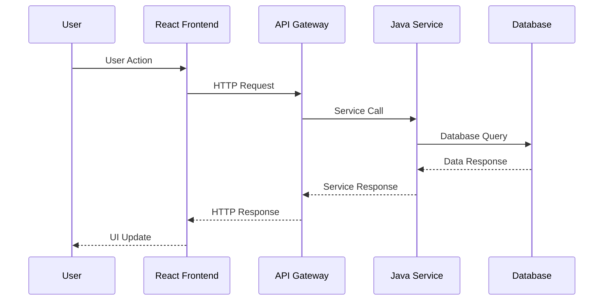

# 🔧 Implementation Plan Template

> **Detailed technical implementation plan for React + Java features and fixes**
> **Priority**: [P1/P2/P3] | **Complexity**: [Low/Medium/High] | **Effort**: [X hours]

---

## 📋 **Implementation Overview**

### **Objective**
[Clear statement of what this implementation achieves]

### **Current State**
[Description of current situation/problem]

### **Target State**
[Description of desired end state after implementation]

---

## 🎯 **Technical Requirements**

### **Frontend Requirements (React)**
- [ ] **Component Development**: [Specific React components needed]
- [ ] **State Management**: [Redux/Context/Local state requirements]
- [ ] **API Integration**: [Frontend service layer changes]
- [ ] **UI/UX Implementation**: [User interface requirements]

### **Backend Requirements (Java)**
- [ ] **API Endpoints**: [REST endpoints to create/modify]
- [ ] **Service Layer**: [Business logic implementation]
- [ ] **Data Access**: [Repository and database operations]
- [ ] **Security**: [Authentication/authorization changes]

### **Database Requirements**
- [ ] **Entity Changes**: [JPA entities to create/modify]
- [ ] **Schema Updates**: [Database schema changes]
- [ ] **Data Migration**: [Data migration requirements]
- [ ] **Performance**: [Indexing and optimization needs]

---

## 🏗️ **Implementation Strategy**

### **Phase 1: Backend Foundation (X hours)**

#### **Database Layer**
```java
// JPA Entity Implementation
@Entity
@Table(name = "feature_entity")
public class FeatureEntity {
    @Id
    @GeneratedValue(strategy = GenerationType.IDENTITY)
    private Long id;
    
    @Column(nullable = false)
    private String name;
    
    @CreationTimestamp
    private LocalDateTime createdAt;
    
    @UpdateTimestamp
    private LocalDateTime updatedAt;
    
    // Constructors, getters, setters
}
```

#### **Repository Layer**
```java
// Repository Interface
@Repository
public interface FeatureRepository extends JpaRepository<FeatureEntity, Long> {
    List<FeatureEntity> findByNameContaining(String name);
    Optional<FeatureEntity> findByName(String name);
}
```

#### **Service Layer**
```java
// Service Implementation
@Service
@Transactional
public class FeatureService {
    
    @Autowired
    private FeatureRepository featureRepository;
    
    public FeatureEntity createFeature(CreateFeatureRequest request) {
        FeatureEntity entity = new FeatureEntity();
        entity.setName(request.getName());
        return featureRepository.save(entity);
    }
    
    public List<FeatureEntity> getAllFeatures() {
        return featureRepository.findAll();
    }
}
```

### **Phase 2: API Layer (X hours)**

#### **Controller Implementation**
```java
// REST Controller
@RestController
@RequestMapping("/api/features")
@CrossOrigin(origins = "http://localhost:3000")
public class FeatureController {
    
    @Autowired
    private FeatureService featureService;
    
    @PostMapping
    public ResponseEntity<FeatureResponse> createFeature(
            @Valid @RequestBody CreateFeatureRequest request) {
        try {
            FeatureEntity entity = featureService.createFeature(request);
            FeatureResponse response = mapToResponse(entity);
            return ResponseEntity.ok(response);
        } catch (Exception e) {
            return ResponseEntity.badRequest().build();
        }
    }
    
    @GetMapping
    public ResponseEntity<List<FeatureResponse>> getAllFeatures() {
        List<FeatureEntity> entities = featureService.getAllFeatures();
        List<FeatureResponse> responses = entities.stream()
            .map(this::mapToResponse)
            .collect(Collectors.toList());
        return ResponseEntity.ok(responses);
    }
}
```

#### **Request/Response DTOs**
```java
// Request DTO
public class CreateFeatureRequest {
    @NotBlank(message = "Name is required")
    private String name;
    
    // Getters, setters, validation
}

// Response DTO
public class FeatureResponse {
    private Long id;
    private String name;
    private LocalDateTime createdAt;
    
    // Getters, setters
}
```

### **Phase 3: Frontend Implementation (X hours)**

#### **API Service Layer**
```typescript
// Frontend API Service
import axios from 'axios';

const API_BASE_URL = 'http://localhost:8080/api';

export interface Feature {
  id: number;
  name: string;
  createdAt: string;
}

export interface CreateFeatureRequest {
  name: string;
}

export class FeatureService {
  private static readonly BASE_URL = `${API_BASE_URL}/features`;

  static async createFeature(request: CreateFeatureRequest): Promise<Feature> {
    const response = await axios.post<Feature>(this.BASE_URL, request);
    return response.data;
  }

  static async getAllFeatures(): Promise<Feature[]> {
    const response = await axios.get<Feature[]>(this.BASE_URL);
    return response.data;
  }
}
```

#### **React Components**
```tsx
// Feature List Component
import React, { useState, useEffect } from 'react';
import { Feature, FeatureService } from '../services/FeatureService';

export const FeatureList: React.FC = () => {
  const [features, setFeatures] = useState<Feature[]>([]);
  const [loading, setLoading] = useState(true);
  const [error, setError] = useState<string | null>(null);

  useEffect(() => {
    loadFeatures();
  }, []);

  const loadFeatures = async () => {
    try {
      setLoading(true);
      const data = await FeatureService.getAllFeatures();
      setFeatures(data);
    } catch (err) {
      setError('Failed to load features');
    } finally {
      setLoading(false);
    }
  };

  if (loading) return <div>Loading...</div>;
  if (error) return <div>Error: {error}</div>;

  return (
    <div className="feature-list">
      <h2>Features</h2>
      {features.map(feature => (
        <div key={feature.id} className="feature-item">
          <h3>{feature.name}</h3>
          <p>Created: {new Date(feature.createdAt).toLocaleDateString()}</p>
        </div>
      ))}
    </div>
  );
};
```

#### **Create Feature Component**
```tsx
// Create Feature Component
import React, { useState } from 'react';
import { FeatureService, CreateFeatureRequest } from '../services/FeatureService';

interface CreateFeatureProps {
  onFeatureCreated: () => void;
}

export const CreateFeature: React.FC<CreateFeatureProps> = ({ onFeatureCreated }) => {
  const [name, setName] = useState('');
  const [loading, setLoading] = useState(false);
  const [error, setError] = useState<string | null>(null);

  const handleSubmit = async (e: React.FormEvent) => {
    e.preventDefault();
    if (!name.trim()) return;

    try {
      setLoading(true);
      setError(null);
      
      const request: CreateFeatureRequest = { name: name.trim() };
      await FeatureService.createFeature(request);
      
      setName('');
      onFeatureCreated();
    } catch (err) {
      setError('Failed to create feature');
    } finally {
      setLoading(false);
    }
  };

  return (
    <form onSubmit={handleSubmit} className="create-feature-form">
      <h3>Create New Feature</h3>
      {error && <div className="error">{error}</div>}
      <div className="form-group">
        <label htmlFor="name">Feature Name:</label>
        <input
          type="text"
          id="name"
          value={name}
          onChange={(e) => setName(e.target.value)}
          disabled={loading}
          required
        />
      </div>
      <button type="submit" disabled={loading || !name.trim()}>
        {loading ? 'Creating...' : 'Create Feature'}
      </button>
    </form>
  );
};
```

### **Phase 4: Integration & Testing (X hours)**

#### **Integration Testing**
```java
// Backend Integration Test
@SpringBootTest
@AutoConfigureTestDatabase(replace = AutoConfigureTestDatabase.Replace.NONE)
@Transactional
class FeatureIntegrationTest {
    
    @Autowired
    private TestRestTemplate restTemplate;
    
    @Test
    void shouldCreateAndRetrieveFeature() {
        // Create feature
        CreateFeatureRequest request = new CreateFeatureRequest();
        request.setName("Test Feature");
        
        ResponseEntity<FeatureResponse> createResponse = restTemplate.postForEntity(
            "/api/features", request, FeatureResponse.class);
        
        assertThat(createResponse.getStatusCode()).isEqualTo(HttpStatus.OK);
        assertThat(createResponse.getBody().getName()).isEqualTo("Test Feature");
        
        // Retrieve features
        ResponseEntity<FeatureResponse[]> getResponse = restTemplate.getForEntity(
            "/api/features", FeatureResponse[].class);
        
        assertThat(getResponse.getStatusCode()).isEqualTo(HttpStatus.OK);
        assertThat(getResponse.getBody()).hasSize(1);
    }
}
```

#### **Frontend Testing**
```typescript
// React Component Test
import { render, screen, fireEvent, waitFor } from '@testing-library/react';
import { FeatureList } from '../FeatureList';
import { FeatureService } from '../../services/FeatureService';

jest.mock('../../services/FeatureService');

describe('FeatureList', () => {
  beforeEach(() => {
    jest.clearAllMocks();
  });

  test('displays features when loaded successfully', async () => {
    const mockFeatures = [
      { id: 1, name: 'Test Feature', createdAt: '2023-01-01T00:00:00Z' }
    ];
    
    (FeatureService.getAllFeatures as jest.Mock).mockResolvedValue(mockFeatures);

    render(<FeatureList />);

    await waitFor(() => {
      expect(screen.getByText('Test Feature')).toBeInTheDocument();
    });
  });

  test('displays error message when loading fails', async () => {
    (FeatureService.getAllFeatures as jest.Mock).mockRejectedValue(new Error('API Error'));

    render(<FeatureList />);

    await waitFor(() => {
      expect(screen.getByText('Error: Failed to load features')).toBeInTheDocument();
    });
  });
});
```

---

## 🧪 **Testing Strategy**

### **Backend Testing**
- [ ] **Unit Tests**: Service and repository layer testing
- [ ] **Integration Tests**: API endpoint testing
- [ ] **Database Tests**: Entity and repository testing
- [ ] **Security Tests**: Authentication/authorization testing

### **Frontend Testing**
- [ ] **Unit Tests**: Component testing with Jest/React Testing Library
- [ ] **Integration Tests**: API service testing
- [ ] **E2E Tests**: User workflow testing
- [ ] **Visual Tests**: UI regression testing

---

## 📋 **Deployment Checklist**

### **Pre-Deployment**
- [ ] **Code review** completed and approved
- [ ] **All tests passing** (unit, integration, E2E)
- [ ] **Database migrations** prepared (if needed)
- [ ] **Environment variables** configured

### **Deployment**
- [ ] **Backend deployment** completed
- [ ] **Frontend build** and deployment completed
- [ ] **Database changes** applied
- [ ] **Health checks** passing

### **Post-Deployment**
- [ ] **Smoke testing** completed
- [ ] **Monitoring** configured and working
- [ ] **Documentation** updated
- [ ] **Stakeholders** notified

---

## 🎓 **Developer Learning Guide**

### **📚 Implementation Concepts**
[Explain complex implementation logic in accessible terms]

### **🏗️ Architecture Flow**


### **🔄 Step-by-Step Breakdown**
1. **Database Layer**: [Explain entity and repository setup]
2. **Service Layer**: [Explain business logic implementation]
3. **API Layer**: [Explain REST endpoint design]
4. **Frontend Integration**: [Explain React component and service integration]

### **⚠️ Implementation Pitfalls**
- **Database Issues**: [Common JPA/Hibernate pitfalls and solutions]
- **API Design Issues**: [Common REST API mistakes and best practices]
- **Frontend Issues**: [Common React integration problems and solutions]
- **Security Issues**: [Common security mistakes and prevention]

### **🔗 Learning Resources**
- **Spring Boot Documentation**: [Relevant Spring Boot concepts]
- **React Documentation**: [Relevant React concepts]
- **JPA/Hibernate Guide**: [Database integration best practices]
- **REST API Design**: [API design principles and patterns]

---

## 📊 **Success Metrics**

### **Technical Metrics**
- [ ] **All tests passing** (>95% success rate)
- [ ] **Performance targets met** (response time <500ms)
- [ ] **Code coverage** (>80% for critical paths)
- [ ] **Security scan** (no critical vulnerabilities)

### **Business Metrics**
- [ ] **Feature functionality** works as specified
- [ ] **User acceptance** criteria met
- [ ] **No regression** in existing features
- [ ] **Documentation** complete and accurate

---

**📝 Template Version**: 1.0  
**🎯 Project Type**: React + Java  
**📅 Created**: [Date]  
**👤 Author**: [Author name]  
**📊 Status**: 📋 Planning
