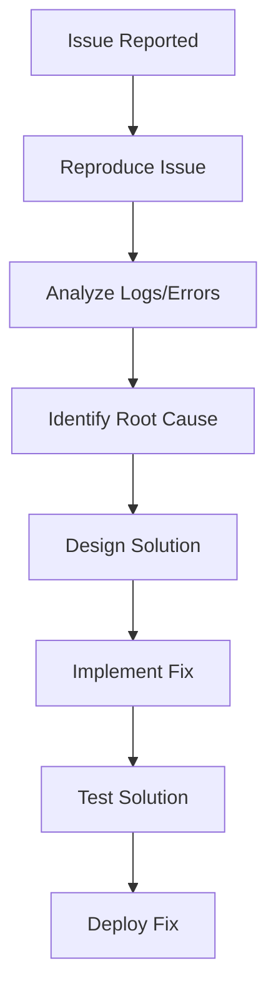

# 🐛 Issue Report Template

> **Use this template to document bugs, technical debt, and issues for React + Java projects**

---

## 📋 **Issue Information**

### **Issue Title**
[Clear, descriptive title for the issue]

### **Issue Type**
- [ ] **🐛 Bug** (Something is broken)
- [ ] **⚛️ Frontend Issue** (React component/UI problem)
- [ ] **☕ Backend Issue** (Java service/API problem)
- [ ] **🗄️ Database Issue** (Data/schema problem)
- [ ] **🔗 Integration Issue** (Frontend-Backend communication)
- [ ] **🔒 Security Vulnerability** (Security concern)
- [ ] **⚡ Performance Issue** (Slow/inefficient code)
- [ ] **📦 Build/Deployment Issue** (CI/CD problem)
- [ ] **🧪 Testing Issue** (Test failures/coverage)
- [ ] **📚 Technical Debt** (Code quality/maintainability)
- [ ] **🔧 Configuration Issue** (Environment/settings)

### **Priority**
- [ ] **🔥 P0 - Critical** (System down, security breach, data loss)
- [ ] **⭐ P1 - High** (Major functionality broken, affects many users)
- [ ] **📋 P2 - Medium** (Minor functionality issue, workaround exists)
- [ ] **📝 P3 - Low** (Cosmetic issue, nice-to-fix)

### **Severity**
- [ ] **🚨 Blocker** (Prevents release/deployment)
- [ ] **🔴 Critical** (Major feature unusable)
- [ ] **🟡 Major** (Important feature partially broken)
- [ ] **🟢 Minor** (Small issue, minimal impact)

---

## 📝 **Issue Description**

### **Summary**
[Brief description of the issue in 1-2 sentences]

### **Expected Behavior**
[What should happen?]

### **Actual Behavior**
[What actually happens?]

### **Impact**
[Who/what is affected by this issue?]

---

## 🔍 **Reproduction Steps**

### **Prerequisites**
[Any setup or conditions needed to reproduce the issue]

### **Steps to Reproduce**
1. [First step]
2. [Second step]
3. [Third step]
4. [Continue as needed]

### **Reproduction Rate**
- [ ] **Always** (100%)
- [ ] **Often** (75-99%)
- [ ] **Sometimes** (25-74%)
- [ ] **Rarely** (<25%)

---

## 🌍 **Environment Information**

### **Frontend Environment**
- **React Version**: [e.g., 18.2.0]
- **Node.js Version**: [e.g., 18.17.0]
- **Browser**: [e.g., Chrome 115.0.5790.110]
- **Operating System**: [e.g., Windows 11, macOS 13.4]

### **Backend Environment**
- **Java Version**: [e.g., OpenJDK 17.0.7]
- **Spring Boot Version**: [e.g., 3.1.2]
- **Database**: [e.g., PostgreSQL 15.3]
- **Application Server**: [e.g., Embedded Tomcat]

### **Deployment Environment**
- **Environment**: [Development/Staging/Production]
- **Container**: [Docker version if applicable]
- **Cloud Platform**: [AWS/Azure/GCP if applicable]

---

## 📊 **Error Information**

### **Frontend Errors**
```javascript
// Console errors (if any)
[Paste browser console errors here]
```

### **Backend Errors**
```java
// Server logs/stack traces (if any)
[Paste server logs or stack traces here]
```

### **Network Errors**
```
// API call failures (if any)
[Paste network errors from browser dev tools]
```

---

## 📸 **Evidence**

### **Screenshots**
[Attach screenshots showing the issue]

### **Screen Recordings**
[Link to screen recordings if helpful]

### **Log Files**
[Attach relevant log files or paste log excerpts]

---

## 🔧 **Analysis & Investigation**

### **Root Cause Analysis**
[What is causing this issue? Leave blank if unknown]

### **Affected Components**
- [ ] **React Components**: [List specific components]
- [ ] **Java Services**: [List specific services]
- [ ] **Database Tables**: [List affected tables]
- [ ] **API Endpoints**: [List affected endpoints]
- [ ] **External Dependencies**: [List third-party services]

### **Related Issues**
[Links to related issues or similar problems]

---

## 💡 **Proposed Solution**

### **Solution Approach**
[High-level approach to fix the issue]

### **Implementation Steps**
1. [Step 1 of the fix]
2. [Step 2 of the fix]
3. [Step 3 of the fix]

### **Alternative Solutions**
[Other possible approaches to consider]

---

## 🧪 **Testing Strategy**

### **Test Cases**
- [ ] **Verify fix works** for reported scenario
- [ ] **Regression testing** to ensure no new issues
- [ ] **Edge case testing** for similar scenarios
- [ ] **Performance testing** if performance-related

### **Test Environment**
[Where should this be tested?]

---

## 📋 **Acceptance Criteria**

### **Definition of Done**
- [ ] **Issue is resolved** and no longer reproducible
- [ ] **No regression** in existing functionality
- [ ] **Tests pass** (unit, integration, E2E as applicable)
- [ ] **Code review** completed and approved
- [ ] **Documentation updated** if necessary

---

## 🎓 **Developer Learning Guide**

### **📚 Issue Context**
[Explain the issue and its impact in beginner-friendly terms]

### **🔍 Debugging Process**


### **🛠️ Debugging Steps**
1. **Reproduce the Issue**: [How to systematically reproduce the problem]
2. **Gather Information**: [What logs, errors, and data to collect]
3. **Analyze Root Cause**: [How to identify the underlying problem]
4. **Design Solution**: [How to approach fixing the issue]

### **⚠️ Common Debugging Pitfalls**
- **Pitfall 1**: [Common mistake and how to avoid it]
- **Pitfall 2**: [Common mistake and how to avoid it]
- **Pitfall 3**: [Common mistake and how to avoid it]

### **🔗 Learning Resources**
- **React Debugging**: [Relevant React debugging techniques]
- **Java Debugging**: [Relevant Java debugging techniques]
- **Related Documentation**: [Links to relevant technical documentation]
- **External Resources**: [Helpful debugging guides and tools]

### **🎯 Prevention Strategies**
- [How to prevent similar issues in the future]
- [Code patterns or practices that help avoid this type of issue]
- [Testing strategies that would catch this type of issue]

---

## 📈 **Metrics & Tracking**

### **Issue Metrics**
- **Reported Date**: [Date issue was first reported]
- **Assigned Date**: [Date issue was assigned for fixing]
- **Resolution Date**: [Date issue was resolved]
- **Time to Resolution**: [Total time from report to resolution]

### **Impact Metrics**
- **Users Affected**: [Number or percentage of users affected]
- **Frequency**: [How often the issue occurs]
- **Business Impact**: [Revenue/productivity impact if applicable]

---

## 🔗 **Related Documents**

- **Implementation Plan**: [Link to fix implementation plan when created]
- **Related Issues**: [Links to similar or related issues]
- **Feature Documentation**: [Links to related feature documentation]
- **Technical Documentation**: [Links to relevant technical docs]

---

**📝 Template Version**: 1.0  
**🎯 Project Type**: React + Java  
**📅 Created**: [Date]  
**👤 Reporter**: [Reporter name]  
**👤 Assignee**: [Assignee name]  
**📊 Status**: 🔍 Investigating
