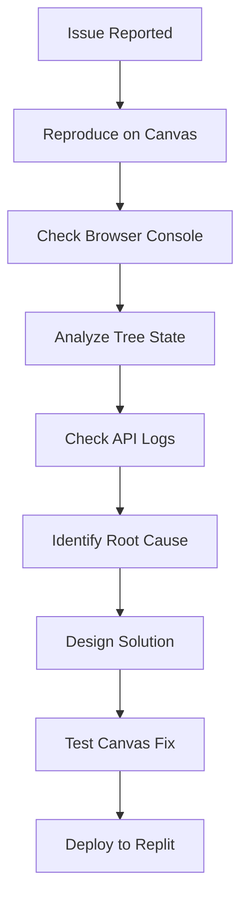

# 🐛 Issue Report Template

> **Use this template to document bugs, technical debt, and issues for AI-Native Impact Tree projects**

---

## 📋 **Issue Information**

### **Issue Title**
[Clear, descriptive title for the issue]

### **Issue Type**
- [ ] **🐛 Bug** (Something is broken in the impact tree)
- [ ] **⚛️ Frontend Issue** (React canvas/component problem)
- [ ] **🟢 Backend Issue** (Node.js/Express API problem)
- [ ] **🗄️ Database Issue** (PostgreSQL/Drizzle ORM problem)
- [ ] **🔗 Integration Issue** (Frontend-Backend/Canvas sync)
- [ ] **🔒 Security Vulnerability** (Authentication/data security)
- [ ] **⚡ Performance Issue** (Canvas rendering/tree loading)
- [ ] **📦 Build/Deployment Issue** (Vite/Replit deployment)
- [ ] **🧪 Testing Issue** (Test failures/coverage)
- [ ] **📚 Technical Debt** (Code quality/maintainability)
- [ ] **🔧 Configuration Issue** (Environment/Replit settings)
- [ ] **🤖 AI Integration Issue** (Vertex AI problems)
- [ ] **🎨 Canvas Issue** (Tree rendering/interaction problems)

### **Priority**
- [ ] **🔥 P0 - Critical** (Canvas unusable, data loss, discovery workflow blocked)
- [ ] **⭐ P1 - High** (Major tree functionality broken, affects PM users)
- [ ] **📋 P2 - Medium** (Minor functionality issue, workaround exists)
- [ ] **📝 P3 - Low** (Cosmetic issue, nice-to-fix)

### **Severity**
- [ ] **🚨 Blocker** (Prevents Replit deployment/development)
- [ ] **🔴 Critical** (Major discovery feature unusable)
- [ ] **🟡 Major** (Important tree feature partially broken)
- [ ] **🟢 Minor** (Small issue, minimal PM impact)

---

## 📝 **Issue Description**

### **Summary**
[Brief description of the issue in 1-2 sentences]

### **Expected Behavior**
[What should happen in the PM's discovery workflow?]

### **Actual Behavior**
[What actually happens when using the impact tree?]

### **Impact**
[How does this affect Product Managers using the tool for discovery?]

---

## 🔍 **Reproduction Steps**

### **Prerequisites**
[Any setup or tree configuration needed to reproduce the issue]

### **Steps to Reproduce**
1. [First step - e.g., "Open impact tree canvas"]
2. [Second step - e.g., "Create outcome node"]
3. [Third step - e.g., "Add opportunity child node"]
4. [Continue as needed]

### **Reproduction Rate**
- [ ] **Always** (100%)
- [ ] **Often** (75-99%)
- [ ] **Sometimes** (25-74%)
- [ ] **Rarely** (<25%)

---

## 🌍 **Environment Information**

### **Frontend Environment**
- **React Version**: [e.g., 18.2.0]
- **Node.js Version**: [e.g., 18.17.0]
- **Browser**: [e.g., Chrome 115.0.5790.110]
- **Canvas Features Used**: [Tree rendering, drag-drop, zoom/pan]
- **Operating System**: [e.g., Windows 11, macOS 13.4]

### **Backend Environment**
- **Node.js Version**: [e.g., 18.17.0]
- **Express Version**: [e.g., 4.18.2]
- **Database**: [PostgreSQL version on Replit]
- **Drizzle ORM Version**: [e.g., 0.28.6]

### **Deployment Environment**
- **Environment**: [Replit Development/Production]
- **Replit Features**: [Autoscale, database, secrets]
- **AI Integration**: [Vertex AI status if applicable]

---

## 📊 **Error Information**

### **Frontend Errors**
```javascript
// Browser console errors (if any)
[Paste React/Canvas errors here]
```

### **Backend Errors**
```javascript
// Server logs/stack traces (if any)
[Paste Express/Node.js errors here]
```

### **Network Errors**
```
// API call failures (if any)
[Paste network errors from browser dev tools]
```

### **Canvas Errors**
```javascript
// Canvas rendering errors (if any)
[Paste HTML5 canvas or SVG rendering errors]
```

---

## 📸 **Evidence**

### **Screenshots**
[Attach screenshots showing the tree/canvas issue]

### **Screen Recordings**
[Link to screen recordings of canvas interactions if helpful]

### **Tree Data**
[Export of tree structure if relevant to the issue]

### **Log Files**
[Attach relevant Replit logs or paste log excerpts]

---

## 🔧 **Analysis & Investigation**

### **Root Cause Analysis**
[What is causing this issue in the impact tree system? Leave blank if unknown]

### **Affected Components**
- [ ] **React Components**: [Tree nodes, canvas, modals]
- [ ] **Node.js Services**: [Express routes, tree management]
- [ ] **Database Tables**: [impact_trees, canvas_state]
- [ ] **API Endpoints**: [/api/impact-trees endpoints]
- [ ] **Canvas System**: [SVG rendering, interactions]
- [ ] **AI Integration**: [Vertex AI services]
- [ ] **State Management**: [Zustand, TanStack Query]

### **Related Issues**
[Links to related canvas/tree issues or similar problems]

---

## 💡 **Proposed Solution**

### **Solution Approach**
[High-level approach to fix the issue in the impact tree context]

### **Implementation Steps**
1. [Step 1 of the fix - e.g., "Update canvas rendering logic"]
2. [Step 2 of the fix - e.g., "Fix tree state synchronization"]
3. [Step 3 of the fix - e.g., "Add error handling for node operations"]

### **Alternative Solutions**
[Other possible approaches considering canvas performance and PM workflow]

---

## 🧪 **Testing Strategy**

### **Test Cases**
- [ ] **Verify fix works** for reported tree scenario
- [ ] **Canvas performance** testing with large trees
- [ ] **Discovery workflow** testing for PM users
- [ ] **Cross-browser** testing for canvas compatibility

### **Test Environment**
[Replit development environment testing approach]

---

## 📋 **Acceptance Criteria**

### **Definition of Done**
- [ ] **Issue is resolved** and tree functionality works correctly
- [ ] **No canvas performance regression** 
- [ ] **PM discovery workflow** not disrupted
- [ ] **Tests pass** (component, API, canvas integration)
- [ ] **Code review** completed and approved
- [ ] **Replit deployment** successful

---

## 🎓 **Developer Learning Guide**

### **📚 Issue Context**
[Explain the issue and its impact in terms of PM discovery workflow and canvas architecture]

This issue affects the AI-Native Impact Tree's ability to support Product Managers in their continuous discovery practice. The impact tree serves as a live document that evolves with PM learning, so any disruption to the canvas or tree functionality directly impacts the discovery workflow.

### **🔍 Debugging Process**


### **🛠️ Debugging Steps**
1. **Reproduce the Issue**: Load the specific tree and follow PM workflow steps
2. **Canvas Inspection**: Check HTML5 canvas rendering and SVG elements
3. **State Analysis**: Examine Zustand tree state and TanStack Query cache
4. **API Investigation**: Review Express endpoint logs and database queries
5. **Root Cause**: Identify whether issue is frontend, backend, or integration

### **⚠️ Common Debugging Pitfalls**
- **Canvas State**: Remember canvas state is separate from tree data
- **Async Operations**: Canvas updates and API calls may be out of sync
- **Performance**: Large trees can mask underlying issues
- **PM Context**: Always consider impact on discovery workflow

### **🔗 Learning Resources**
- **React Canvas Debugging**: Browser dev tools for canvas inspection
- **Drizzle Debugging**: PostgreSQL query analysis and optimization
- **Express Debugging**: Node.js logging and error handling
- **Impact Tree Architecture**: Understanding tree state and canvas integration

### **🎯 Prevention Strategies**
- Comprehensive canvas testing with various tree sizes
- State synchronization validation between frontend and backend
- Performance monitoring for tree operations
- PM user testing to catch workflow disruptions

---

## 📈 **Metrics & Tracking**

### **Issue Metrics**
- **Reported Date**: [Date issue was first reported]
- **Assigned Date**: [Date issue was assigned for fixing]
- **Resolution Date**: [Date issue was resolved]
- **PM Impact**: [Number of PM users affected]

### **Impact Metrics**
- **Discovery Workflow Impact**: [How this affects PM discovery activities]
- **Canvas Performance Impact**: [Effect on tree rendering performance]
- **Business Impact**: [Impact on product-market fit discovery]

---

## 🔗 **Related Documents**

- **Implementation Plan**: [Link to fix implementation plan when created]
- **Related Issues**: [Links to similar canvas or tree issues]
- **PRD Documentation**: [docs/PRD.md - Product requirements]
- **Canvas Architecture**: [Technical documentation for canvas system]

---

**📝 Template Version**: 2.0  
**🎯 Project Type**: AI-Native Impact Tree (React + Node.js)  
**📅 Created**: [Date]  
**👤 Reporter**: [Reporter name]  
**👤 Assignee**: [Assignee name]  
**📊 Status**: 🔍 Investigating
