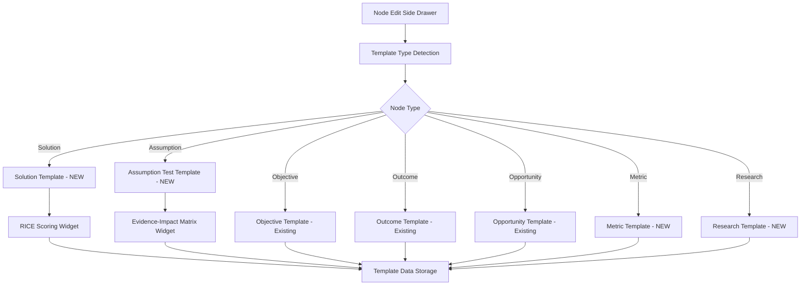

# 🎯 Extended Node Templates for Solution, Assumption Test, Metric, and Research

> **Feature Type**: Content Structure Enhancement - PM Documentation Quality Extension  
> **Priority**: High - Content Quality & Consistency Improvement  
> **Complexity**: Medium - UI Component Enhancement with Additional Structured Forms  
> **PM Value**: Comprehensive standardized node documentation workflow

---

## 🎯 **Feature Overview**

Extend the existing template system to include structured templates for Solution, Assumption Test, Metric, and Research node types, while preserving the current Objective, Outcome, and Opportunity templates. This enhancement will provide Product Managers with comprehensive guided frameworks for all node types in the impact tree.

### **Current State Analysis**
- **Existing Implementation**: Templates for Objective, Outcome, and Opportunity nodes with structured forms
- **Current Gap**: Solution, Assumption Test, Metric, and Research nodes still use free-form description fields
- **Template Infrastructure**: Existing template engine and UI components ready for extension

### **Target State Vision**
- **Complete Template Coverage**: All seven node types have structured template forms
- **Consistent UI/UX**: Extended templates use the same design patterns as existing templates
- **Advanced Scoring**: RICE scoring for Solutions, Evidence-Impact prioritization for Assumptions
- **Preserved Functionality**: Existing templates remain unchanged

---

## 📋 **Detailed Requirements**

### **Template Specifications**

#### **1. Solution Node Template**
```
Fields:
- Title (mandatory)
- Solution Rationale - How this solution addresses the parent opportunity
- Solution Description - High-level summary and user interaction
- Key Use Cases / User Stories - Specific user scenarios
- Core Features - Primary functionality components
- Dependencies - Technical, legal, and cross-functional requirements
- RICE Prioritization Score (Reach/Impact/Confidence/Effort with calculator)
```

#### **2. Assumption Test Node Template**
```
Fields:
- Title (mandatory)
- Assumption Type - Desirability/Feasibility/Viability/Usability
- Core Assumption - Clear statement of what you believe to be true
- Experiment Design - Smallest, fastest, most cost-effective test
- Learning Goal - Specific insight or question to answer
- Success Indicators - Qualitative/quantitative signals to look for
- Evidence-Impact Prioritization (Evidence strength vs Impact if wrong)
```

#### **3. Metric Node Template**
```
Fields:
- Title (mandatory)
- Metric Type - Leading/Lagging/Diagnostic
- Definition - Clear description of what is measured
- Data Source - Where the metric data comes from
- Collection Method - How the data is gathered
- Frequency - How often the metric is measured
- Target Value - Desired metric outcome
- Current Baseline - Starting point measurement
```

#### **4. Research Node Template**
```
Fields:
- Title (mandatory)
- Research Type - User Research/Market Research/Competitive Analysis/Technical Research
- Research Question - Primary question to be answered
- Methodology - Approach and methods to be used
- Participants/Sources - Target participants or data sources
- Timeline - Expected duration and milestones
- Success Criteria - What constitutes successful research
- Key Findings - Results and insights (filled during/after research)
```

### **Advanced Scoring Systems**

#### **1. RICE Scoring for Solutions**
- **Interactive Input Fields**: Reach, Impact, Confidence, Effort
- **Real-time Calculation**: Automatic score computation
- **Rationale Fields**: Explanation areas for each component
- **Visual Score Display**: Prominent calculated RICE score

#### **2. Evidence-Impact Matrix for Assumption Tests**
- **Evidence Strength Scale**: Strong Evidence → Weak Evidence
- **Impact if Wrong Scale**: Low Impact → High Impact
- **Priority Calculation**:
  - Strong Evidence + High Impact = Low Priority
  - Strong Evidence + Low Impact = Not Worth Testing
  - Weak Evidence + Low Impact = Low Priority
  - Weak Evidence + High Impact = High Priority
- **Visual Matrix Display**: 2x2 grid showing priority quadrants

---

## 🔧 **Technical Implementation**

### **Extended Template Field Definitions**

#### **Solution Template Schema**
```typescript
interface SolutionTemplateData {
  solutionRationale: string;
  solutionDescription: string;
  keyUseCases: string;
  coreFeatures: string;
  dependencies: string;
  
  // RICE Scoring
  riceReach: number;
  riceImpact: number;
  riceConfidence: number;
  riceEffort: number;
  riceReachRationale: string;
  riceImpactRationale: string;
  riceConfidenceRationale: string;
  riceEffortRationale: string;
  calculatedRiceScore: number;
}
```

#### **Assumption Test Template Schema**
```typescript
interface AssumptionTestTemplateData {
  assumptionType: 'desirability' | 'feasibility' | 'viability' | 'usability';
  coreAssumption: string;
  experimentDesign: string;
  learningGoal: string;
  successIndicators: string;
  
  // Evidence-Impact Prioritization
  evidenceStrength: number; // 1-5 scale
  impactIfWrong: number; // 1-5 scale
  evidenceRationale: string;
  impactRationale: string;
  calculatedPriority: 'high' | 'low' | 'not-worth-testing';
}
```

#### **Metric Template Schema**
```typescript
interface MetricTemplateData {
  metricType: 'leading' | 'lagging' | 'diagnostic';
  definition: string;
  dataSource: string;
  collectionMethod: string;
  frequency: string;
  targetValue: string;
  currentBaseline: string;
}
```

#### **Research Template Schema**
```typescript
interface ResearchTemplateData {
  researchType: 'user-research' | 'market-research' | 'competitive-analysis' | 'technical-research';
  researchQuestion: string;
  methodology: string;
  participantsSources: string;
  timeline: string;
  successCriteria: string;
  keyFindings: string;
}
```

### **Component Architecture Extensions**

#### **New Template Components**
```typescript
SolutionForm.tsx - Solution-specific fields with RICE scoring
AssumptionTestForm.tsx - Assumption test fields with Evidence-Impact matrix
MetricForm.tsx - Metric tracking and measurement fields
ResearchForm.tsx - Research planning and findings fields
RiceScoringWidget.tsx - Interactive RICE calculation interface
EvidenceImpactWidget.tsx - Evidence-Impact prioritization matrix
```

---

## 🎨 **User Experience Design**

### **Template-Specific Placeholder Examples**

#### **Solution Template Placeholders**
```typescript
const SOLUTION_PLACEHOLDERS = {
  solutionRationale: "e.g., 'By proactively displaying universally recognized symbols of digital security, we can address the user's fear, uncertainty, and doubt at the exact moment they are asked to trust us with their financial data. This increased feeling of safety will make them more likely to complete the bank connection process.'",
  
  solutionDescription: "e.g., 'A new module on the bank connection page that displays security information and credentials to build user trust.'",
  
  keyUseCases: "e.g., 'As a new user, when I am asked to connect my bank account, I want to see proof of security so that I can feel confident my data is safe.'",
  
  coreFeatures: "e.g., 'Display a row of third-party security logos (e.g., Norton, McAfee, Plaid). Include a \"Learn More\" link that opens a modal with details on encryption and data policies.'",
  
  dependencies: "e.g., 'Technical: Access to the Plaid API for their official security marks. Cross-functional: Legal team review of all security claims made in the \"Learn More\" modal.'"
};
```

#### **Assumption Test Template Placeholders**
```typescript
const ASSUMPTION_TEST_PLACEHOLDERS = {
  desirability: {
    coreAssumption: "e.g., 'Our music streaming app users desire a personalized playlist curator feature that learns their preferences and automatically generates new playlists, saving them time and introducing them to new music.'",
    
    experimentDesign: "e.g., 'Conduct a brief, in-app survey for 100 active users asking: \"Would you be interested in a feature that automatically creates personalized playlists for you based on your listening habits?\"'",
    
    learningGoal: "e.g., 'To gauge the level of user interest in an automated playlist curation feature and understand their specific needs and expectations from it, informing whether to invest in its development.'",
    
    successIndicators: "e.g., 'Over 70% of surveyed users indicating strong interest (\"Yes, definitely\" or \"Yes, probably\"). Recurring themes in open-ended responses about saving time, discovering new artists, or matching specific moods.'"
  },
  
  feasibility: {
    coreAssumption: "e.g., 'Our current database and API infrastructure can handle real-time inventory updates across all product SKUs for our e-commerce platform during peak traffic without significant latency or data inconsistencies.'",
    
    experimentDesign: "e.g., 'Run a controlled load test in a staging environment. Simulate 500 concurrent users browsing products and 50 concurrent \"purchase\" events (which trigger inventory updates).'",
    
    learningGoal: "e.g., 'To determine if our existing technical architecture can support real-time inventory synchronization under realistic load conditions, identifying any performance bottlenecks or data integrity risks.'",
    
    successIndicators: "e.g., 'Average inventory update latency remaining below 200ms. Database CPU and memory utilization staying below 80%. No instances of incorrect inventory counts observed after concurrent updates.'"
  }
};
```

### **Advanced Scoring Widget Design**

#### **RICE Scoring Interface**
- **Horizontal Sliders**: Clean input sliders for Reach, Impact, Confidence, Effort
- **Real-time Calculation**: Live RICE score updates as values change
- **Contextual Help**: Tooltips explaining each RICE component
- **Rationale Text Areas**: Compact explanation fields below each slider
- **Score Visualization**: Large, prominent calculated score with color coding

#### **Evidence-Impact Matrix Interface**
- **2D Slider Interface**: X-axis for Evidence Strength, Y-axis for Impact if Wrong
- **Quadrant Visualization**: Visual 2x2 matrix showing priority zones
- **Priority Auto-calculation**: Real-time priority determination based on position
- **Color-coded Quadrants**: Visual feedback for different priority levels
- **Explanatory Text**: Clear guidance on interpreting the matrix

---

## 🚀 **Implementation Plan**

### **Phase 1: Template Infrastructure Extension (Week 1)**
- **Extended Template Definitions**: Create field schemas for all four new node types
- **Component Architecture**: Build new template-specific form components
- **Data Model Updates**: Extend TreeNode interface to support new template data
- **Basic Form Rendering**: Implement template-specific form rendering

### **Phase 2: Advanced Scoring Widgets (Week 2)**
- **RICE Scoring Widget**: Build interactive RICE calculation interface
- **Evidence-Impact Matrix**: Create 2D prioritization matrix widget
- **Real-time Calculations**: Implement live score/priority updates
- **Visual Feedback**: Add color coding and visual indicators

### **Phase 3: Placeholder System Extension (Week 3)**
- **Template-Specific Placeholders**: Implement contextual placeholder texts
- **Dynamic Placeholder Loading**: Context-aware placeholder selection
- **Tooltip Integration**: Add help tooltips for complex concepts
- **User Guidance**: Implement progressive disclosure for template help

### **Phase 4: Integration & Testing (Week 4)**
- **Template Switching**: Extend existing template switching to new types
- **Data Persistence**: Update backend to handle extended template data
- **Comprehensive Testing**: Test all new template functionality
- **Performance Optimization**: Ensure smooth performance with extended templates

---

## 📊 **Success Metrics**

### **Template Adoption Metrics**
- **Solution Template Usage**: 90% of new solution nodes use template format
- **Assumption Test Template Usage**: 95% of new assumption tests use structured format
- **Template Completion Rate**: 75% of template fields completed for new nodes
- **RICE Score Usage**: 100% of solution nodes include RICE scores

### **User Experience Metrics**
- **Template Switching Efficiency**: <300ms switching between all template types
- **Scoring Widget Usage**: 85% of users complete advanced scoring widgets
- **Form Completion Time**: 40% reduction in time to create comprehensive nodes
- **User Satisfaction**: Positive feedback on extended template guidance

### **Data Quality Metrics**
- **Structured Data Coverage**: 100% of new nodes use appropriate templates
- **Field Completion Consistency**: 80% consistency in field completion across node types
- **Scoring Accuracy**: Validated RICE and Evidence-Impact calculations
- **Template Data Integrity**: 100% successful extended template data storage

---

## 🔍 **Risk Assessment**

### **Technical Risks**
- **Performance Impact**: Additional template complexity may affect drawer performance
- **Data Migration**: Existing Solution/Assumption/Metric/Research nodes need template conversion
- **UI Complexity**: Multiple scoring widgets may overwhelm the interface
- **Memory Usage**: Extended template data increases client-side memory usage

### **UX Risks**
- **Cognitive Load**: Seven different templates may confuse users initially
- **Template Selection**: Users may choose wrong template for their node type
- **Scoring Fatigue**: Multiple scoring systems may lead to incomplete assessments
- **Mobile Usability**: Complex scoring widgets challenging on mobile devices

### **Mitigation Strategies**
- **Progressive Rollout**: Implement templates one node type at a time
- **Smart Defaults**: Pre-select appropriate templates based on node context
- **Collapsible Sections**: Use progressive disclosure to manage complexity
- **Mobile Optimization**: Simplified mobile interfaces for scoring widgets

---

## 🎯 **Acceptance Criteria**

### **Template Functionality**
- [ ] All four new node types have complete template implementations
- [ ] Existing Objective, Outcome, and Opportunity templates remain unchanged
- [ ] RICE scoring calculates correctly for Solution nodes
- [ ] Evidence-Impact matrix calculates priority correctly for Assumption Tests

### **User Interface Consistency**
- [ ] New templates use identical design patterns as existing templates
- [ ] All template fields have appropriate placeholder text with examples
- [ ] Tooltip and help text approach matches existing implementation
- [ ] Collapsible sections work smoothly across all templates

### **Advanced Scoring Systems**
- [ ] RICE scoring widget provides real-time calculations
- [ ] Evidence-Impact matrix displays priority quadrants visually
- [ ] All scoring rationale fields are properly integrated
- [ ] Scoring widgets are mobile-responsive

### **Data Handling**
- [ ] Extended template data saves correctly to database
- [ ] Template switching preserves compatible data across all node types
- [ ] Form validation works for all new field types
- [ ] Migration path exists for converting existing nodes to templates

---

## 🎓 **Developer Learning Guide**

### **Plain English Explanation**
This feature extends our existing template system to cover all node types in impact trees. Think of it like having structured forms for every type of business document - just as you wouldn't use the same template for a meeting agenda and a project plan, different node types need different structured approaches to capture the right information.

### **Visual Architecture Diagram**


### **Implementation Logic Breakdown**

#### **Step 1: Template Extension Architecture**
1. **Extend Existing System**: Build on the proven template infrastructure
2. **Component Reuse**: Leverage existing TemplateField components and patterns
3. **Data Model Extension**: Add new template data types to existing schema
4. **UI Consistency**: Use identical visual patterns and interactions

#### **Step 2: Advanced Scoring Integration**
1. **RICE Calculator**: Real-time calculation widget for Solution prioritization
2. **Evidence-Impact Matrix**: 2D scoring system for Assumption Test prioritization
3. **Visual Feedback**: Color-coded scores and priority indicators
4. **Rationale Capture**: Text fields explaining scoring decisions

#### **Step 3: Context-Aware Placeholders**
1. **Type-Specific Examples**: Different placeholder text based on assumption type
2. **Progressive Guidance**: More detailed help for complex fields
3. **Tooltip Integration**: Consistent help system across all templates

### **Context & Rationale**

#### **Why These Specific Templates?**
- **Solution Template**: Provides structured approach to solution design with business justification
- **Assumption Test Template**: Follows lean startup methodology for hypothesis validation
- **Metric Template**: Ensures consistent measurement and tracking approaches
- **Research Template**: Standardizes research planning and knowledge capture

#### **Why Advanced Scoring Systems?**
- **RICE for Solutions**: Industry-standard prioritization framework for product decisions
- **Evidence-Impact for Assumptions**: Risk-based approach to testing prioritization
- **Real-time Calculation**: Immediate feedback improves decision-making speed
- **Rationale Capture**: Preserves reasoning for future reference and team alignment

### **Common Pitfalls & Solutions**

#### **Template Complexity Overload**
- **Problem**: Seven different templates may overwhelm users
- **Solution**: Progressive disclosure, collapsible sections, smart defaults

#### **Scoring Widget Performance**
- **Problem**: Complex calculations may slow down the interface
- **Solution**: Debounced calculations, optimized re-rendering, memoization

#### **Mobile Template Usability**
- **Problem**: Complex forms challenging on small screens
- **Solution**: Responsive design, simplified mobile interfaces, touch-optimized controls

### **Learning Connections**

#### **Prerequisites**
- Understanding of existing template system implementation
- Knowledge of React form handling and state management
- Familiarity with business prioritization frameworks (ICE, RICE)

#### **Related Concepts**
- **Template Pattern**: Software design pattern for structured data capture
- **Progressive Disclosure**: UX pattern for managing interface complexity
- **Business Model Canvas**: Similar structured approach to business planning
- **Lean Startup Methodology**: Framework for assumption testing and validation

#### **Further Reading**
- [RICE Prioritization Framework](https://www.productplan.com/glossary/rice-scoring-model/)
- [Assumption Testing in Product Development](https://www.mindtheproduct.com/validation-assumption-testing/)
- [Progressive Disclosure in UX Design](https://www.nngroup.com/articles/progressive-disclosure/)

---

## 🔗 **Related Documentation**

### **Implementation**
- **Implementation Plan**: [Extended Node Templates Implementation Plan](../implementation_plans/26_Extended_Node_Templates_Implementation_Plan.md)
- **Base Feature**: [Node Content Templates](Node_Content_Templates.md)
- **Workflow Guide**: [Documentation Workflow Guide](../workflow_guide.md)

### **Dependencies**
- **Existing Templates**: Objective, Outcome, and Opportunity template implementations
- **UI Components**: Existing slider, collapsible sections, form validation components
- **Template Engine**: Current template rendering and switching system
- **Database Schema**: Extended template data storage capabilities

### **Impact Analysis**
- **Database Schema**: Additional fields for extended template data
- **API Endpoints**: Enhanced to handle all template types
- **Frontend State**: Extended template management in TreeContext
- **User Workflow**: Comprehensive structured content creation for all node types

---

**📝 Feature Version**: 1.0  
**🎯 Project Impact**: High - Complete Template System Coverage  
**📅 Created**: January 2025  
**👤 Stakeholder**: Product Manager Discovery Team  
**📊 Status**: 📋 Feature Specification - Ready for Implementation
