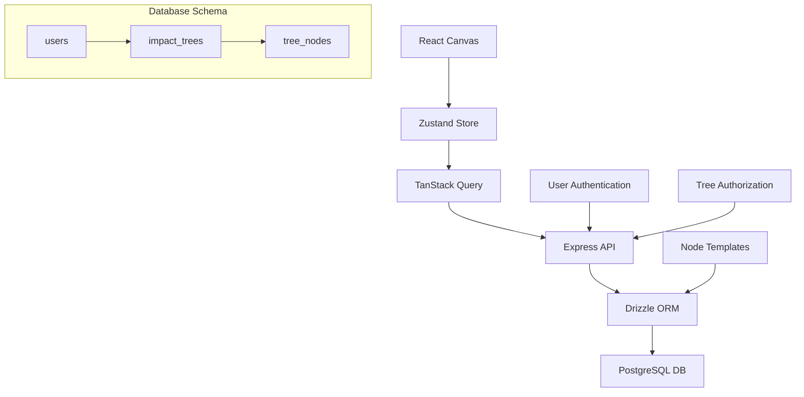

# 🚀 Feature Request: Enhanced Tree and Node Data Persistence

> **Complete PostgreSQL backend implementation for tree and node data management**

---

## 📋 **Feature Information**

### **Feature Name**
Enhanced Tree and Node Data Persistence with PostgreSQL Backend

### **Feature Type**
- [x] **🗄️ Database Entity/Schema** (PostgreSQL/Drizzle ORM)
- [x] **🌐 Backend API Endpoint** (Express.js REST endpoints)
- [x] **🔗 Frontend-Backend Integration** (Canvas state sync, real-time updates)

---

## 🎯 **Business Case**

### **Problem Statement**
The current system lacks proper database persistence for impact trees and nodes. Users cannot save their strategic planning work, collaborate effectively, or access their trees across sessions. This blocks the core value proposition of the AI-Native Impact Tree as a persistent discovery tool for Product Managers.

### **User Story**
**As a** Product Manager practicing continuous discovery  
**I want** my impact trees and nodes to be persistently stored in a database  
**So that** I can save my strategic planning work, access it across sessions, and collaborate with my team on evolving discovery artifacts

### **Priority & Impact**
- **Priority**: 
  - [x] 🔥 **Critical** (Blocking product-market fit discovery)

- **Impact**: 
  - [x] 🎯 **High** (Core discovery functionality, affects all PMs)

---

## 🔧 **Technical Specification**

### **Components Affected**
- [x] **🟢 Node.js Backend** (Express.js services, API endpoints)
- [x] **🗄️ Database** (PostgreSQL schema, Drizzle ORM entities)
- [x] **🌐 REST API** (Impact tree endpoints, canvas state sync)
- [x] **⚛️ React Frontend** (Canvas components, modals, state management)

### **Effort Estimate**
- [x] **🟡 Medium** (3-5 days)

### **Dependencies**
- PostgreSQL database setup and connection
- Drizzle ORM configuration
- Express.js API framework
- Canvas rendering system compatibility
- Tree state management (Zustand) integration

### **API Changes**
- [x] **New endpoints only**

---

## 📝 **Detailed Requirements**

### **Frontend Requirements (React + TypeScript)**
1. **State Management**: Update Zustand store to sync with backend APIs
2. **API Integration**: TanStack Query integration for tree and node CRUD operations
3. **Error Handling**: Proper error states and user feedback for database operations
4. **Real-time Sync**: Canvas state synchronization with persistent storage

### **Backend Requirements (Node.js + Express)**
1. **API Endpoints**: Complete CRUD operations for trees and nodes
   - `GET /api/impact-trees` - List user's trees
   - `POST /api/impact-trees` - Create new tree
   - `GET /api/impact-trees/:id` - Get specific tree with nodes
   - `PUT /api/impact-trees/:id` - Update tree metadata
   - `DELETE /api/impact-trees/:id` - Delete tree and all nodes
   - `POST /api/impact-trees/:id/nodes` - Create new node
   - `PUT /api/impact-trees/:id/nodes/:nodeId` - Update node
   - `DELETE /api/impact-trees/:id/nodes/:nodeId` - Delete node
2. **Business Logic**: Tree validation, node relationships, user authorization
3. **Data Access**: Drizzle ORM operations with proper error handling
4. **User Isolation**: Ensure trees are only accessible to their creators

### **Database Requirements**
1. **Schema Design**: 
   - `impact_trees` table for tree metadata
   - `tree_nodes` table for individual nodes with parent-child relationships
   - User isolation through foreign key relationships
2. **Relationships**: Proper foreign key constraints and cascading deletes
3. **Performance**: Indexes for tree queries and user-based filtering
4. **Data Types**: JSONB for flexible node template data storage

---

## 🧪 **Testing Strategy**

### **Frontend Testing**
- [ ] **API Integration Tests**: TanStack Query operations with mocked backend
- [ ] **State Management Tests**: Zustand store persistence and sync
- [ ] **Error Handling Tests**: Network failures and database error scenarios
- [ ] **Canvas Integration Tests**: Tree rendering after data persistence

### **Backend Testing**
- [ ] **Unit Tests**: Service layer and business logic testing
- [ ] **API Tests**: All CRUD endpoints with proper authorization
- [ ] **Database Tests**: Drizzle ORM operations and constraint validation
- [ ] **Integration Tests**: Full tree creation and management workflows

---

## 📊 **Success Metrics**

### **Functional Metrics**
- [ ] **Tree Persistence**: 100% successful tree save/load operations
- [ ] **Node Management**: Complete CRUD operations for all node types
- [ ] **User Isolation**: Zero cross-user data access incidents
- [ ] **Canvas Sync**: Real-time synchronization between canvas and database

### **Quality Metrics**
- [ ] **API Response Times**: <200ms for tree operations
- [ ] **Database Performance**: Optimized queries for large trees (100+ nodes)
- [ ] **Error Recovery**: Graceful handling of all database error scenarios
- [ ] **Data Integrity**: Zero data loss incidents during operations

---

## 🎓 **Developer Learning Guide**

### **📚 Concept Overview**
This feature implements the foundational data persistence layer for the AI-Native Impact Tree, enabling Product Managers to save and manage their strategic discovery work across sessions. The system uses PostgreSQL for reliable data storage with an adjacency list model for efficient tree hierarchy representation.

The implementation supports continuous discovery practices by ensuring that impact trees serve as persistent, evolving documents that capture PM learning over time. Each tree represents a strategic planning canvas with hierarchical nodes containing structured templates for objectives, outcomes, opportunities, and solutions.

### **🏗️ Architecture Diagram**

### **🔄 Implementation Flow**
1. **Tree Creation**: PM creates new tree → API creates record → Canvas initializes
2. **Node Management**: PM adds/edits nodes → Canvas updates → API persists changes
3. **Data Sync**: Canvas state synchronizes with database via TanStack Query
4. **User Isolation**: All operations filtered by authenticated user ID
5. **Template Storage**: Node template data stored as JSONB for flexibility

### **⚠️ Common Pitfalls**
- **Adjacency List Performance**: Large trees can slow recursive queries - implement pagination
- **Canvas-Database Sync**: State management must handle optimistic updates and conflicts
- **User Authorization**: Every database operation must validate user ownership
- **Template Evolution**: JSONB schema changes require careful migration planning
- **Concurrent Editing**: Multiple users editing same tree needs conflict resolution

### **🔗 Learning Resources**
- **Adjacency List Model**: Database design for hierarchical data structures
- **Drizzle ORM**: Type-safe PostgreSQL operations with migrations
- **TanStack Query**: React state synchronization with backend APIs
- **PostgreSQL JSONB**: Flexible schema design for template data
- **Express.js Authorization**: Route-level user authentication patterns

### **🎯 Key Takeaways**
- Database design should support PM workflow patterns and tree evolution
- User isolation is critical for multi-tenant impact tree management
- JSONB enables flexible template storage while maintaining query performance
- Real-time sync between canvas and database requires careful state management
- All database operations must be designed for scalability with large tree structures
- The persistence layer should be invisible to PM users but robust for collaboration

---

## 📋 **Implementation Checklist**

### **Pre-Implementation**
- [ ] **Database schema** designed and reviewed for PM workflow support
- [ ] **API endpoints** specification completed with proper authorization
- [ ] **Canvas integration** approach planned for state synchronization
- [ ] **User isolation** strategy validated for security compliance

### **Implementation**
- [ ] **PostgreSQL schema** implemented with Drizzle migrations
- [ ] **Express API endpoints** implemented with full CRUD operations
- [ ] **Frontend integration** completed with TanStack Query
- [ ] **User authorization** implemented at all API levels

### **Post-Implementation**
- [ ] **End-to-end testing** completed for full PM workflow
- [ ] **Performance testing** completed with large trees
- [ ] **Security validation** completed for user data isolation
- [ ] **Canvas synchronization** validated across all operations

---

## 🔗 **Related Documents**

- **Implementation Plan**: [Link to be created automatically]
- **PRD Document**: [docs/PRD.md - AI-Native Impact Tree specification]
- **Database Architecture**: [Database design patterns for tree structures]
- **Canvas Integration**: [Canvas state management and API synchronization]

---

**📝 Template Version**: 2.0  
**🎯 Project Type**: AI-Native Impact Tree (React + Node.js)  
**📅 Created**: January 2025  
**👤 Author**: AI Assistant  
**📊 Status**: 📋 Planned
