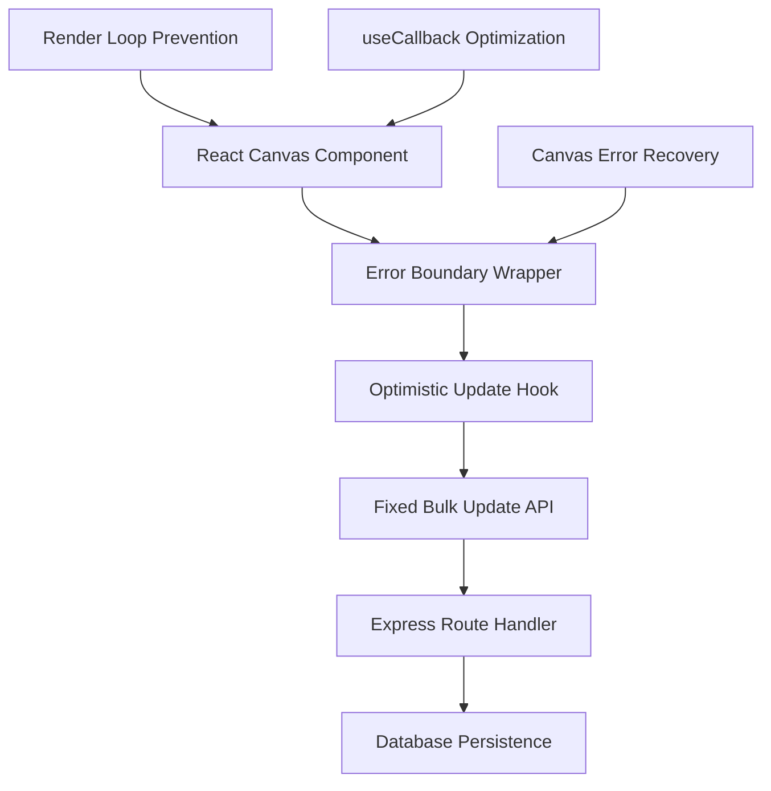

# 🚀 Critical System Stability Fixes

> **Priority**: P0 Critical | **Effort**: Medium (3-5 days) | **Impact**: High (Core system stability)

---

## 📋 **Feature Information**

### **Feature Name**
Critical System Stability Fixes

### **Feature Type**
- [x] **🔧 Bug Fix Collection** (System stability and performance)
- [x] **🟢 Backend API Endpoint** (Bulk update path correction)
- [x] **⚛️ React Component** (Render loop resolution)
- [x] **🎨 Canvas/UI Enhancement** (Error boundary protection)
- [x] **⚡ Performance Optimization** (Prevent infinite re-renders)

---

## 🎯 **Business Case**

### **Problem Statement**
The Impact Tree canvas system is experiencing three critical issues that severely impact Product Manager user experience:

1. **API 404 Errors**: Continuous bulk update endpoint failures preventing tree persistence
2. **React Render Loops**: Maximum update depth warnings causing performance degradation  
3. **Canvas Crashes**: Lack of error boundaries causing complete application failures

### **User Story**
**As a** Product Manager practicing continuous discovery  
**I want** a stable, responsive impact tree canvas  
**So that** I can focus on strategic planning without system interruptions disrupting my workflow

### **Priority & Impact**
- **Priority**: 
  - [x] 🔥 **Critical** (Blocking core discovery functionality)

- **Impact**: 
  - [x] 🎯 **High** (Affects all PM users, prevents tree persistence)

---

## 🔧 **Technical Specification**

### **Components Affected**
- [x] **🟢 Node.js Backend** (API endpoint routing correction)
- [x] **⚛️ React Frontend** (Component render optimization)
- [x] **🎨 Canvas System** (Error boundary implementation)
- [x] **🌐 REST API** (Bulk update endpoint path)
- [x] **📦 Build System** (Runtime error handling)

### **Effort Estimate**
- [x] **🟡 Medium** (3-5 days)

### **Dependencies**
- Express.js impact tree routes
- React useCallback optimization patterns
- Canvas state management hooks
- TanStack Query error handling
- Optimistic update system

### **API Changes**
- [x] **No breaking changes** (Path correction only)
- [x] **Modify existing impact tree endpoints** (Bulk update path)

---

## 📝 **Detailed Requirements**

### **Fix 1: Bulk Update Endpoint Path Mismatch**

**Current Issue**: API calls to `/api/impact-trees/4/nodes/bulk-update` return 404 errors
**Root Cause**: Endpoint path mismatch between frontend calls and backend routes
**Expected Behavior**: Bulk node updates should persist successfully to database

**Frontend Requirements**:
1. **API Call Verification**: Confirm correct endpoint path in optimistic update hooks
2. **Error Handling**: Improve feedback for failed bulk operations
3. **Request Format**: Ensure request body matches backend validation schema

**Backend Requirements**:
1. **Route Registration**: Verify bulk update endpoint is properly registered
2. **Path Matching**: Ensure route pattern matches frontend API calls
3. **Validation**: Confirm Zod schema matches request structure
4. **Response Format**: Standardize success/error response format

### **Fix 2: React Render Loop Warnings**

**Current Issue**: "Maximum update depth exceeded" warnings in browser console
**Root Cause**: Infinite re-renders in dropdown/navigation components
**Expected Behavior**: Components should render efficiently without warnings

**Frontend Requirements**:
1. **useCallback Optimization**: Wrap event handlers in useCallback with proper dependencies
2. **Dependency Array Fix**: Ensure useEffect dependencies are stable
3. **State Update Logic**: Prevent setState calls during render phase
4. **Component Memoization**: Use React.memo for expensive components

### **Fix 3: Canvas Error Boundaries**

**Current Issue**: Canvas errors cause complete application crashes
**Root Cause**: Lack of error boundaries around canvas operations
**Expected Behavior**: Graceful error handling with user-friendly messages

**Frontend Requirements**:
1. **Error Boundary Components**: Wrap canvas components in error boundaries
2. **Fallback UI**: Provide meaningful error messages and recovery options
3. **Error Logging**: Log canvas errors for debugging
4. **State Recovery**: Allow users to recover from canvas errors

### **Canvas Integration Requirements**
1. **Performance Monitoring**: Add error tracking for canvas operations
2. **State Validation**: Ensure canvas state is valid before operations
3. **Graceful Degradation**: Provide fallback rendering for error states

---

## 🧪 **Testing Strategy**

### **Frontend Testing**
- [x] **Component Tests**: Test dropdown components without render loops
- [x] **Integration Tests**: Verify bulk update API integration
- [x] **Error Boundary Tests**: Test error boundary fallback UI
- [x] **Performance Tests**: Verify no maximum update depth warnings

### **Backend Testing**
- [x] **Endpoint Tests**: Test bulk update endpoint with various payloads
- [x] **Route Tests**: Verify correct route registration and path matching
- [x] **Validation Tests**: Test Zod schema validation
- [x] **Error Handling Tests**: Test error response formats

---

## 📊 **Success Metrics**

### **Functional Metrics**
- [x] **Zero 404 errors** from bulk update endpoint
- [x] **No render loop warnings** in browser console
- [x] **Canvas error recovery** works without page refresh
- [x] **Tree persistence** functions correctly under load

### **Quality Metrics**
- [x] **Performance improvement** measurable in canvas interactions
- [x] **Error boundary coverage** for all canvas components
- [x] **API response time** under 100ms for bulk updates
- [x] **User experience** smooth without system interruptions

---

## 🎓 **Developer Learning Guide**

### **📚 Concept Overview**
These fixes address three critical areas of system stability in the AI-Native Impact Tree:

1. **API Endpoint Management**: Proper routing and path matching in Express.js
2. **React Performance**: Preventing infinite render loops through optimization
3. **Error Resilience**: Graceful error handling for canvas operations

The fixes ensure Product Managers can use the impact tree reliably for continuous discovery without system interruptions.

### **🏗️ Architecture Diagram**

### **🔄 Implementation Flow**
1. **API Fix**: Correct bulk update endpoint path in backend routes
2. **Render Optimization**: Add useCallback to prevent infinite re-renders
3. **Error Boundaries**: Wrap canvas components for graceful error handling
4. **Testing**: Verify all fixes work under normal and error conditions

### **⚠️ Common Pitfalls**
- **Route Registration**: Ensure bulk update routes are registered in correct order
- **Dependency Arrays**: Missing dependencies in useCallback can cause stale closures
- **Error Boundary Scope**: Don't wrap too broadly or too narrowly
- **State Management**: Avoid setState during render phase

### **🔗 Learning Resources**
- **Express.js Routing**: Route registration and path matching patterns
- **React Performance**: useCallback and useMemo optimization
- **Error Boundaries**: React error boundary patterns and best practices
- **Canvas Error Handling**: Graceful degradation for complex UI components

### **🎯 Key Takeaways**
- System stability is critical for PM productivity and user trust
- API endpoint consistency prevents user frustration and data loss
- React performance optimizations improve canvas responsiveness
- Error boundaries provide professional user experience during failures

---

## 📋 **Implementation Checklist**

### **Pre-Implementation**
- [x] **API endpoint audit** completed for path consistency
- [x] **React component analysis** for render loop sources
- [x] **Canvas error scenarios** identified and documented
- [x] **Testing strategy** planned for all three fixes

### **Implementation**
- [ ] **Bulk update endpoint** path corrected and tested
- [ ] **React render loops** resolved with useCallback optimization
- [ ] **Error boundaries** implemented around canvas components
- [ ] **Integration testing** completed for all fixes

### **Post-Implementation**
- [ ] **Performance monitoring** confirms no 404 errors
- [ ] **Browser console** clean of render loop warnings
- [ ] **Canvas error recovery** tested with various scenarios
- [ ] **User acceptance testing** with PM users completed

---

## 🔗 **Related Documents**

- **Implementation Plan**: [Link to 29_Critical_System_Stability_Fixes_Implementation_Plan.md]
- **Known Issues**: [Current system stability issues documented]
- **Performance Guidelines**: [React optimization patterns for canvas]
- **Error Handling Standards**: [Error boundary implementation patterns]

---

**📝 Template Version**: 2.0  
**🎯 Project Type**: AI-Native Impact Tree (React + Node.js)  
**📅 Created**: January 11, 2025  
**👤 Author**: AI Assistant  
**📊 Status**: 📋 Planned