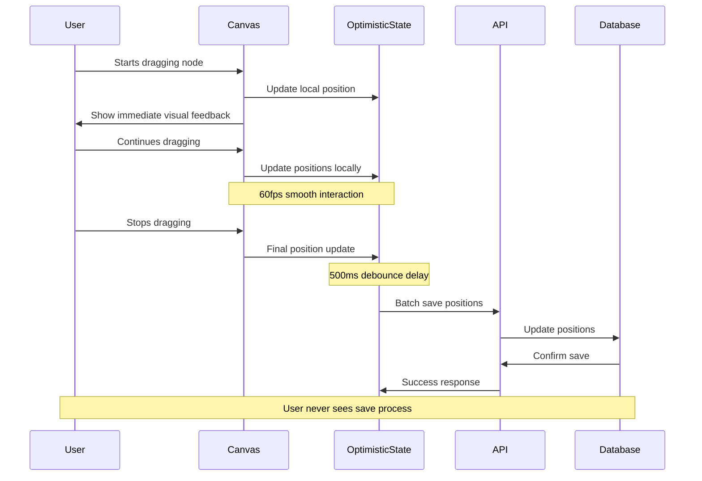

# 🚀 Feature Request: Smooth Canvas Interaction Performance

> **Non-intrusive save operations for seamless PM discovery workflow**

---

## 📋 **Feature Information**

### **Feature Name**
Smooth Canvas Interaction Performance (Non-Intrusive Save Operations)

### **Feature Type**
- [x] **⚛️ React Component** (Canvas interactions, optimistic updates)
- [x] **🟢 Backend API Endpoint** (Batch save operations, debounced persistence)
- [x] **🔗 Frontend-Backend Integration** (Optimistic updates, background sync)
- [x] **🎨 Canvas/UI Enhancement** (Smooth drag operations, instant feedback)
- [x] **⚡ Performance Optimization** (Debounced saves, batch operations)
- [x] **📊 Analytics/Tracking** (Save operation metrics, UX performance)

---

## 🎯 **Business Case**

### **Problem Statement**
Product Managers practicing continuous discovery need uninterrupted flow when manipulating their impact trees on the canvas. Currently, save operations interrupt the user experience during card movements, tree repositioning, and branch reorganization, breaking the PM's cognitive flow and disrupting their strategic thinking process. The save process creates visible delays and prevents smooth, intuitive canvas interactions that are essential for effective discovery work.

### **User Story**
**As a** Product Manager practicing continuous discovery  
**I want** to move trees, cards, and branches around the canvas with smooth, uninterrupted interactions  
**So that** I can maintain my cognitive flow while organizing my strategic thinking without being distracted by save operations or system delays

### **Priority & Impact**
- **Priority**: 
  - [x] ⭐ **High** (Important for discovery workflow)
  - [ ] 🔥 **Critical** (Blocking product-market fit discovery)
  - [ ] 📋 **Medium** (Nice to have for PM productivity)
  - [ ] 📝 **Low** (Future consideration)

- **Impact**: 
  - [x] 🎯 **High** (Core discovery functionality, affects all PMs)
  - [ ] 📊 **Medium** (Improves discovery experience)
  - [ ] 🔧 **Low** (Internal improvement)

---

## 🔧 **Technical Specification**

### **Components Affected**
- [x] **⚛️ React Frontend** (Canvas drag operations, optimistic updates, debounced saves)
- [x] **🟢 Node.js Backend** (Batch save endpoints, debounced persistence)
- [x] **🗄️ Database** (Batch update operations, transaction optimization)
- [x] **🌐 REST API** (Bulk update endpoints, background sync)
- [x] **🎨 Canvas System** (Drag-drop performance, position updates)
- [x] **📦 Build System** (Performance monitoring, save operation tracking)

### **Effort Estimate**
- [x] **🟡 Medium** (3-5 days)
- [ ] **🟢 Small** (1-2 days)
- [ ] **🟠 Large** (1-2 weeks)
- [ ] **🔴 XL** (2+ weeks)

### **Dependencies**
- Existing optimistic updates system (useOptimisticUpdates hook)
- Tree state management (Zustand)
- Server state management (TanStack Query)
- Canvas drag-drop system
- Bulk update API endpoints
- PostgreSQL batch operations with Drizzle ORM

### **API Changes**
- [x] **New endpoints only**
- [ ] **No API changes**
- [ ] **Modify existing impact tree endpoints**
- [ ] **Breaking changes** (requires version bump)

---

## 📝 **Detailed Requirements**

### **Frontend Requirements (React + TypeScript)**

#### **1. Optimistic Update Enhancement**
- **Instant Visual Feedback**: All canvas operations show immediate visual changes
- **Debounced Persistence**: Save operations delayed until user stops interacting
- **Background Sync**: Save operations happen invisibly in the background
- **Conflict Resolution**: Handle concurrent user actions without UI interruption
- **State Consistency**: Ensure UI state matches server state eventually

#### **2. Canvas Interaction Improvements**
- **Smooth Drag Operations**: 60fps drag performance with no save interruptions
- **Batch Position Updates**: Group multiple position changes into single operations
- **Progressive Enhancement**: Graceful degradation if save operations fail
- **Visual Indicators**: Subtle, non-intrusive save status indicators
- **Error Recovery**: Automatic retry for failed save operations

#### **3. Performance Optimization**
- **Debouncing Strategy**: 500ms delay after user stops moving elements
- **Batch Processing**: Group multiple changes into single API calls
- **Memory Management**: Efficient cleanup of temporary state
- **Event Throttling**: Limit position update frequency during drag
- **Cache Optimization**: Smart cache invalidation after successful saves

### **Backend Requirements (Node.js + Express)**

#### **1. Batch Save Operations**
- **Bulk Position Updates**: Single endpoint for multiple node position changes
- **Tree Reorganization**: Efficient handling of branch/tree movements
- **Transaction Safety**: Atomic operations for consistent data state
- **Debounced Processing**: Server-side debouncing for rapid consecutive updates
- **Performance Monitoring**: Track save operation timing and success rates

#### **2. API Optimization**
- **Bulk Update Endpoints**: Efficient batch processing of canvas changes
- **Optimistic Response**: Immediate acknowledgment for UI responsiveness
- **Error Handling**: Graceful degradation for partial save failures
- **Rate Limiting**: Prevent abuse while allowing smooth interactions
- **Compression**: Optimize request/response sizes for position data

### **Database Requirements**

#### **1. Batch Operations**
- **Bulk Updates**: Efficient multi-row updates for position changes
- **Transaction Optimization**: Minimize database locks during updates
- **Index Optimization**: Ensure efficient queries for position updates
- **Concurrent Access**: Handle multiple users editing same tree
- **Data Consistency**: Maintain referential integrity during batch operations

#### **2. Performance Considerations**
- **Connection Pooling**: Efficient database connection management
- **Query Optimization**: Minimize database round-trips for position updates
- **Batch Size Limits**: Prevent database overload from large batch operations
- **Monitoring**: Track database performance during bulk operations
- **Rollback Strategy**: Efficient recovery from failed batch operations

---

## 🎨 **User Experience Requirements**

### **Interaction Flow**
1. **User starts dragging**: Immediate visual feedback, no save operation
2. **User continues dragging**: Smooth 60fps performance, positions updated locally
3. **User stops dragging**: 500ms delay, then background save operation
4. **Save completion**: Subtle success indicator, no interruption to workflow
5. **Save failure**: Automatic retry with optional user notification

### **Visual Feedback**
- **Drag State**: Clear visual indication of elements being moved
- **Save Status**: Subtle indicators (small dot, progress bar) showing save state
- **Error State**: Non-intrusive error messages for failed operations
- **Success State**: Brief confirmation of successful saves
- **Loading State**: Minimal loading indicators during background operations

### **Performance Targets**
- **Drag Response Time**: <16ms for smooth 60fps interactions
- **Save Debounce**: 500ms delay after user stops interacting
- **Background Save**: <200ms for position updates
- **Error Recovery**: <1000ms for automatic retry attempts
- **Memory Usage**: <50MB additional memory for optimistic updates

---

## 🔍 **Success Criteria**

### **Performance Metrics**
- **Frame Rate**: Maintain 60fps during all canvas interactions
- **Save Latency**: Background saves complete within 200ms
- **User Perception**: No visible interruptions during canvas manipulation
- **Error Rate**: <1% failed save operations with automatic recovery
- **Memory Efficiency**: No memory leaks from optimistic update system

### **User Experience Metrics**
- **Flow Interruption**: Zero visible interruptions during canvas interactions
- **Feedback Timing**: Visual feedback within 16ms of user actions
- **Save Transparency**: Users unaware of background save operations
- **Error Recovery**: Automatic recovery from 95% of save failures
- **Cognitive Load**: Reduced mental overhead from smooth interactions

---

## 🎓 **Developer Learning Guide**

### **Plain English Explanation**
This feature transforms the canvas interaction experience from a "stop-and-save" model to a "flow-and-sync" model. Instead of interrupting the user every time they move something, the system immediately shows the change visually while quietly saving the data in the background after the user finishes their action.

Think of it like writing with a pen - you don't stop writing every few words to make sure the ink is dry. The writing appears instantly, and the ink dries on its own without interrupting your writing flow.

### **Visual Architecture Diagram**

### **Implementation Logic Breakdown**

#### **Step 1: Optimistic State Management**
- **Local State**: Canvas maintains immediate visual state
- **Pending Changes**: Track what needs to be saved
- **Debounce Timer**: Delay save operations until user stops
- **Conflict Resolution**: Handle overlapping changes gracefully

#### **Step 2: Background Synchronization**
- **Batch Collection**: Group multiple changes together
- **API Communication**: Send batched updates to server
- **Error Handling**: Retry failed operations automatically
- **State Reconciliation**: Ensure UI matches server state

#### **Step 3: Performance Optimization**
- **Event Throttling**: Limit update frequency during drag
- **Memory Management**: Clean up temporary state efficiently
- **Cache Strategy**: Smart invalidation after successful saves
- **Monitoring**: Track performance metrics and errors

### **Context & Rationale**

#### **Why This Approach**
1. **User Experience**: Maintains cognitive flow during discovery work
2. **Performance**: Reduces server load through batching
3. **Reliability**: Optimistic updates provide immediate feedback
4. **Scalability**: Debouncing prevents server overload
5. **Maintainability**: Clear separation of concerns

#### **Alternative Approaches Considered**
1. **Synchronous Saves**: Rejected due to UX interruption
2. **No Debouncing**: Rejected due to server overload risk
3. **Client-Only State**: Rejected due to data persistence needs
4. **Websocket Streaming**: Rejected due to complexity overhead

### **Common Pitfalls**
1. **Race Conditions**: Multiple rapid saves can conflict
2. **Memory Leaks**: Unbounded optimistic state growth
3. **Network Failures**: Lost saves due to connection issues
4. **State Drift**: UI state diverging from server state
5. **Performance Degradation**: Too many pending operations

### **Learning Connections**
- **React Patterns**: Custom hooks for optimistic updates
- **Database Transactions**: Batch operations and atomicity
- **Performance Optimization**: Debouncing and throttling
- **User Experience**: Perceived performance vs actual performance
- **Error Handling**: Graceful degradation and recovery

---

## 🔗 **Related Documentation**
- [Implementation Plan: 31_Smooth_Canvas_Interaction_Performance_Implementation_Plan.md](../implementation_plans/31_Smooth_Canvas_Interaction_Performance_Implementation_Plan.md)
- [Canvas Performance Guidelines](../development/canvas_performance_guidelines.md)
- [API Design Guidelines](../development/api_design_guidelines.md)
- [Database Design Patterns](../development/database_design_patterns.md)
- [Existing Optimistic Updates System](../implementation_plans/28_Tree_Node_Data_Persistence_Implementation_Plan.md)

---

**Status**: 🆕 **New** - Ready for implementation  
**Created**: January 14, 2025  
**Priority**: High  
**Effort**: 3-5 days  
**Components**: React Canvas, Node.js API, PostgreSQL