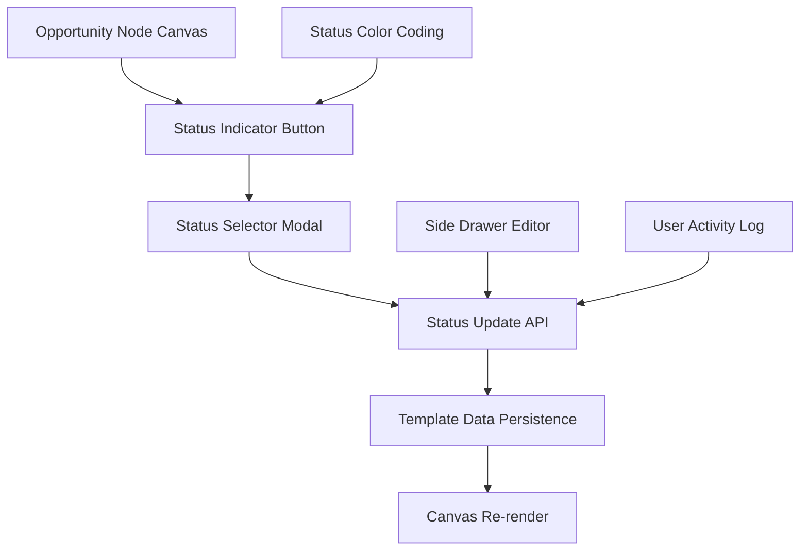

# 🚀 Feature Request: Opportunity Workflow Status

> **Visual workflow status management for opportunity nodes in the Impact Tree canvas**

---

## 📋 **Feature Information**

### **Feature Name**
Opportunity Workflow Status - Visual Status Management for Discovery Workflow

### **Feature Type**
- [x] **⚛️ React Component** (Tree nodes, canvas controls, status indicators)
- [x] **🟢 Backend API Endpoint** (Express.js status persistence)
- [x] **🗄️ Database Schema** (PostgreSQL/Drizzle ORM status fields)
- [x] **🔗 Frontend-Backend Integration** (Canvas state sync, real-time updates)
- [x] **🎨 Canvas/UI Enhancement** (HTML5 canvas, tree visualization)
- [x] **🔧 Discovery Feature** (Continuous discovery support)

---

## 🎯 **Business Case**

### **Problem Statement**
Product Managers practicing continuous discovery need to track the workflow status of opportunity nodes as they move through the discovery process. Currently, there's no visual indication of where an opportunity stands in the discovery workflow (Identified, Later, Next, Now, Done, Trash), making it difficult to manage discovery activities and prioritize research efforts.

### **User Story**
**As a** Product Manager practicing continuous discovery  
**I want** to visually see and manage the workflow status of opportunity nodes on the impact tree  
**So that** I can effectively track opportunity progression through the discovery process and prioritize my research activities

### **Priority & Impact**
- **Priority**: 
  - [x] ⭐ **High** (Important for discovery workflow)

- **Impact**: 
  - [x] 🎯 **High** (Core discovery functionality, affects all PMs)

---

## 🔧 **Technical Specification**

### **Components Affected**
- [x] **⚛️ React Frontend** (Canvas components, node components, side drawer)
- [x] **🟢 Node.js Backend** (Express.js services, API endpoints)
- [x] **🗄️ Database** (PostgreSQL schema, Drizzle ORM entities)
- [x] **🌐 REST API** (Impact tree endpoints, canvas state sync)
- [x] **🎨 Canvas System** (HTML5 canvas, SVG rendering, node status indicators)

### **Effort Estimate**
- [x] **🟡 Medium** (3-5 days)

### **Dependencies**
- Existing opportunity node rendering system
- Tree node editing infrastructure (side drawer)
- Canvas state management (useCanvas hook)
- Impact tree API endpoints (Express.js)
- PostgreSQL database with Drizzle ORM
- Node template data system

### **API Changes**
- [x] **Modify existing impact tree endpoints** (add status field to node updates)

---

## 📝 **Detailed Requirements**

### **Frontend Requirements (React + TypeScript)**
1. **Status Indicator Component**: Visual status button on opportunity nodes (top right corner)
2. **Status Selector**: Dropdown/modal for status selection (Identified, Later, Next, Now, Done, Trash)
3. **Canvas Integration**: Status indicator rendering on HTML5 canvas
4. **Side Drawer Integration**: Status editing capability in node edit drawer
5. **Visual Design**: Modern, sleek button design with color coding

### **Backend Requirements (Node.js + Express)**
1. **Status Persistence**: Store workflow status in templateData field
2. **Validation**: Ensure status values are from allowed enum
3. **API Updates**: Modify existing node update endpoints to handle status changes
4. **Activity Logging**: Track status changes in user activity logs

### **Database Requirements**
1. **Template Data Extension**: Add workflowStatus field to opportunity node templateData
2. **Status Enum**: Define allowed status values (Identified, Later, Next, Now, Done, Trash)
3. **Migration**: Update existing opportunity nodes with default status
4. **Indexing**: Consider indexing for status-based queries

### **Canvas Integration Requirements**
1. **Status Rendering**: Visual indicator on opportunity nodes in canvas
2. **Interactive Elements**: Clickable status button with hover effects
3. **Color Coding**: Different colors for different status states
4. **State Persistence**: Status changes trigger canvas re-render

---

## 🧪 **Testing Strategy**

### **Frontend Testing**
- [x] **Component Tests**: Status indicator component rendering and interactions
- [x] **Integration Tests**: Canvas interaction and status updates
- [x] **Visual Tests**: Status button appearance and color coding
- [x] **E2E Tests**: Complete workflow status change scenarios

### **Backend Testing**
- [x] **Unit Tests**: Status validation and persistence
- [x] **Integration Tests**: Database operations and API integration
- [x] **API Tests**: Status update endpoints

---

## 📊 **Success Metrics**

### **Functional Metrics**
- [x] **Status visualization** works correctly on opportunity nodes
- [x] **Status updates** persist correctly in database
- [x] **Canvas performance** maintains 60fps with status indicators
- [x] **Side drawer integration** allows status editing

### **Quality Metrics**
- [x] **Test coverage > 80%** for status management features
- [x] **No performance regressions** in canvas rendering
- [x] **TypeScript strict mode** compliance
- [x] **Accessibility standards** met for status indicators

---

## 🎓 **Developer Learning Guide**

### **📚 Concept Overview**
This feature implements a visual workflow status system for opportunity nodes in the Impact Tree, supporting Product Managers in their continuous discovery practice. The system tracks opportunities through six workflow states: Identified (newly discovered), Later (backlog), Next (upcoming research), Now (active research), Done (completed), and Trash (discarded).

The workflow status serves as a visual cue for PMs to understand the discovery pipeline and prioritize research activities. It integrates seamlessly with the existing canvas system and node editing infrastructure.

### **🏗️ Architecture Diagram**

### **🔄 Implementation Flow**
1. **Status Display**: Opportunity nodes render with status indicator in top-right corner
2. **User Interaction**: PM clicks status button to open status selector
3. **Status Selection**: PM selects new status from dropdown (Identified, Later, Next, Now, Done, Trash)
4. **API Update**: Frontend sends status update to backend via existing node update endpoint
5. **Persistence**: Backend stores status in templateData.workflowStatus field
6. **Canvas Update**: Canvas re-renders with new status indicator color
7. **Activity Logging**: Status change recorded in user activity log

### **⚠️ Common Pitfalls**
- **Canvas Performance**: Adding status indicators to every opportunity node could impact rendering performance
- **State Synchronization**: Status changes must update both canvas display and side drawer
- **Color Accessibility**: Status colors must meet accessibility standards for colorblind users
- **Database Migration**: Existing opportunity nodes need default status assignment

### **🔗 Learning Resources**
- **React Canvas**: HTML5 canvas rendering with React state management
- **Continuous Discovery**: Teresa Torres methodology for opportunity tracking
- **Node Template System**: Existing templateData structure for node customization
- **Canvas Performance**: Optimization techniques for large tree rendering

### **🎯 Key Takeaways**
- Status indicators provide visual workflow management for discovery process
- Integration with existing node system minimizes architectural changes
- Canvas performance optimization is critical for smooth user experience
- Status changes should trigger comprehensive state updates across all UI components

---

## 📋 **Implementation Checklist**

### **Pre-Implementation**
- [x] **Discovery requirements clarified** with PM users
- [x] **Canvas performance** impact assessed
- [x] **Status enum** values defined and validated
- [x] **UI/UX design** approved for status indicators

### **Implementation**
- [ ] **Status indicator component** implemented with modern design
- [ ] **Status selector modal** created with all workflow states
- [ ] **Canvas integration** completed with performance optimization
- [ ] **Side drawer integration** updated with status editing
- [ ] **Backend API** modified to handle status persistence
- [ ] **Database schema** updated with workflowStatus field

### **Post-Implementation**
- [ ] **Code review** completed and approved
- [ ] **Canvas performance** testing completed
- [ ] **Discovery workflow** testing with PM users
- [ ] **Visual accessibility** testing completed

---

## 🔗 **Related Documents**

- **Implementation Plan**: [32_Opportunity_Workflow_Status_Implementation_Plan.md](../implementation_plans/32_Opportunity_Workflow_Status_Implementation_Plan.md)
- **PRD Document**: [docs/PRD.md - AI-Native Impact Tree specification](../PRD.md)
- **Canvas Guidelines**: [docs/development/canvas_performance_guidelines.md](../development/canvas_performance_guidelines.md)
- **Node Templates**: [docs/new_features/Node_Content_Templates.md](Node_Content_Templates.md)

---

**📝 Template Version**: 2.0  
**🎯 Project Type**: AI-Native Impact Tree (React + Node.js)  
**📅 Created**: January 14, 2025  
**👤 Author**: AI Assistant  
**📊 Status**: 📋 Planned