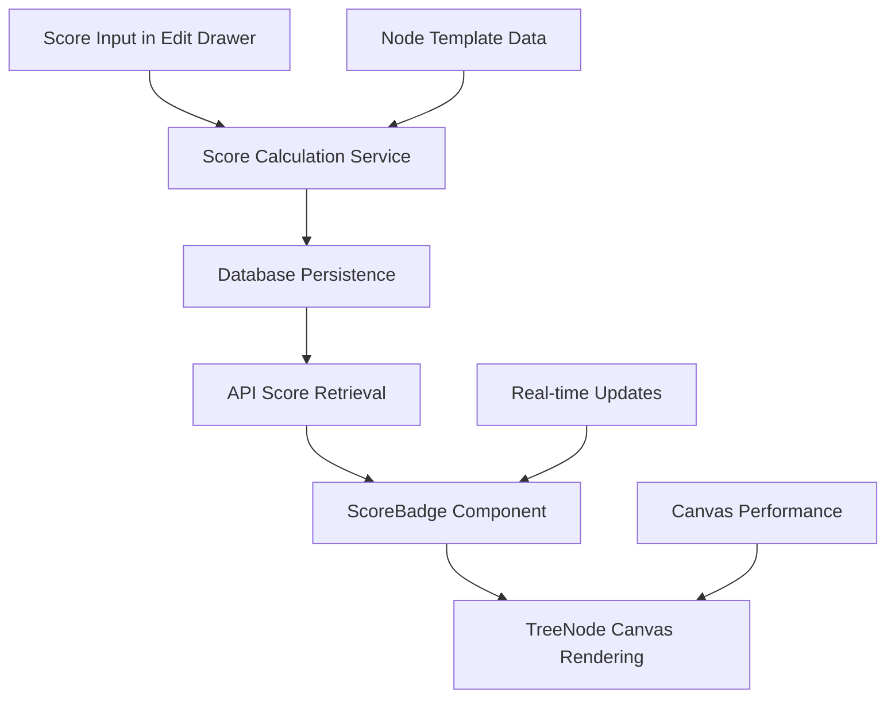

# 🚀 Feature Request: ICE & RICE Score Badge Display

> **Display calculated ICE and RICE scores as badges on Opportunity and Solution cards for visual comparison and prioritization**

---

## 📋 **Feature Information**

### **Feature Name**
ICE & RICE Score Badge Display on Tree Node Cards

### **Feature Type**
- [x] **⚛️ React Component** (Score badge component for tree nodes)
- [x] **🟢 Backend API Endpoint** (Score calculation and persistence)
- [x] **🗄️ Database Schema** (Score persistence in tree nodes)
- [x] **🔗 Frontend-Backend Integration** (Real-time score updates)
- [x] **🎨 Canvas/UI Enhancement** (Visual scoring badges on canvas)
- [x] **📊 Analytics/Tracking** (Score calculation tracking)
- [ ] **🔒 Authentication/Security** (Replit Auth, tree permissions)
- [ ] **📊 AI Integration** (Vertex AI discovery insights)
- [ ] **📱 Responsive Design** (Mobile canvas experience)
- [ ] **⚡ Performance Optimization** (Canvas rendering, optimistic updates)
- [ ] **🧪 Testing Infrastructure** (Component/API testing)
- [ ] **🔧 Discovery Feature** (Continuous discovery support)
- [ ] **Other**: _______________

---

## 🎯 **Business Case**

### **Problem Statement**
Product Managers practicing continuous discovery need to visually compare and prioritize Opportunities and Solutions based on their ICE (Impact, Confidence, Ease) and RICE (Reach, Impact, Confidence, Effort) scores. Currently, these scores are only visible within the detailed node editing interface, making it difficult to perform quick visual comparisons and stack ranking across multiple nodes on the canvas.

### **User Story**
**As a** Product Manager practicing continuous discovery  
**I want** to see ICE scores on Opportunity cards and RICE scores on Solution cards as persistent visual badges  
**So that** I can quickly compare and stack rank opportunities and solutions without opening detailed editing interfaces

### **Priority & Impact**
- **Priority**: 
  - [x] ⭐ **High** (Important for discovery workflow)
  - [ ] 🔥 **Critical** (Blocking product-market fit discovery)
  - [ ] 📋 **Medium** (Nice to have for PM productivity)
  - [ ] 📝 **Low** (Future consideration)

- **Impact**: 
  - [x] 📊 **Medium** (Improves discovery experience)
  - [ ] 🎯 **High** (Core discovery functionality, affects all PMs)
  - [ ] 🔧 **Low** (Internal improvement)

---

## 🔧 **Technical Specification**

### **Components Affected**
- [x] **⚛️ React Frontend** (Score badge component, tree node rendering)
- [x] **🟢 Node.js Backend** (Score calculation service, persistence logic)
- [x] **🗄️ Database** (Score storage in tree_nodes table)
- [x] **🌐 REST API** (Score calculation and retrieval endpoints)
- [x] **🎨 Canvas System** (Badge rendering within tree nodes)
- [x] **📦 Build System** (TypeScript compilation for new components)
- [ ] **🔒 Security** (Replit Auth, session management, tree permissions)
- [ ] **🚀 Replit Deployment** (Autoscale deployment configuration)
- [ ] **📊 Analytics** (User activity tracking, tree metrics)

### **Effort Estimate**
- [ ] **🟢 Small** (1-2 days)
- [x] **🟡 Medium** (3-5 days)
- [ ] **🟠 Large** (1-2 weeks)
- [ ] **🔴 XL** (2+ weeks)

### **Dependencies**
- Existing ICE scoring system in Opportunity node templates
- Existing RICE scoring system in Solution node templates
- Tree node rendering system on HTML5 canvas
- Database schema for tree_nodes table with templateData JSONB column
- Optimistic updates system for real-time badge updates
- Node editing drawer system for score input

### **API Changes**
- [ ] **No API changes**
- [x] **New endpoints only**
- [ ] **Modify existing impact tree endpoints**
- [ ] **Breaking changes** (requires version bump)

---

## 📝 **Detailed Requirements**

### **Frontend Requirements (React + TypeScript)**
1. **Score Badge Component**: New ScoreBadge component that displays ICE/RICE scores with consistent styling
2. **Node Integration**: Integrate badges into existing TreeNode component rendering
3. **Real-time Updates**: Update badges when scores change in the editing drawer
4. **Conditional Display**: Show badges only when scores exist (all required fields completed)
5. **Visual Design**: Sleek, non-intrusive badge that doesn't overpower node title

### **Backend Requirements (Node.js + Express)**
1. **Score Calculation Service**: Calculate ICE and RICE scores using existing frontend formulas
2. **Score Persistence**: Store calculated scores in database for consistent display
3. **Bulk Score Updates**: Update scores efficiently during bulk node operations
4. **Score Validation**: Validate score inputs and handle edge cases
5. **Performance**: Optimize score calculations for large trees

### **Database Requirements**
1. **Score Storage**: Extend templateData JSONB to include calculated scores
2. **Score Fields**: Add iceScore and riceScore fields to node template data
3. **Migration Strategy**: Update existing nodes to calculate and store scores
4. **Indexing**: No additional indexes needed (scores stored in existing JSONB)

### **Canvas Integration Requirements**
1. **Badge Positioning**: Position badges on bottom-left of node cards
2. **Canvas Performance**: Ensure badge rendering doesn't impact canvas performance
3. **Zoom Compatibility**: Badges scale appropriately with canvas zoom levels
4. **Selection States**: Badges remain visible when nodes are not selected, during node selection and hover states

---

## 🧪 **Testing Strategy**

### **Frontend Testing**
- [x] **Component Tests**: ScoreBadge component rendering and props
- [x] **Integration Tests**: Badge integration with TreeNode component
- [x] **Visual Tests**: Badge positioning and styling consistency
- [x] **Canvas Tests**: Badge rendering performance with large trees

### **Backend Testing**
- [x] **Unit Tests**: Score calculation logic and validation
- [x] **Integration Tests**: Score persistence and retrieval
- [x] **API Tests**: Score calculation endpoint responses
- [x] **Performance Tests**: Bulk score calculations for large trees

---

## 📊 **Success Metrics**

### **Functional Metrics**
- [x] **Score Display**: ICE scores visible on Opportunity cards
- [x] **Score Display**: RICE scores visible on Solution cards
- [x] **Real-time Updates**: Badges update immediately when scores change
- [x] **Conditional Display**: Badges only show when scores are complete
- [x] **Performance**: No noticeable impact on canvas rendering speed

### **Quality Metrics**
- [x] **Visual Consistency**: Badges match current UI design system
- [x] **Accessibility**: Badges are readable and accessible
- [x] **Canvas Performance**: No regression in tree rendering performance
- [x] **Data Integrity**: Calculated scores match frontend formulas

---

## 🎓 **Developer Learning Guide**

### **📚 Concept Overview**
This feature implements visual scoring badges that display calculated ICE and RICE scores directly on tree node cards. ICE (Impact, Confidence, Ease) scoring is used for Opportunity nodes to help PMs prioritize which opportunities to pursue. RICE (Reach, Impact, Confidence, Effort) scoring is used for Solution nodes to help PMs prioritize which solutions to implement.

The badges provide immediate visual feedback for prioritization decisions without requiring PMs to open detailed editing interfaces. This supports the continuous discovery workflow by enabling quick comparison and stack ranking of opportunities and solutions.

### **🏗️ Architecture Diagram**


### **🔄 Implementation Flow**
1. **Score Input**: PM enters ICE/RICE values in node editing drawer
2. **Calculation**: Backend service calculates final scores using established formulas
3. **Persistence**: Calculated scores stored in database templateData
4. **Display**: ScoreBadge component renders scores on canvas nodes
5. **Updates**: Real-time updates when scores change through optimistic updates

### **📊 Scoring Formulas**
**ICE Score Calculation:**
```typescript
// ICE Score = (Impact x Confidence x Ease) 
const iceScore = (iceImpact * iceConfidence * iceEase);
```

**RICE Score Calculation:**
```typescript
// RICE Score = (Reach × Impact × Confidence) / Effort
const riceScore = (riceReach * riceImpact * riceConfidence) / riceEffort;
```

### **⚠️ Common Pitfalls**
- **Score Calculation Consistency**: Ensure backend calculations match frontend formulas exactly
- **Badge Positioning**: Position badges to avoid overlapping with node titles or other elements
- **Canvas Performance**: Multiple badges on large trees can impact rendering performance
- **Data Synchronization**: Keep displayed scores in sync with actual template data
- **Edge Cases**: Handle division by zero in RICE calculations and incomplete score data

### **🔗 Learning Resources**
- **ICE Scoring Methodology**: Product management prioritization framework
- **RICE Scoring Framework**: Intercom's prioritization framework
- **Canvas Performance**: HTML5 canvas optimization techniques
- **React Component Design**: Best practices for reusable components

### **🎯 Key Takeaways**
- Score badges provide immediate visual feedback for PM prioritization decisions
- Consistent score calculation between frontend and backend is critical
- Canvas performance must be maintained even with multiple badges
- Conditional display ensures badges only appear when scores are meaningful
- Real-time updates enhance the discovery workflow by providing immediate feedback

---

## 📋 **Implementation Checklist**

### **Pre-Implementation**
- [x] **Score calculation formulas** verified and documented
- [x] **Database schema** approach reviewed for score persistence
- [x] **Canvas integration** strategy defined for badge positioning
- [x] **Performance considerations** evaluated for large trees

### **Implementation**
- [ ] **Score calculation service** implemented in backend
- [ ] **Database persistence** logic implemented
- [ ] **ScoreBadge component** created with proper styling
- [ ] **TreeNode integration** completed for badge display
- [ ] **Real-time updates** implemented through optimistic updates

### **Post-Implementation**
- [ ] **Visual testing** completed for badge appearance
- [ ] **Performance testing** completed for canvas rendering
- [ ] **Score accuracy** validated against frontend calculations
- [ ] **PM workflow testing** completed for discovery use cases

---

## 🔗 **Related Documents**

- **Implementation Plan**: [Link to 33_ICE_RICE_Score_Badge_Implementation_Plan.md]
- **Node Content Templates**: [docs/new_features/Node_Content_Templates.md]
- **Canvas Performance**: [docs/development/canvas_performance_guidelines.md]
- **Database Design**: [docs/development/database_design_patterns.md]

---

**📝 Template Version**: 2.0  
**🎯 Project Type**: AI-Native Impact Tree (React + Node.js)  
**📅 Created**: July 15, 2025  
**👤 Author**: AI Assistant  
**📊 Status**: 📋 Planned