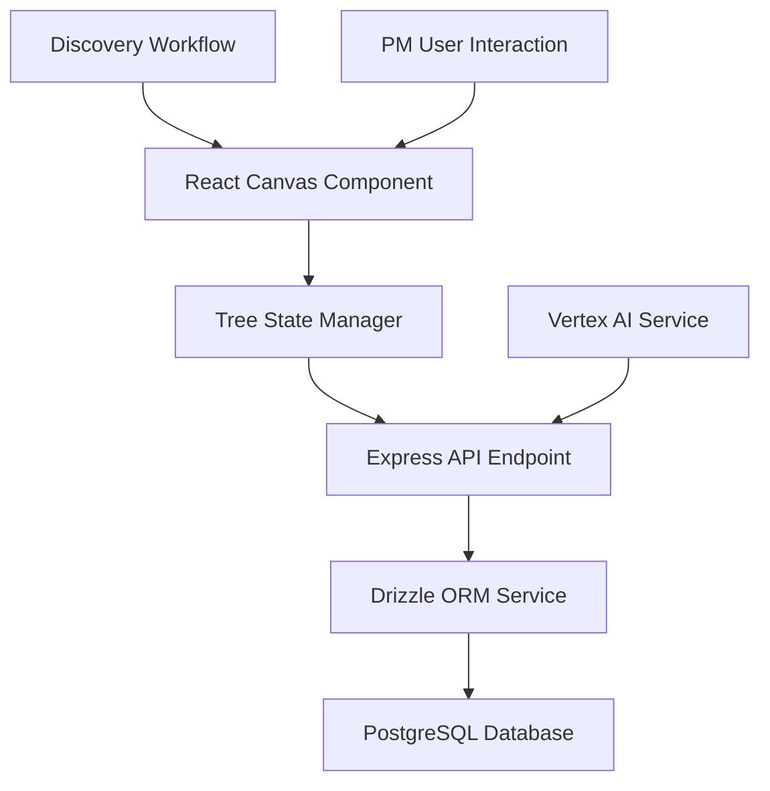

# 🚀 Feature Request Template

> **Use this template to document new features for AI-Native Impact Tree projects**

---

## 📋 **Feature Information**

### **Feature Name**
[Clear, descriptive name for the feature]

### **Feature Type**
- [ ] **⚛️ React Component** (Tree nodes, canvas controls, modals)
- [ ] **🟢 Backend API Endpoint** (Express.js REST endpoints)
- [ ] **🗄️ Database Schema** (PostgreSQL/Drizzle ORM)
- [ ] **🔗 Frontend-Backend Integration** (Canvas state sync, real-time updates)
- [ ] **🔒 Authentication/Security** (Replit Auth, tree permissions)
- [ ] **📊 AI Integration** (Vertex AI discovery insights)
- [ ] **🎨 Canvas/UI Enhancement** (HTML5 canvas, tree visualization)
- [ ] **📱 Responsive Design** (Mobile canvas experience)
- [ ] **⚡ Performance Optimization** (Canvas rendering, optimistic updates)
- [ ] **🧪 Testing Infrastructure** (Component/API testing)
- [ ] **🔧 Discovery Feature** (Continuous discovery support)
- [ ] **📊 Analytics/Tracking** (User activity, tree metrics)
- [ ] **Other**: _______________

---

## 🎯 **Business Case**

### **Problem Statement**
[What problem does this feature solve for Product Managers practicing continuous discovery?]

### **User Story**
**As a** [Product Manager practicing continuous discovery]  
**I want** [functionality]  
**So that** [I can better organize my product strategy and discovery activities]

### **Priority & Impact**
- **Priority**: 
  - [ ] 🔥 **Critical** (Blocking product-market fit discovery)
  - [ ] ⭐ **High** (Important for discovery workflow)
  - [ ] 📋 **Medium** (Nice to have for PM productivity)
  - [ ] 📝 **Low** (Future consideration)

- **Impact**: 
  - [ ] 🎯 **High** (Core discovery functionality, affects all PMs)
  - [ ] 📊 **Medium** (Improves discovery experience)
  - [ ] 🔧 **Low** (Internal improvement)

---

## 🔧 **Technical Specification**

### **Components Affected**
- [ ] **⚛️ React Frontend** (Canvas components, modals, Zustand state management)
- [ ] **🟢 Node.js Backend** (Express.js services, API endpoints)
- [ ] **🗄️ Database** (PostgreSQL schema, Drizzle ORM entities)
- [ ] **🌐 REST API** (Impact tree endpoints, canvas state sync)
- [ ] **🔒 Security** (Replit Auth, session management, tree permissions)
- [ ] **🎨 Canvas System** (HTML5 canvas, SVG rendering, drag-drop, zoom/pan)
- [ ] **📦 Build System** (Vite, TypeScript compilation)
- [ ] **🚀 Replit Deployment** (Autoscale deployment configuration)
- [ ] **📊 Analytics** (User activity tracking, tree metrics)

### **Effort Estimate**
- [ ] **🟢 Small** (1-2 days)
- [ ] **🟡 Medium** (3-5 days)
- [ ] **🟠 Large** (1-2 weeks)
- [ ] **🔴 XL** (2+ weeks)

### **Dependencies**
[List any features, services, or external systems this depends on]
- HTML5 canvas rendering system
- Tree state management (Zustand)
- Server state management (TanStack Query)
- Impact tree API endpoints (Express.js)
- PostgreSQL database with Drizzle ORM
- Replit Auth system
- Vertex AI integration (for AI features)

### **API Changes**
- [ ] **No API changes**
- [ ] **New endpoints only**
- [ ] **Modify existing impact tree endpoints**
- [ ] **Breaking changes** (requires version bump)

---

## 📝 **Detailed Requirements**

### **Frontend Requirements (React + TypeScript)**
1. **Component Structure**: [Canvas components, modals, tree nodes, drawer interfaces]
2. **State Management**: [Zustand for tree state, TanStack Query for server state]
3. **User Interface**: [HTML5 canvas interactions, node editing, discovery workflows]
4. **Routing**: [Wouter navigation between trees and discovery views]
5. **Performance**: [Optimistic updates, debounced saves, canvas optimization]

### **Backend Requirements (Node.js + Express)**
1. **API Endpoints**: [Impact tree CRUD, canvas state persistence, bulk operations]
2. **Business Logic**: [Tree validation, node relationships, discovery workflows]
3. **Data Access**: [Drizzle ORM operations, PostgreSQL queries, batch processing]
4. **AI Integration**: [Vertex AI API calls for discovery insights]
5. **Authentication**: [Replit Auth integration, session management]

### **Database Requirements**
1. **Schema Changes**: [impact_trees, tree_nodes, user_activities tables]
2. **Relationships**: [Node hierarchies, parent-child relationships, user tracking]
3. **Migrations**: [Drizzle migrations with npm run db:push]
4. **Performance**: [GIN indexes for JSONB, adjacency list optimization]

### **Canvas Integration Requirements**
1. **Node Rendering**: [SVG-based node visualization and interactions]
2. **State Persistence**: [Canvas zoom/pan state, node positions]
3. **Real-time Updates**: [Efficient re-rendering, state synchronization]

---

## 🧪 **Testing Strategy**

### **Frontend Testing**
- [ ] **Component Tests**: React Testing Library for canvas components
- [ ] **Integration Tests**: Canvas interaction and API integration
- [ ] **E2E Tests**: Discovery workflow testing with Playwright
- [ ] **Visual Tests**: Canvas rendering regression testing

### **Backend Testing**
- [ ] **Unit Tests**: Service and API endpoint testing
- [ ] **Integration Tests**: Database operations and AI integration
- [ ] **API Tests**: Impact tree endpoints and canvas state sync
- [ ] **Performance Tests**: Large tree handling and canvas optimization

---

## 📊 **Success Metrics**

### **Functional Metrics**
- [ ] **Discovery workflow works** as specified for PM users
- [ ] **Canvas performance** maintains 60fps with 100+ nodes
- [ ] **AI suggestions** provide relevant discovery insights
- [ ] **Tree persistence** handles complex hierarchies correctly

### **Quality Metrics**
- [ ] **Test coverage > 80%** for critical discovery features
- [ ] **No performance regressions** in canvas rendering
- [ ] **TypeScript strict mode** compliance
- [ ] **Accessibility standards** met for PM users

---

## 🎓 **Developer Learning Guide**

### **📚 Concept Overview**
[Explain the feature in context of Product Management continuous discovery practices]

This feature supports Product Managers who practice continuous discovery by [explain how it fits into the discovery workflow]. The AI-Native Impact Tree serves as a live document that evolves with PM learning, connecting OKR methodology with impact mapping and user story mapping techniques.

### **🏗️ Architecture Diagram**

### **🔄 Implementation Flow**
1. **Canvas Interaction**: PM interacts with impact tree nodes on HTML5 canvas
2. **State Management**: Zustand updates tree state and triggers re-renders
3. **API Persistence**: TanStack Query syncs changes to Express backend
4. **AI Enhancement**: Vertex AI provides discovery insights based on tree context

### **⚠️ Common Pitfalls**
- **Canvas Performance**: Large trees can slow down rendering - use virtualization
- **State Synchronization**: Keep canvas state and server state in sync
- **AI Integration**: Handle Vertex AI rate limits and token costs
- **Discovery Context**: Ensure features support continuous discovery practices

### **🔗 Learning Resources**
- **React Canvas**: HTML5 canvas with React best practices
- **Impact Mapping**: Teresa Torres continuous discovery methodology
- **Drizzle ORM**: Type-safe PostgreSQL operations
- **Vertex AI**: Google Cloud AI integration patterns

### **🎯 Key Takeaways**
- Impact trees are live documents that evolve with PM discovery
- Canvas performance is critical for user experience with large trees
- AI integration should enhance discovery workflows, not replace PM judgment
- All features should support the continuous discovery mindset

---

## 📋 **Implementation Checklist**

### **Pre-Implementation**
- [ ] **Discovery requirements clarified** with PM users
- [ ] **Canvas architecture** approach approved by team
- [ ] **AI integration** strategy defined for discovery insights
- [ ] **Database schema** changes planned and reviewed

### **Implementation**
- [ ] **Backend API** endpoints implemented and tested
- [ ] **React components** implemented with canvas integration
- [ ] **Zustand state** management implemented
- [ ] **Drizzle schema** and migrations completed
- [ ] **Vertex AI** integration implemented (for AI features)

### **Post-Implementation**
- [ ] **Code review** completed and approved
- [ ] **Canvas performance** testing completed
- [ ] **Discovery workflow** testing with PM users
- [ ] **Replit deployment** completed successfully

---

## 🔗 **Related Documents**

- **Implementation Plan**: [Link to implementation plan when created]
- **PRD Document**: [docs/PRD.md - AI-Native Impact Tree specification]
- **Canvas Architecture**: [Canvas rendering and interaction patterns]
- **Discovery Methodology**: [Continuous discovery workflow documentation]

---

**📝 Template Version**: 2.0  
**🎯 Project Type**: AI-Native Impact Tree (React + Node.js)  
**📅 Created**: [Date]  
**👤 Author**: [Author name]  
**📊 Status**: 📋 Planned
