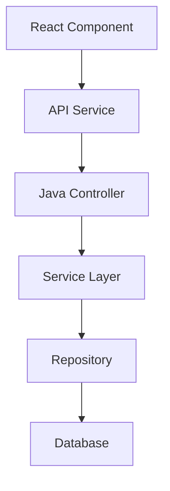

# 🚀 Feature Request Template

> **Use this template to document new features for React + Java projects**

---

## 📋 **Feature Information**

### **Feature Name**
[Clear, descriptive name for the feature]

### **Feature Type**
- [ ] **⚛️ React Component**
- [ ] **🌐 Backend API Endpoint**
- [ ] **🗄️ Database Entity/Schema**
- [ ] **🔗 Frontend-Backend Integration**
- [ ] **🔒 Authentication/Security**
- [ ] **📊 Data Processing/Analytics**
- [ ] **🎨 UI/UX Enhancement**
- [ ] **📱 Responsive Design**
- [ ] **⚡ Performance Optimization**
- [ ] **🧪 Testing Infrastructure**
- [ ] **🔧 Developer Tool**
- [ ] **Other**: _______________

---

## 🎯 **Business Case**

### **Problem Statement**
[What problem does this feature solve or what opportunity does it address?]

### **User Story**
**As a** [type of user]  
**I want** [functionality]  
**So that** [benefit/value]

### **Priority & Impact**
- **Priority**: 
  - [ ] 🔥 **Critical** (Blocking/Security)
  - [ ] ⭐ **High** (Important for next release)
  - [ ] 📋 **Medium** (Nice to have)
  - [ ] 📝 **Low** (Future consideration)

- **Impact**: 
  - [ ] 🎯 **High** (Core functionality, many users)
  - [ ] 📊 **Medium** (Improves user experience)
  - [ ] 🔧 **Low** (Internal improvement)

---

## 🔧 **Technical Specification**

### **Components Affected**
- [ ] **⚛️ React Frontend** (Components, hooks, state management)
- [ ] **☕ Java Backend** (Services, controllers, repositories)
- [ ] **🗄️ Database** (Entities, schema, migrations)
- [ ] **🌐 REST API** (Endpoints, request/response models)
- [ ] **🔒 Security** (Authentication, authorization)
- [ ] **🎨 UI/Styling** (CSS, component library)
- [ ] **📦 Build System** (Maven/Gradle, npm/yarn)
- [ ] **🐳 Infrastructure** (Docker, deployment)

### **Effort Estimate**
- [ ] **🟢 Small** (1-2 days)
- [ ] **🟡 Medium** (3-5 days)
- [ ] **🟠 Large** (1-2 weeks)
- [ ] **🔴 XL** (2+ weeks)

### **Dependencies**
[List any features, services, or external systems this depends on]
- Dependency 1: [Description]
- Dependency 2: [Description]

### **API Changes**
- [ ] **No API changes**
- [ ] **New endpoints only**
- [ ] **Modify existing endpoints**
- [ ] **Breaking changes** (requires version bump)

---

## 📝 **Detailed Requirements**

### **Frontend Requirements (React)**
1. **Component Structure**: [Describe React components needed]
2. **State Management**: [Redux/Context/Local state requirements]
3. **User Interface**: [UI/UX specifications]
4. **Routing**: [Navigation and routing changes]

### **Backend Requirements (Java)**
1. **API Endpoints**: [REST endpoints to be created/modified]
2. **Business Logic**: [Service layer requirements]
3. **Data Access**: [Repository and database operations]
4. **Security**: [Authentication/authorization requirements]

### **Database Requirements**
1. **Entities**: [JPA entities to be created/modified]
2. **Relationships**: [Entity relationships and constraints]
3. **Migrations**: [Schema changes required]
4. **Indexes**: [Performance optimization indexes]

### **Integration Requirements**
1. **Frontend-Backend**: [API integration specifications]
2. **External Services**: [Third-party integrations]
3. **Data Flow**: [How data flows through the system]

---

## 🧪 **Testing Strategy**

### **Frontend Testing**
- [ ] **Unit Tests**: Component testing with Jest/React Testing Library
- [ ] **Integration Tests**: Component integration testing
- [ ] **E2E Tests**: User workflow testing
- [ ] **Visual Tests**: UI regression testing

### **Backend Testing**
- [ ] **Unit Tests**: Service and repository testing with JUnit
- [ ] **Integration Tests**: API endpoint testing
- [ ] **Database Tests**: Repository and entity testing
- [ ] **Security Tests**: Authentication/authorization testing

---

## 📊 **Success Metrics**

### **Functional Metrics**
- [ ] **Feature works as specified**
- [ ] **All acceptance criteria met**
- [ ] **No breaking changes introduced**
- [ ] **Performance requirements met**

### **Quality Metrics**
- [ ] **Test coverage > 80%**
- [ ] **No critical security vulnerabilities**
- [ ] **Code review approved**
- [ ] **Documentation updated**

---

## 🎓 **Developer Learning Guide**

### **📚 Concept Overview**
[Explain the feature concept in plain English, suitable for developers at all levels]

### **🏗️ Architecture Diagram**

### **🔄 Implementation Flow**
1. **Step 1**: [Detailed explanation of first implementation step]
2. **Step 2**: [Detailed explanation of second implementation step]
3. **Step 3**: [Detailed explanation of third implementation step]

### **⚠️ Common Pitfalls**
- **Pitfall 1**: [Description and how to avoid]
- **Pitfall 2**: [Description and how to avoid]
- **Pitfall 3**: [Description and how to avoid]

### **🔗 Learning Resources**
- **React Documentation**: [Relevant React concepts]
- **Spring Boot Documentation**: [Relevant Spring Boot concepts]
- **Related Features**: [Links to similar implemented features]
- **External Resources**: [Helpful tutorials, articles, or documentation]

### **🎯 Key Takeaways**
- [Important concept 1 that developers should understand]
- [Important concept 2 that developers should understand]
- [Important concept 3 that developers should understand]

---

## 📋 **Implementation Checklist**

### **Pre-Implementation**
- [ ] **Requirements clarified** with stakeholders
- [ ] **Technical approach approved** by team
- [ ] **Dependencies identified** and available
- [ ] **Database changes planned** and reviewed

### **Implementation**
- [ ] **Backend implementation** completed and tested
- [ ] **Frontend implementation** completed and tested
- [ ] **Integration testing** completed successfully
- [ ] **Documentation updated** (API docs, README, etc.)

### **Post-Implementation**
- [ ] **Code review** completed and approved
- [ ] **Testing** completed (unit, integration, E2E)
- [ ] **Deployment** completed successfully
- [ ] **Monitoring** and logging configured

---

## 🔗 **Related Documents**

- **Implementation Plan**: [Link to implementation plan when created]
- **Related Features**: [Links to related feature documents]
- **Technical Documentation**: [Links to relevant technical docs]
- **API Documentation**: [Links to API documentation]

---

**📝 Template Version**: 1.0  
**🎯 Project Type**: React + Java  
**📅 Created**: [Date]  
**👤 Author**: [Author name]  
**📊 Status**: 📋 Planned
